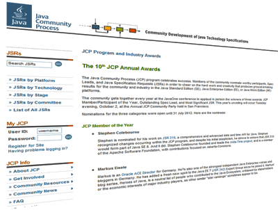

What a surprise! I am nominated for the <a href="http://jcp.org/en/press/news/awards/2012award_nominees">10th JCP Annual Awards</a>. It is especially true since I am following the JCP for a long time now and finally managed to actually contribute by officially joining it. On the one side as a German <a href="" target="_blank">iJUG</a> representative but also as an individual contributing to<a href="http://java.net/projects/javaee-spec/pages/Home" target="_blank"> Java EE 7</a> as part of the Expert Group.
 
 

 

 The <a href="http://jcp.org/en/home/index" target="_blank">JCP</a> is the mechanism for developing standard technical specifications for Java technology. Anyone can register for the site and participate in reviewing and providing feedback for the Java Specification Requests (JSRs), and anyone can sign up to become a JCP Member and then participate on the Expert Group of a JSR or even submit their own JSR Proposals. With no member fee for personal contributors this is an outstanding chance to help shape the future of Java and bring your personal experiences into the standards backing Java. 
 
 <b>JCP Member/Participant Of The Year</b> - This award recognizes the corporate or individual member (either Member or Participant) who has made the most significant positive impact on the community in the past year. Leadership, investment in the community, and innovation are some of the qualities that EC Members look for in voting for this award. 
 
 
 I don't know if I truly have a chance of winning this category. There is great competition:
 <b>Stephen Colebourne</b> - (for his work with JSR 310, Times-Ten)
 <b>Google </b>- (helping to keep the Java platform open by defending the right to create independent implementations of its API specifications.)
 <b>JUG Chennai</b> - (for being the first - and is still the only - JUG from India.)
 <b>Werner Keil</b> - (for his work towards a new version of the JCP, also known as JCP 2.8)
 <b>London Java Community and SouJava</b> - (for <a href="http://java.net/projects/adoptajsr/pages/Home">The Adopt a JSR program</a>)
 
 Antoine Sabot-Durand - (because of his excellent response to the rejected EC ballot for JSR 357)
 
 
 Congratulations to all the nominees! Looking forward meeting you Tuesday evening, October 2, at the Annual JCP Community Party held in San Francisco.