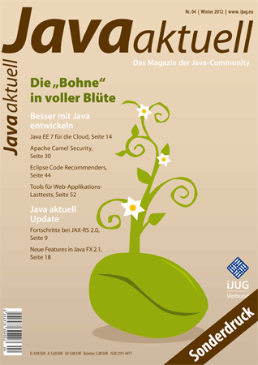

For your reading pleasure. I mean, as long as you can read and understand German. A new article of mine was published in the mouthpiece of the German Java User Groups, <a href="http://www.ijug.eu/index.php?option=com_content&amp;view=article&amp;id=10&amp;Itemid=35">Java Aktuell</a>. This is kind of an early announcement:
 
 

 

 The No4 (winter edition) will be available on the 5th of September and contains a lot more interesting articles. Translation of the introduction for my English speaking readers:
 
 <b>Java EE 7: Development for the clouds</b>
 
 
 Java EE 7 casts its shadows. Initial ideas and goals were presented at last year's JavaOne already. Meanwhile many of the contained Java Specification Requests have started and making good progress. The articles gives an overview&nbsp;on the objectives, the schedule and the current status of specifications and explained novelties.
 
 
 You can <a href="http://www.eisele.net/pdf/2012_4_Java-aktuell_Sonderdruck_Eisele_Java_EE7_Entwickeln-fuer-die-Wolken.pdf" target="_blank">download my article as a reprint PDF</a> edition.