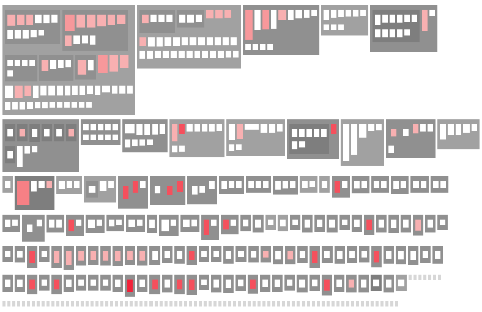

It has been a while since I last looked at the quality of the three major JSF component libraries. In December 2009 I started a comparison of the <a href="http://blog.eisele.net/2009/12/software-quality-jsf-component.html">overall software quality</a> of RichFaces, Primefaces and ICEfaces. Things have changed since than and I wanted to re-evaluate and update this since some time now. The tools I used back in 2009 are still valid but the tool-suite was a bit tricky to setup and I was simply missing the time for doing this. Thanks to the recent needs for a FAMIX 2.1 exporter I was looking again at <a href="http://www.intooitus.com/products/infusion">inFusion</a>. &nbsp;It did the trick for GlassFish City posts (<a href="http://blog.eisele.net/2011/02/glassfish-city-another-view-onto-your.html">First</a>, <a href="http://blog.eisele.net/2012/08/glassfish-city-revisited.html">Second</a>). But beside this it is far more. It's a tool to help with&nbsp;assessment&nbsp;of quality for your systems. It&nbsp;focuses&nbsp;on architecture and design quality and allows for quality assurance of multi-million LOC systems.
 
 Before I give you an idea about what inFusion can do for you (implicitly by analyzing the candidates, I don't do advertising :-D) I have to thank <a href="http://www.intooitus.com/company">Dr. Radu Marinescu and Dr. Adrian Trifu</a> for providing a full functional test and evaluation license of their product to me. Without this I would not be able to show you the great software cities or blog about quality of open source projects in general like today! Please look at the resources underneath this post for further links about inFusion and the principles behind it. If you would like me to do a complete product post, let me know in the comments!
 
 <b>Focus of this Article</b>
 <a href="" target="_blank">PrimeFaces</a>, <a href="http://www.jboss.org/richfaces" target="_blank">RichFaces</a> and <a href="http://www.icesoft.org/projects/ICEfaces/overview.jsf" target="_blank">ICEfaces</a> are the three mostly used JSF component libraries. Looking at the communities using it I always get the feeling that there is kind of a competition for the one and only. This is absolutely driven by the PrimeFaces lead. You can think about what he is doing and like it or not. With this post I am not trying to blame anybody about political correct&nbsp;behavior&nbsp;but trying to bring this back to some more objective views on the different projects by looking at the delivered quality.
 
 <b>Introduction</b>
 
 Before we get to the results I need to introduce you to some basics. If you feel you have seen enough of this before and everything down below is simple, feel free to proceed to the single results.
 
 InFusion assesses software quality in a way that is build around but not centered on metrics. So it is introducing a special kind of quality model (QM) which expresses the quality of a software system in terms of some of its measurable characteristics.&nbsp;Quality itself can mean a couple of different things (External, Process, Internal quality). inFusion defines the notion of quality as “internal quality”, in other words the quality of the system’s architecture and design. The inFusion QM defines two decompositional layers: a layer of "quality attributes", and a layer of "design properties". The higher level overview contains a set of five "design properties" which is build up on a couple of well known "design principles" (e.g.&nbsp;DRY Principle and the Law of Demeter).&nbsp;With these principles in mind, inFusion measures deviations from most of these principles and design rules. By taking into account also the "bad smells" these deviations are quantified. All this together with the right mapping (which could be looked up in inFusion itself or the publications mentioned below) a&nbsp;"Quality Deficit Index" (QDI) is computed.&nbsp;The QDI is a positive, upwards unbound value, which is a measure of "badness" of the analyzed system's design quality respecting the overall size of the system.
 
 Beside those high-level measures, inFusion also presents visualizations like coupling, encapsulation and design flaws on different levels (package, inheritance, class and modules).
 
 I also like the metrics pyramid. It somehow answers the question "How does my project compare to others?".It generates a pyramid, showing key metrics for your project along with comparisons to industry-standard ranges for those numbers.It is separated into three different categories (inheritance, size and communication).
 
<table align="center" cellpadding="0" cellspacing="0" class="tr-caption-container" style="margin-left: auto; margin-right: auto; text-align: center;">
 <tbody>
  <tr>
   <td style="text-align: center;"></td>
  </tr>
  <tr>
   <td class="tr-caption" style="text-align: center;">Overview Pyramid</td>
  </tr>
 </tbody>
</table> The numbers indicate the ratios; the colors indicate where the ratios fit into the industry-standard ranges (derived from numerous open source projects). Each ratio
 
 is either green (close to average range), blue (close to low range), or red (close to high range). The generated numbers serve a couple of purposes. First, they allow you to compare your code base to others along several dimensions. Second, these numbers indicate places where you might want to expend effort to improve code hygiene and design. However, you must understand these numbers in context.
 
 <b>PrimeFaces (QDI: 30,8)</b>
 

<table cellpadding="0" cellspacing="0" class="tr-caption-container" style="float: right; margin-left: 1em; text-align: right;">
 <tbody>
  <tr>
   <td style="text-align: center;"></td>
  </tr>
  <tr>
   <td class="tr-caption" style="text-align: center;">Design Flaws on PrimeFaces</td>
  </tr>
 </tbody>
</table> Founded in 2009 and having a growing user base. Head of development is <a href="http://blog.eisele.net/2012/08/the-heroes-of-java-cagatay-civici.html">Çağatay Çivici</a>. The following analysis was run on the latest development trunk.
 
 
 The <b>total</b> number of lines of code in the system is 44.123 (includings comments and whitespace). The Quality Deficit Index for primefaces is 30,8. 
 
 InFusion detected 12 different Design Flaws. Most impacting ones are the 24 Data Classes and the 23&nbsp;Refused Parent Bequest classes. Followed by three God classes. There are quite a few duplication flaws but no cyclomatic dependencies.
 
 <i>Class hierarchies</i> tend to be <b>tall </b> and <b>wide </b> (i.e. inheritance trees tend to have many depth-levels and base-classes with many directly derived sub-classes)
 <i>Classes </i> tend to contain an <b>average </b> number of methods; be organized in rather <b>fine-grained packages</b> (i.e. few classes per package)
 <i>Methods </i> tend to be rather <b>long </b> and having an <b>average logical complexity</b> ; call <b>many methods</b> (high coupling intensity) from <b>few other classes</b> (low coupling dispersion); 
 
 

<table align="center" cellpadding="0" cellspacing="0" class="tr-caption-container" style="margin-left: auto; margin-right: auto; text-align: center;">
 <tbody>
  <tr>
   <td style="text-align: center;"></td>
  </tr>
  <tr>
   <td class="tr-caption" style="text-align: center;">Metrics Pyramid for PrimeFaces</td>
  </tr>
 </tbody>
</table> Given the fact, that this is a component library the NDD (Number of direct descendants) and HIT (Height of inheritance tree) might be acceptable. Complex inheritance is something that make understanding and predicting behavior more complex. Deeper trees constitute greater design complexity, since more methods and classes are involved, but enhance the potential reuse of inherited methods. NOM refers to the number of methods. This is a simple metric showing the complexity of a class in terms of responsibilities but not in terms of size of the methods.
 
 <b>RichFaces (QDI: 9.1)</b>
 
<table cellpadding="0" cellspacing="0" class="tr-caption-container" style="float: right; margin-left: 1em; text-align: right;">
 <tbody>
  <tr>
   <td style="text-align: center;"></td>
  </tr>
  <tr>
   <td class="tr-caption" style="text-align: center;">Design Flaws on RichFaces</td>
  </tr>
 </tbody>
</table> RichFaces originated from Ajax4jsf in late 2005. It is the widely used component library on JBoss.
 
 The analysis was using the latest development trunk and only includes the core and the components parts.
 
 
 The <b>total</b> number of lines of code in the system is 134.037 (includings comments and whitespace).
 
 The Quality Deficit Index for RichFaces is&nbsp;9.1.
 
 
 <i>Class hierarchies</i> tend to be <b>tall</b>&nbsp;and of &nbsp;<b>average width</b> &nbsp;(i.e. inheritance trees tend to have many depth-levels and base-classes with several directly derived sub-classes)
 <i>Classes</i> tend to contain an <b>average </b>number of methods; and are&nbsp;organized in rather <b>fine-grained packages</b> &nbsp;(i.e. few classes per package);
 <i>Methods</i> tend to:&nbsp;be <b>average</b> &nbsp;in length and having an <b>average logical complexity</b>; call &nbsp;<b>many methods</b> &nbsp;(high coupling intensity) &nbsp;from &nbsp;<b>few other classes</b> &nbsp;(low coupling dispersion);
 

  

<table align="center" cellpadding="0" cellspacing="0" class="tr-caption-container" style="margin-left: auto; margin-right: auto; text-align: center;">
 <tbody>
  <tr>
   <td style="text-align: center;"></td>
  </tr>
  <tr>
   <td class="tr-caption" style="text-align: center;">Metrics Pyramid for RichFaces</td>
  </tr>
 </tbody>
</table>

 RichFaces is doing a better job with&nbsp;hierarchies&nbsp;in general. Only the inheritance tree&nbsp;height is close to high range. The NOM for communication classes also is close to high. The rest is within the defined ranges which actually leads to this good QDI.

  

 <b>ICEfaces (QDI: 16.6)</b>

<table cellpadding="0" cellspacing="0" class="tr-caption-container" style="float: right; margin-left: 1em; text-align: right;">
 <tbody>
  <tr>
   <td style="text-align: center;"></td>
  </tr>
  <tr>
   <td class="tr-caption" style="text-align: center;">Design Flaws on ICEfaces</td>
  </tr>
 </tbody>
</table>

 ICEfaces is there since ... and&nbsp;

 The analysis was done against the 3.1.0-tag and includes the core, push and the components.&nbsp;

 
 The <b>total</b> number of lines of code in the system is 153.843 (includings comments and whitespace).
 
 The Quality Deficit Index for ICEfaces is 16.6.
 
 InFusion detected 16 different design flaws with 35 Data Classes,&nbsp;13 God Classes, 20 SAP Breakers followed by&nbsp;21&nbsp;Refused Parent Bequest classes&nbsp;and 35&nbsp;Cyclic Dependencies.We have a fair amount duplication in there, too.
 
 <i>Class hierarchies</i> tend to be <b>tall</b> and of <b>average width</b> i.e. inheritance trees tend to have many depth-levels and base-classes with several directly derived sub-classes)
 
 <i>Classes</i> tend to contain an <b>average</b> number of methods; be organized in rather <b>fine-grained packages</b> (i.e. few classes per package).
 
 <i>Methods</i> tend to be rather <b>long</b> and having an <b>average logical complexity</b>; call <b>many methods</b> (high coupling intensity) from <b>few other classes</b> (low coupling dispersion). 
 
 
<table align="center" cellpadding="0" cellspacing="0" class="tr-caption-container" style="margin-left: auto; margin-right: auto; text-align: center;">
 <tbody>
  <tr>
   <td style="text-align: center;"></td>
  </tr>
  <tr>
   <td class="tr-caption" style="text-align: center;">Metrics Pyramid for ICEfaces</td>
  </tr>
 </tbody>
</table> As expected, we also find a close to high inheritance tree&nbsp;height. Beside that only the number of methods is something to worry about.
 
 <b>Interpretation</b>
 
 This analysis is different from the one I did a few years back. I skipped looking at all the obvious stuff (e.g. checkstyle, findbugs) because everybody is running a different approach here and to me this simply isn't a comparable base for system quality in general.
 <b>Before we draw the conclusion here, let me first express that the results are no indication about weather you should use any of the candidates or not.</b> The system design quality doesn't influence the quality of the code you produce using them. Also it shouldn't be any indicator about if the candidates are stable or bug-free. It simply focuses on the issues the developers building the products might face. On a long range this also might have an impact on you as a user. Because&nbsp;design problems&nbsp;are&nbsp;expensive,&nbsp;frequent and&nbsp;unavoidable. So having a lot of quality defects in a code base could influence the number of new features a team is able to deliver over time or the time for fixing bugs raises significantly. At the end, in combination with a small team this might lead to the end of a product.
 
 
 All three candidates share the same problems in terms of inheritance. The reason for that is, that they are all frameworks which provide a good set of features to their clients. In combination with the size of the candidates, PrimeFaces seems to have the biggest design flaws at the moment doing the analysis. RichFaces is the leader in terms of quality far in front of any of the other two. This is what I expected to see from a RedHat community driven project. Another indicator, that working software communities are vital, skilled and kicking! ICEfaces is the only project with cyclic dependencies and an unusual amount of duplicated code. So they might end up having to fix the same error a couple of times.
 
 
 I don't have a price to give away here but like to send my congratulations to the RichFaces team for a high quality product! Keep up the good work!
 
 
 Here is your RichFaces-City (core &amp; components). The green area is the old org.ajax4jsf.* bungalow :)
 
<table align="center" cellpadding="0" cellspacing="0" class="tr-caption-container" style="margin-left: auto; margin-right: auto; text-align: center;">
 <tbody>
  <tr>
   <td style="text-align: center;"></td>
  </tr>
  <tr>
   <td class="tr-caption" style="text-align: center;">RichFaces-City</td>
  </tr>
 </tbody>
</table><b>Resources:</b>
 <a href="http://www.intooitus.com/products/infusion">inFusion Product Page</a>
 <a href="http://www.springer.com/computer/swe/book/978-3-540-24429-5?cm_mmc=NBA-_-Aug-06_CHL_229153-_-product-_-978-3-540-24429-5">Object-Oriented Metrics in Practice</a> (Springer, 2006)
 <a href="http://loose.upt.ro./download/papers/marinescu-iPlasma.pdf">iPlasma: An Integrated Platform for Quality Assessment of Object-Oriented Design</a> (PDF)
 <a href="http://www.slideshare.net/girba/pragmatic-quality-assessment-tutorial-icse-2008">Pragmatic Design Quality Assessment</a> (Slideshare presentation)