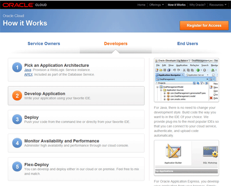
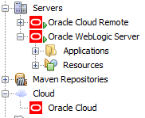
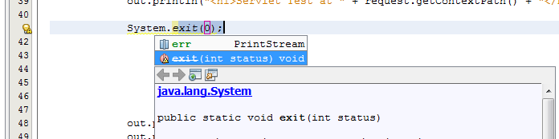

Who expected that to happen: Oracle is working on a public cloud offering and the signs of the approaching official launch are there. Nearly a year after the <a href="http://blog.eisele.net/2011/10/oracle-weblogic-java-cloud-service.html">official announcement</a> I was invited to join the so called "Early Access" program to test-drive the new service and give feedback. Thanks to <a href="" target="_blank">Reza Shafii</a> who is the product manager in charge I have the allowance to dish the dirt a bit. Even if I am not allowed to show you some screenshots from the UI there is plenty to talk about. And today I am willing to give you a first test-drive of the developer experience with NetBeans.
 
 <b>Preparations</b>
 

 

 As usual there are some preparations to do. Get yourself a copy of the latest <a href="" target="_blank">NetBeans 7.2 RC1</a> Java EE edition. This is the publicly available IDE which has oracle cloud support. It was dropped from the 7.2 Final because ... yeah ... the OPC isn't public and nobody wanted to see unusable features in a final release. So the first secret seems to be lifted here. When OPC launches we will see a 7.3 release popping up (concluded from this <a href="http://wiki.netbeans.org/TS_73_Cloud" target="_blank">test-specification</a>). Another useful preparation is to download and install the corresponding <a href="http://www.oracle.com/technetwork/middleware/ias/downloads/wls-main-097127.html" target="_blank">WebLogic 10.3.6</a>&nbsp;for local development. And that is the second surprise so far. Oracle Public Cloud Java Service will be a Java EE 5 service. At least for the GA. And absolutely it doesn't make any sense to stay at this version. So it is really save to say that the WebLogic 12c which has Java EE 6 support will follow sometime next. All set. Fire up NetBeans.
 
 <b>Create your Java EE Application</b>
 
 All you have to do now is to create a new Java EE Web Application with NetBeans. Give it a name (I'm calling it MyCloud) and add a new local WebLogic 10 server in the "Add..." Server dialogue. Don't forget to chose Java EE 5 as EE version. Let's add JSF 2.0 and Primefaces 3.2 on the Framework tab. Click "Finish". If NetBeans is complaining about missing server libraries, let it deploy them. That's it for now. Right Click your app and Run it. This will fire up your local WebLogic domain and point your browser to&nbsp;<a href="">http://localhost:7001/MyCloud/</a>&nbsp;or whatever your app is called. as you can see, the Primefaces components are also working. Not spectacular.
 
 <b>Add Cloud...</b>
 

 

 Next you have to add some cloud. Switch to the services tab, right click on the cloud node and select "Add Cloud...". Chose "Oracle Cloud" and click Next. You will have to fill in a couple of information here.
 
<ul>
 <li><strong>Identity Domain.</strong> The individual or group identity of your Oracle Cloud account.&nbsp;</li>
 <li><strong>Java Service Name.</strong> The name of the Java Service.</li>
 <li><strong>Database Service Name.</strong> The name of the Database Service.</li>
 <li><strong>Administrator.</strong> Your identity as Oracle Cloud administrator.</li>
 <li><strong>Password.</strong> Your Oracle Cloud administrator password.</li>
 <li><strong>SDK.</strong> Path to your local copy of the Oracle Cloud SDK. Click Configure to browse for this file. &nbsp; &nbsp; &nbsp;&nbsp;</li>
</ul> Lucky you, you don't have to care about the details here. You get hand on the information after the successful account creation. And it is pretty straight forward to figure out what is meant here if you get a hand on the cloud finally. Some more words about the identity domain.When setting up Oracle Cloud services, a service name and an identity domain must be given to each service. An identity domain is a collection of users and roles that have been given specific privileges to use&nbsp;certain services or manage certain services in the domain. So it basically is kind of a secure storage.
 

 

 Click "Finish" if everything is filled out correctly. NetBeans verifies your provided information against the OPC and you now have the Oracle Cloud in it. Additionally you find a new server "Oracle Cloud Remote" which is actually the server hook you have to specify in your projects run configuration. Go there. Switch it from local "Oracle WebLogic Server" to "Oracle Cloud Remote" and hit OK. Now you are all set for the cloud deployment.
 
 <b>Run in the Cloud...</b>
 
 Right click and "Run" your project. You see a lot of stuff happen. First of all NetBeans is doing the normal build and afterwards is starting the distribution. First of all this is uploading the bundle (MyCload.war) to the cloud. It get's scanned for viruses and needs to pass the Whitelist scan (more on this later). If both&nbsp;succeeds the deployment happens and your application is opened in your system's default browser:
 

 

 
 That was a typical development round-trip with the Oracle Public Cloud Java Service. Develop and test locally deploy and run in the cloud.
 
 <b>Some more NetBeans goodies</b>
 
 But for what is the "Oracle Cloud" entry in the Cloud services good for? For now this is very simple. You can use it to access your deployment jobs and the according log-files.
 

 

 Every deployment gets a unique number and you see the deployments status. Together with the log excerpts you are able to track that down further. Let's try some more. Add a servlet named "Test" and try to use some malicious code ;)
 
<pre class="brush:java"> System.exit(0); </pre> First indication that something is wrong here is dashed code hint. 
 

 

 Completing it pops up a little yellow exclamation mark. Let's verify the project. Right click on it and select "Verify". That runs the White List Tool which outputs a detailed error report about the white-list validations. 
 
<pre>ERROR - Path:D:\MyCloud\dist\MyCloud.war (1 Error) ERROR - Class:net.eisele.opc.servlet.Test (1 Error) ERROR - 1:Method exit not allowed from java.lang.System.(Line No:41 Method Name:java.lang.System-&gt;exit(int)) ERROR - D:\MyCloud\dist\MyCloud.war Failed with 1 error(s) </pre> It is disappointing but there are limitations (aka White List) in place which prevent you from using every single Java functionality you know. For the very moment I am not going to drill this down further. All early access members had to say something about the restrictions and Oracle listened carefully. A lot of things are moving here and it simply is too early to make any statements about the final white list. A lot of 3rd party libraries (e.g. primefaces) are tested and run smoothly. Those aren't affected by the white list at all. 
 
 <b>Bottom Line</b>
 
 That is all for today. I am not going to show you anything else of the OPC. And I know that you can't test-drive the service your own. You need to have the Javacloud SDK in place which isn't publicly available today. But it will be. And there will be a chance to test-drive the cloud for free. A trial. And I am looking forward showing you some more of the stuff that is possible. As soon as it becomes available. As of today you can <a href="" target="_blank">register for access</a> and get notified as the service is ready to sign you up!