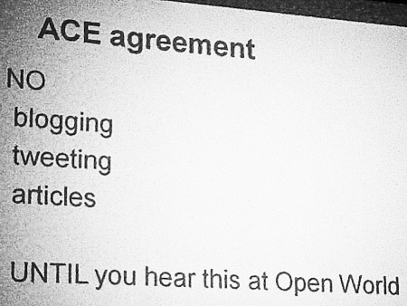

The special days in the year are finally there. After some excitement during the latest early access and internal preview actions I was involved it is finally time to fly to San Francisco and see all that stuff being announced at the annual Oracle conferences OpenWorld and JavaOne. This post kicks of my week in the states.
 
 <b>Traveling</b>
 

 

 My first time on KLM. Being a loyal Lufthansa customer since some time I was forced to switch carrier because they simply beat the Lufthansa price tack significantly. No A380 for me this time. Instead I had to fly the airplane of my dreams: a <a href="http://www.klm.com/travel/us_en/prepare_for_travel/on_board/seating_plans/b747.htm">Boeing 747-400</a>. When I was a little kid visiting FRA for the first time it was the biggest airplane and I dreamed of flying with it. Honestly some time has passed by since then and it is an old airplane today. Anyway it was a nice experience and the KLM crew did a good job during the flight in serving the customers. So, I was positively surprised. All-in-all it was a long trip and I was happy to fall into the hotel bed after 38h. 
 
 <b>ACED Briefing</b>
 

 

 Some comments on twitter today about why I am that early. JavaOne starts Sunday with the keynotes. Part of the annual experience is the ACE Director Briefing at Oracle Headquarters. We have a packed schedule and get a gist of OpenWorld in two days front-up. The negative side here is, that we simply aren't allowed to blog about the details until they officially show up during OpenWorld. The schedule today starts at 08:30 with an update on the Oracle Development Tools; followed by an update on the Oracle Database. After that it was Middleware and Cloud time; passing by IdM and finally meeting Thomas Kurian and Steve Miranda. Wim Coekaerts closed the day with an update on Virtualization and Linux. It is annoying that we are forced to be silent. But also completely fair. All Oracle is asking for are some 30h to keep the silence. And this is doable even for the most vocal ACEs.
 
 Talking to the fellow ACEs we realize, that we're meeting once a year and keep getting older. But this doesn't stop us from having fun and doing some networking.
 
 <b>The OTN "Thank-you"</b>
 
 I probably do this every year. But I can't help myself but send this big "Thank-you" out to Lillian, Vikki and their team. Without you and your support we wouldn't be here and we probably wouldn't be able to make the right connections to help or give feedback! It's a pleasure to contribute and an honor to be an ACED. Thanks for all your efforts for bringing the right PMs to the briefing and for organizing some great OpenWorld days!