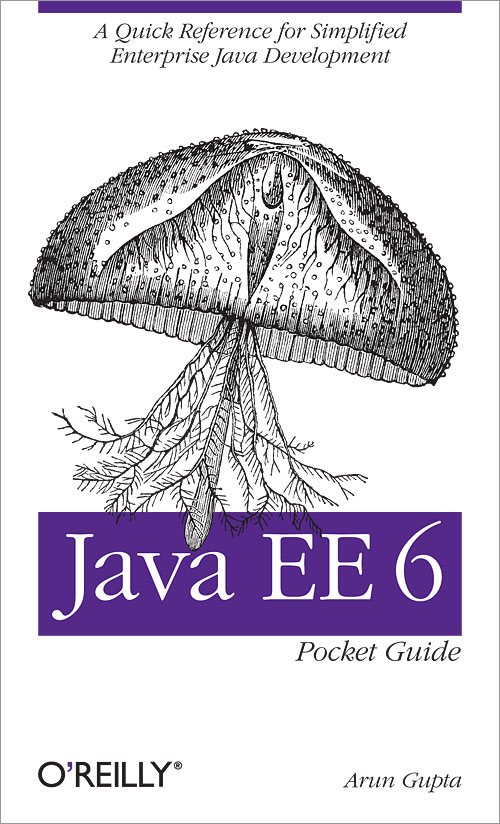

This is a review I am very pleased to write. My friend Arun published the Java EE 6 pocket guide and it will be at your hands as early as you can order. I knew about the book quite early, because I had the pleasure to review it and I am thankful for the chance to contribute a little to it! The Kindle edition is already available and the printed books should be available until JavaOne. There is a good chance to have Arun sign it, if you bump into him there!
 
 <b>Abstract</b>
 

 

 The Java Enterprise Edition 6 platform provides capabilities that make it easier for Java programmers to develop and deploy enterprise and Web applications. This handy guide provides an overview of the main technologies in the Java EE 6 platform, including extensive easy-to-understand code samples that demonstrate many improvements. Whether you're familiar with Java EE 5 or a Java programmer approaching the enterprise edition for the first time, this book will quickly get you up to speed on Java EE 6. Discover how Java EE 6 provides a simplified developer experience and improves on the developer productivity features introduced in Java EE 5. Delve into Java EE 6 profiles, including a comprehensive profile for lightweight, standards-based modern web applications. Explore how the platform enables extensibility with open source libraries and frameworks. Learn how specifications such as Contexts &amp; Dependency Injection, Java API for RESTful Services, and Servlets 3 make the platform more powerful.
 
 
 Book: "<a href="http://shop.oreilly.com/product/0636920026464.do" target="_blank">Java EE 6 Pocket Guide</a>" 
 
 Language : English
 
 Paperback: 204 pages 
 
 Release Date : September 2012
 
 ISBN-10: 144933668X 
 
 ISBN-13: 978-1449336684
 
 <b>The Author</b>
 
 Arun (<a href="">@arungupta</a>) is the Java EE evangelist at Oracle. He has over 15 years of experience in the software industry working in the Java platform and several web-related technologies. In his current role, he works to create and foster the community around Java EE and GlassFish. He has been with the Java EE team since its inception and contributed to all releases. Arun has extensive world wide speaking experience on myriad of topics and loves to engage with the community, customers, partners, and Java User Groups everywhere to spread the goodness of Java. He is running a well know blog named "<a href="" target="_blank">Miles to go...</a>" 
 
 <b>The Content</b>
 
 204 pages is a good size for a pocket guide. It covers the basics you need to know of Java EE 6 and gives good examples of all relevant parts.&nbsp;Chapter 1 &nbsp;introduces you to the Java Enterprise Edition in general. Chapter 2 follows with a brief introduction to Managed Beans and their overall&nbsp;life-cycle. Chapter 3 dives into Servlets and all relevant parts. Chapter 4 introduces the&nbsp;Java Persistence API beginning with Entities and the surrounding happenings.&nbsp;Chapter 5 dedicates content around the Enterprise JavaBeans specification. Thins includes&nbsp;Stateful, Stateless, Singleton and Message-Driven up to the&nbsp;Embeddable&nbsp;API and the EJBLite specification.&nbsp;Chapter 6 is about Contexts and Dependency Injection including the portable extensions. The&nbsp;Chapter 7 covers JavaServer Faces very briefly and introduces you to the main concepts.&nbsp;Chapters 8 and 9 are about&nbsp;SOAP-Based Web Services and&nbsp;RESTful Web Services with simple and understandable examples.&nbsp;Chapter 10 covers the Java Message Service with a message send example. The book closes with &nbsp;Chapter 11 about Bean Validation and how it integrates with JPA and JSF.
 
 <b>Writing and Style</b>
 
 This is a pocket guide which is&nbsp;comprehensively&nbsp;written. I could follow all examples and it was a good read overall. No complicated constructs and clear writing. Walking from chapter to chapter works, but it isn't designed like that. It is more like a reference book to look up the most important topics in Java EE 6 at one point. It isn't watered-down by complex examples and sticks to the most important characteristics of the covered specifications. If you ever have seen one of Arun's presentations or tutorials you know that he is good in explaining things and this style found the way into the guide.
 
 
 <b>Conclusion and recommendation</b>
 
 I'm obviously not neutral here :) GO GET IT! It is the only book you probably will need about Java EE 6! It is comprehensive, wonderfully written and covers everything you need in your daily work. It is not a complete reference but provides a great shortcut to the things you need to know. To me it is a good beginners guide and also works as a companion for advanced users. Get it while it's hot! Thanks Arun for sharing your knowledge!