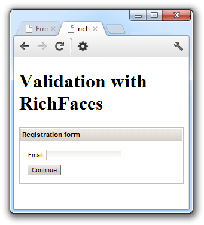

I initially thought I could write this post months back already. But I ended up being&nbsp;overwhelmed&nbsp;by different things. One among them was, that it wasn't able to simply fire up the RichFaces showcase like I did it for the 4.0 release. With all the JMS magic and the different provider checks in the showcase this has become some kind of a challenge to simply build and deploy it.
 
 Anyway, I was willing to give this a try and here we go. If you want to get started with any of the JBoss technologies it is a good idea to check with the <a href="" target="_blank">JBoss Developer Framework</a> first. That is a nice collection of different <a href="" target="_blank">examples</a> and <a href="" target="_blank">quickstarts</a> to get you started on Java EE and it's technologies. One of them is the <a href="" target="_blank">RichFaces-Validation</a> example which demonstrates how to use JSF 2.0, RichFaces 4.2, CDI 1.0, JPA 2.0 and Bean Validation 1.0 together.
 
 <b>The Example</b>
 

 

 The example consists of a Member entity which has some JSR-303 (Bean Validation) constraints on it. Usually those are checked in several places, beginning with the Database, on to the persistence layer and finally the view layer in close interaction with the client. Even if this quickguide doesn't contain a persistence layer it starts with the Enity which reflects the real life situation quite good. The application contains a view layer written using JSF and RichFaces and includes an AJAX wizard for new member registration. A newly registered member needs to provide a couple of information before he is actually "registered". This includes e-mail a name and his phone number. 
 
 <b>Getting Started</b>
 
 I'm not going to repeat what the excellent and detailed quickstart is already showing you. So, if you want to run this on JBoss AS7 .. go there. We're starting with a blank Maven web-project. And the best and easiest way to do this is to fire up NetBeans 7.2 and create one. Lets name it "richwls-web". Open your pom.xml and start changing some stuff there. First remove the endorsed stuff there. We don't need it. Next is to add a little bit of dependencyManagement:
 
<pre class="brush:xml"> &lt;dependencyManagement&gt; &lt;dependencies&gt; &lt;dependency&gt; &lt;groupId&gt;org.jboss.bom&lt;/groupId&gt; &lt;artifactId&gt;jboss-javaee-6.0-with-tools&lt;/artifactId&gt; &lt;version&gt;1.0.0.Final&lt;/version&gt; &lt;type&gt;pom&lt;/type&gt; &lt;scope&gt;import&lt;/scope&gt; &lt;/dependency&gt; &lt;dependency&gt; &lt;groupId&gt;org.richfaces&lt;/groupId&gt; &lt;artifactId&gt;richfaces-bom&lt;/artifactId&gt; &lt;version&gt;4.2.0.Final&lt;/version&gt; &lt;scope&gt;import&lt;/scope&gt; &lt;type&gt;pom&lt;/type&gt; &lt;/dependency&gt; &lt;/dependencies&gt; &lt;/dependencyManagement&gt; </pre> This adds the Bill of Materials (BOM) for both Java EE 6 and RichFaces to your project. A BOM specifies the versions of a "stack" (or a collection) of artifacts. You find it with anything from the RedHat guys and it is considered "best practice" to have one. At the end this makes your life easier because it manages versions and dependencies for you.
 
 On to the lengthy list of true dependencies:
 
<pre class="brush:xml">&lt;!-- Import the CDI API --&gt; &lt;dependency&gt; &lt;groupId&gt;javax.enterprise&lt;/groupId&gt; &lt;artifactId&gt;cdi-api&lt;/artifactId&gt; &lt;scope&gt;provided&lt;/scope&gt; &lt;/dependency&gt; &lt;!-- Import the JPA API --&gt; &lt;dependency&gt; &lt;groupId&gt;javax.persistence&lt;/groupId&gt; &lt;artifactId&gt;persistence-api&lt;/artifactId&gt; &lt;version&gt;1.0.2&lt;/version&gt; &lt;scope&gt;provided&lt;/scope&gt; &lt;/dependency&gt; &lt;!-- JSR-303 (Bean Validation) Implementation --&gt; &lt;dependency&gt; &lt;groupId&gt;org.hibernate&lt;/groupId&gt; &lt;artifactId&gt;hibernate-validator&lt;/artifactId&gt; &lt;version&gt;4.3.0.Final&lt;/version&gt; &lt;scope&gt;provided&lt;/scope&gt; &lt;exclusions&gt; &lt;exclusion&gt; &lt;groupId&gt;org.slf4j&lt;/groupId&gt; &lt;artifactId&gt;slf4j-api&lt;/artifactId&gt; &lt;/exclusion&gt; &lt;/exclusions&gt; &lt;/dependency&gt; &lt;!-- Import the JSF API --&gt; &lt;dependency&gt; &lt;groupId&gt;javax.faces&lt;/groupId&gt; &lt;artifactId&gt;jsf-api&lt;/artifactId&gt; &lt;version&gt;2.1&lt;/version&gt; &lt;scope&gt;provided&lt;/scope&gt; &lt;/dependency&gt; &lt;!-- Import RichFaces runtime dependencies - these will be included as libraries in the WAR --&gt; &lt;dependency&gt; &lt;groupId&gt;org.richfaces.ui&lt;/groupId&gt; &lt;artifactId&gt;richfaces-components-ui&lt;/artifactId&gt; &lt;/dependency&gt; &lt;dependency&gt; &lt;groupId&gt;org.richfaces.core&lt;/groupId&gt; &lt;artifactId&gt;richfaces-core-impl&lt;/artifactId&gt; &lt;/dependency&gt; </pre> Except the RichFaces dependencies all others are provided by the runtime. In this case it will be GlassFish 3.1.2.2. In case you haven't defined it elsewhere (settings.xml) you should also add the JBoss repository to your build section: 
 
<pre class="brush:xml"> &lt;repository&gt; &lt;id&gt;jboss-public-repository-group&lt;/id&gt; &lt;name&gt;JBoss Public Maven Repository Group&lt;/name&gt; &lt;url&gt;https://repository.jboss.org/nexus/content/groups/public-jboss/&lt;/url&gt; &lt;/repository&gt; </pre> Copy the contents of the richfaces-validation directory of the source-zip or <a href="https://github.com/jboss-jdf/jboss-as-quickstart/tree/7.1.2.M1/richfaces-validation" target="_blank">check it out from github</a>. Be a little bit careful and don't mess up with the pom.xml we created ;) Build it and get that stuff deployed.
 
 <b>Issues</b>
 
 First thing you are greeted with is a nice little weld message:
 
<pre>WELD-000054 Producers cannot produce non-serializable instances for injection into non-transient fields of passivating beans [...] Producer Method [Logger] with qualifiers </pre> We obviously have an issue here and need to declare the Logger field as transient.
 
<pre class="brush:java">@Inject private transient Logger logger; </pre> Don't know why this works on AS7 but might be I find out someday :) Next iteration: Change it, build, deploy.
 
<pre>java.lang.NoSuchMethodError: com.google.common.collect.ImmutableSet.copyOf(Ljava/util/Collection;)Lcom/google/common/collect/ImmutableSet; </pre> That doesn't look better. Fire up the WLS CAT at <a href="">http://localhost:7001/wls-cat/</a> and try to find out about it.
 

 

 Seems as if Oracle is using Google magic inside the server. Ok, fine. We have no way to deploy RichFaces as a standalone war on WebLogic because we need to resolve some classloading issues here. And the recommended way is to add a so-called Filtering Classloader. You do this by adding a&nbsp;weblogic-application.xml to your ear. Yeah: Lets repackage everything and put the war into an empty ear and add the magic to the weblogic-application.xml:
 
<pre class="brush:xml"> &lt;prefer-application-packages&gt; &lt;package-name&gt;com.google.common.*&lt;/package-name&gt; &lt;/prefer-application-packages&gt; </pre> Done? Another deployment and you finally see your application. Basically RichFaces run on WebLogic but you have to package it into an ear and turn the classloader around for the com.google.common.* classes. That is way easier with PrimeFaces but ... anyway, there are reasons why I tried this. One is, that I do like the idea of being able to trigger the Bean Validation on the client side. If you take a look at the example you see, that the <a href="http://showcase.richfaces.org/richfaces/component-sample.jsf?demo=clientValidation&amp;skin=blueSky" target="_blank">&lt;rich:validator event="blur" /&gt;</a>&nbsp;adds client side validation for both bean validation constraints and standard jsf validators to the client. Without having to mess around with anything in JavaScript or duplicate logic. Great! Thanks!