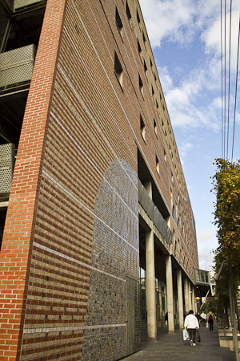
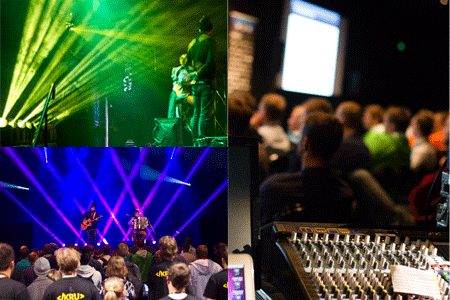

Being back home it is time to summarize my latest trip a bit. I was in Oslo, Norway for JavaZone, which is the biggest meeting place for software developers in Scandinavia, and one of Europe's most important conferences. JavaZone has been described as a high quality, independent conference - a leading forum for knowledge exchange for IT-professionals. Each year around 2,300 conference tickets are sold. This years JavaZone is the eleventh. They got most famous for their promotional videos you can find on a <a href="http://jz12.java.no/videos" target="_blank">dedicated page</a> on their website. All this is organized by <a href="" target="_blank">javaBin</a> which is a non-profit, independent organization. The purpose is to promote java skills among members, member firms and the market. javaBin is headquartered in Oslo, with subgroups in Stavanger, Bergen, Trondheim and the South Coast.. 
 
 What did I do this far in the north? Good question. I was attending last years Jfokus and I was very surprised by the warm welcome and the overall atmosphere there. And I'm some kind of person who loves to be in northern areas. So it was only one more step to submit a talk after my friend Masoud Kalali pointed me to it. That should have been a&nbsp;combined talk.&nbsp;Unfortunately&nbsp;he fell sick and I had to take this on my own.
 
 <b>The Trip</b>
 

 

 Looking at cheep flights and&nbsp;accommodation I arrived noon on the day before the conference. The 2 hour direct flight&nbsp;is convenient and not too long. Best way from OSL to Oslo is to take the <a href="" target="_blank">Flytoget</a> which is the airport express. It is cheep compared with a taxi and comfortable to have&nbsp;power plugs&nbsp;and free wifi on board. After 30 minutes you arrive at Oslo S which is the central station. 5 minutes walk bring you to most of the venue hotels. Those mostly are around the Oslo Spektrum which is the venue where JavaZone is held. I stayed at the <a href="https://plus.google.com/111316791945549513931/about?gl=US&amp;hl=en" target="_blank">Thon Hotel Terminus</a>. What should I say: It is ok for the few hours you stay there. Nothing (really nothing) compared to other hotels I have seen for the same price.
 
 <b>The City</b>
 

 

 Wonderful. It is big enough to not have a chance to do it in one day without any help of a local guide. Safe and mostly clean. You are at the waterfront in minutes (walking) and you can spend all the money you have because it simply is expensive. Norway itself is (25% VAT) but Oslo seems to be even more expensive. You can go everywhere with public transport and taxis. To me it felt a little bit like an american city. Don't know why, it might be the modern traffic signs or the sound of the ambulance. Nearly everybody is smiling around and even some rain didn't stop anybody from walking around. I enjoyed the feeling there. If you have the chance to walk around don't forget to visit&nbsp;the <a href="" target="_blank">Oslo Opera House</a> (Norwegian: Operahuset). &nbsp;It is the largest cultural building constructed in Norway since Nidarosdomen was completed circa 1300. I love the architecture and the overall impression this makes.
 
 <b>The Venue</b>
 

 

 The <a href="" target="_blank">Oslo Spektrum</a>. Was build as part of the efforts to revitalize this part of the city. It should be a flexible venue with a lot of different functions.It was done by architects LPO architects AS. In collaboration with artist Guttorm Guttormsgaard and ceramist Søren Ubisch. The outside looks wonderful and the way it was used for JavaZone is good. The central auditorium was the&nbsp;exhibition&nbsp;area with lots of companies' booths and a javaBin booth in the overall center. Around that were the different rooms. Four in the lower level and three theater like rooms in the upper level. Especially the upper level rooms gave a university feeling which was very impressive and familiar from Jfokus. One room in the lower level, I believe it was room 3 had a split auditorium and the stage in the middle with the screen hanging above the head of the speaker. Lovely. Especially if you see someone like Tim Berglund speaking and acting in a space like that. A word about the catering. Four different kinds of food (Italian, Indian, Mexican and Sushi) from 10am until 6pm. Coffee all day long and on top of that water and&nbsp;soft drinks (at least around noon). And a beer duke which was spitting out beer if you held your registration QR code under his red nose. Very impressive lineup. No queues and longer waiting times. But it didn't work for me. I don't want a lunch before it is lunch-time and I want a cake in the afternoon and some kind of snacks in between do work a lot better for me than this 8h lunch package.&nbsp;&nbsp;There is a&nbsp;<a href="https://plus.google.com/photos/100362024804331957185/albums/5787215279961106561" target="_blank">complete album on Google+</a>&nbsp;with most of the pictures I took.
 
 <b>The Speaker Service</b>
 

 

 I was a first timer here. I know a couple of other conferences already and this doesn't made me feel bad about the one supporting email which came upfront giving information about the speaker dinner and a contact for further questions. But it was the only email that reached me and beside the very informal (but entertaining) speaker dinner this was my last contact with the organizers. The conferences I know a little better left another impression with me. I have seen a decent support for foreign speakers with someone being around and offering help and information. The javaBin guys have been at the booth the whole day for sure but they didn't made me feel like being a guest there. I was only one among all the other attendees. No, I'm not a diva. I don't need to be pampered the whole day. But I value a honest conversation and a friendly smile if I walk around alone the same place for the second time. Let's summarize it like this: There is always room for improvement.
 
 <b>Friends on the Road</b>
 
 Thank you Aslak! I had a great time chatting with you and Bartosz and it has been the best four beers in a row I had with some guys at a table talking about Java EE, Oracle, RedHat and kids, family and other stuff that matters since a year. I am truly looking forward meeting you again at JavaOne! Thanks&nbsp;Anton Arhipov for&nbsp;always being around&nbsp;for a&nbsp;nice chat! Thanks Dalibor! We had some good laughs about OpenJDK, Oracle and stuff that we better not disclose ;)
 
 Beside that I meet some of the famous names of our business. Angelika Langer, Tim Berglund was around. I had the chance to introduce myself to James Ward and talk Kevlin Henney into a nice little interview. 
 
 <b>PhotoZone</b>
 
 Talking about frustrations still leaves one thing open: My PhotoZone submissions. It's not that I need a new cam. But the Leica would have been nice. And generally I simply would have loved to see my pictures up on that PhotoZone screen. It seems as if it simply shouldn't be. So, for the records, these are three of the four submissions which didn't find their way to the contest.
 
 

 

 
 <b>The Talk</b>
 
 It was ok. 30 something attendees at the last slot of the last day is somehow more than I expected. And they were fair and interested listeners. I hope I was at least a little bit entertaining after two long and exhausting conference days.&nbsp;Here is the recording of the talk:
 <iframe allowfullscreen frameborder="0" height="281" mozallowfullscreen="mozallowfullscreen" src="http://player.vimeo.com/video/49458044" webkitallowfullscreen="webkitallowfullscreen" width="500"></iframe>
 <a href="http://vimeo.com/49458044">Java EE Security in practice with Java EE 6 and GlassFish</a> from <a href="http://vimeo.com/javazone">JavaZone</a> on <a href="">Vimeo</a>.
 
 
 Here are the slides:
 <iframe allowfullscreen frameborder="0" height="356" marginheight="0" marginwidth="0" scrolling="no" src="http://www.slideshare.net/slideshow/embed_code/14274124" style="border-width: 1px 1px 0; border: 1px solid #CCC; margin-bottom: 5px;" width="427"> </iframe>
 

 <strong> <a href="http://www.slideshare.net/myfear/security-in-practice-with-java-ee-6-and-glassfish" target="_blank" title="Security in practice with Java EE 6 and GlassFish">Security in practice with Java EE 6 and GlassFish</a> </strong> from <strong><a href="http://www.slideshare.net/myfear" target="_blank">Markus Eisele</a></strong>

 <b>Bottom Line</b>
 
 It was a nice trip. I reached a couple of people and had the chance to bring some more security into the Java EE world. Keep up the good work javaBin and I am looking forward to next years video trailers!
 
 And it was a pleasure bringing Sparky to Norway with Arun having to cancel his trip with short notice!