It always ends different than thought. I aimed at doing a blog-post per day for my recent San Francisco trip. But it simply wasn't doable. Far too many things going on in parallel and I didn't had a minute to spare during the week. Being back in Germany with an additional week of vacation which should be dedicated to family and overall recovery I found my few minutes to write at least a little write-up. Beware, this is going to be a lengthy post.
 
 <b>Travel with KLM not Lufthansa</b>
 

 <a href="http://www.gcmap.com/mapui?P=AMS-SFO&amp;MS=bm&amp;PC=%23ff0000&amp;RC=%23000080&amp;DU=km&amp;SU=kts" imageanchor="1" style="clear: right; float: right; margin-bottom: 1em; margin-left: 1em;" target="_blank">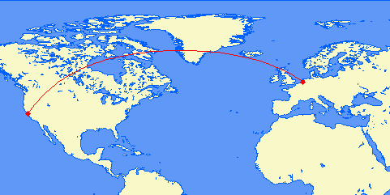</a>

 My favorite airline is Lufthansa. Due to their outrageous price for the trip I had to take KLM for the 9512 nm (17616 km). This was disappointing from a frequent flyer miles point of view but also interesting to compare the services of the two airlines. I was surprised to see, that KLM has a decent website and after registering I could register everything needed for the immigration procedures with the US. Some&nbsp;hiccups made this experience a little unpleasant. Lufthansa is a little more professional here. Bottom line: I could do everything I needed to do. Travel from Germany to Amsterdam and further on to San Francisco was also good. The <a href="http://www.klm.com/travel/de_en/prepare_for_travel/on_board/seating_plans/Fokker70.htm" target="_blank">Fokker 70</a> (Cityhopper) is a fast but comparable old&nbsp;machine. Long distance is done with a <a href="http://www.klm.com/travel/de_en/prepare_for_travel/on_board/seating_plans/b747.htm" target="_blank">Boing 747-400</a>. Another elderly machine which has exactly nothing to offer compared with <a href="http://konzern.lufthansa.com/de/flotte/interkontinental-flotte/airbus-a380-800.html" target="_blank">Lufthansa's A380</a>. The good news are: KLM has nice attendant teams on their flights and they did a professional job. A little&nbsp;embarrassing&nbsp;was the fact, that they didn't manage to get coffee on a 6am flight.
 
 <b>ACE Director Briefing</b>
 
<table cellpadding="0" cellspacing="0" class="tr-caption-container" style="float: right; margin-left: 1em; text-align: right;">
 <tbody>
  <tr>
   <td style="text-align: center;"><a href="IMG-20120926-00452.jpg" imageanchor="1" style="clear: right; margin-bottom: 1em; margin-left: auto; margin-right: auto;">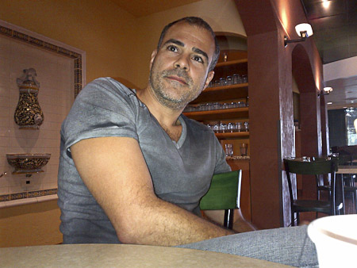</a></td>
  </tr>
  <tr>
   <td class="tr-caption" style="text-align: center;">Maiko Rocha - Oracle A-Team</td>
  </tr>
 </tbody>
</table> I arrived Wednesday noon in San Francisco. Together with a bunch of Dutch ACED I was&nbsp;transferred&nbsp;to the Sofitel next to the Oracle Head-Quarter. The next two days were dedicated to the annual ACED Briefing which gives a good and comprehensive overview about the important things to come during the next few days. This briefing strongly focuses on Oracle products and announcements. Get some impressions from my <a href="http://blog.eisele.net/2012/09/day-0-oracle-openworld-and-javaone.html">blog-post of my first day</a>. This is an awesome event. The two days allow for great networking and meeting peers which I usually only meet once a year. Being next to the HQ also makes it possible to jump over for a quick hello with local friends (thanks <a href="http://www.twitter.com/maiko_rocha" target="_blank">@maiko_rocha</a> for the walk around and the coffee!) Also the other way round is possible. I meet Mike Lehmann and Jeffrey West for a beer at the Sofitel and we had a great chat about WebLogic, GlassFish and community in general. Some very exciting things to come. Even if the impact on WebLogic from the complete Fusion Middleware Stack makes quick moves difficult. Another important topic for the briefing is networking. Sometimes over a beer or two.
 
 A big thank you to Lillian for the nice birthday surprise!
 
<table cellpadding="0" cellspacing="0" class="tr-caption-container" style="float: right; margin-left: 1em; text-align: right;">
 <tbody>
  <tr>
   <td style="text-align: center;"></td>
  </tr>
  <tr>
   <td class="tr-caption" style="text-align: center;">A combined birthday cake with Vikki!</td>
  </tr>
 </tbody>
</table> It has become a nice tradition to have a final one during the dinner before moving on to the Hilton Union-Square in San Francisco. During the 40 minutes ride we had wifi on the bus and it was a good time to relax a bit before all the excitement finally starts. Vikki and Lillian run the Oracle community programs and both found the time to give a nice little interview to Todd during our stay at the Sofitel. If you are brave enough to watch this through (bad sound quality) you see some fellow ACE Directors talking about what they like. I'm giving the last statement before the closing curtain.
 
 <iframe allowfullscreen frameborder="0" height="315" src="http://www.youtube.com/embed/jcg0ZSssKv4?rel=0" width="500"></iframe>
 
 <b>JavaOne Saturday - Geek Bike Ride</b>
 
 Normally the Saturday is the "day-off". For sightseeing and stuff like this. This year it was bike-ride-time. Fabiene organized a follow up from the famous Brazilian Geek-Bikeride and somehow I decided to attend. Short version: It was awesome. In two ways: Many great people and lots of fun. And it was unbelievably exhausting. At least for me. Starting at Blazing Saddles around 11am we went all the way down to the bridge.
 
 &nbsp; <iframe frameborder="0" height="350" marginheight="0" marginwidth="0" scrolling="no" src="https://maps.google.com/maps?f=d&amp;source=s_d&amp;saddr=Blazing+Saddles+Bike+Rentals+and+Tours,+Mason+Street,+San+Francisco,+CA,+United+States&amp;daddr=37.8063196,-122.4235459+to:37.80598,-122.4253786+to:37.8064655,-122.4371009+to:37.803051,-122.462826+to:37.80476,-122.46828+to:37.81007,-122.47642+to:37.8393508,-122.482542+to:37.8392559,-122.4826408+to:Inn+Above+Tide,+30+El+Portal+Street,+Sausalito,+CA+94965&amp;hl=en&amp;geocode=FRTgQAIdpwK0-CFjYk0FPKvwVSlv5k8j4YCFgDFjYk0FPKvwVQ%3BFe_gQAIdB_ez-CmlqZ-O4ICFgDFKpwPG7P69_A%3BFZzfQAId3u-z-ClpXN813oCFgDFL9mtWzcIRmw%3BFYHhQAIdFMKz-Cl1O9ppKIGFgDHIQSax185Kfw%3BFSvUQAIdll2z-CkjPdOT24aFgDGktCvM7iWDTA%3BFdjaQAIdSEiz-CkltEdL3YaFgDFvPMJ_qeRtlg%3BFZbvQAIdfCiz-CmdifiM7IaFgDHsW1GuraGZyQ%3BFfZhQQIdkhCz-Ck1-1PjOoSFgDG7YLFEIPkeUg%3BFZdhQQIdMBCz-Ck1-1PjOoSFgDG6YLFEIPkeUg%3BFYKhQQIdDiCz-Cn9iai6RYSFgDFv33kDd85s9A&amp;aq=0&amp;oq=Blaz&amp;sll=37.831548,-122.446318&amp;sspn=0.047386,0.104628&amp;t=h&amp;mra=dvme&amp;mrsp=7&amp;sz=14&amp;via=1,2,3,4,5,6,7,8&amp;ie=UTF8&amp;ll=37.831548,-122.446318&amp;spn=0.047386,0.104628&amp;output=embed" width="425"></iframe>
 <small><a href="https://maps.google.com/maps?f=d&amp;source=embed&amp;saddr=Blazing+Saddles+Bike+Rentals+and+Tours,+Mason+Street,+San+Francisco,+CA,+United+States&amp;daddr=37.8063196,-122.4235459+to:37.80598,-122.4253786+to:37.8064655,-122.4371009+to:37.803051,-122.462826+to:37.80476,-122.46828+to:37.81007,-122.47642+to:37.8393508,-122.482542+to:37.8392559,-122.4826408+to:Inn+Above+Tide,+30+El+Portal+Street,+Sausalito,+CA+94965&amp;hl=en&amp;geocode=FRTgQAIdpwK0-CFjYk0FPKvwVSlv5k8j4YCFgDFjYk0FPKvwVQ%3BFe_gQAIdB_ez-CmlqZ-O4ICFgDFKpwPG7P69_A%3BFZzfQAId3u-z-ClpXN813oCFgDFL9mtWzcIRmw%3BFYHhQAIdFMKz-Cl1O9ppKIGFgDHIQSax185Kfw%3BFSvUQAIdll2z-CkjPdOT24aFgDGktCvM7iWDTA%3BFdjaQAIdSEiz-CkltEdL3YaFgDFvPMJ_qeRtlg%3BFZbvQAIdfCiz-CmdifiM7IaFgDHsW1GuraGZyQ%3BFfZhQQIdkhCz-Ck1-1PjOoSFgDG7YLFEIPkeUg%3BFZdhQQIdMBCz-Ck1-1PjOoSFgDG6YLFEIPkeUg%3BFYKhQQIdDiCz-Cn9iai6RYSFgDFv33kDd85s9A&amp;aq=0&amp;oq=Blaz&amp;sll=37.831548,-122.446318&amp;sspn=0.047386,0.104628&amp;t=h&amp;mra=dvme&amp;mrsp=7&amp;sz=14&amp;via=1,2,3,4,5,6,7,8&amp;ie=UTF8&amp;ll=37.831548,-122.446318&amp;spn=0.047386,0.104628" style="color: blue; text-align: left;">View Larger Map</a></small>
 
 This probably isn't the exact route but it should be close to what we did. Roughly 10 miles with some photo-stops on the way. We had a great dinner in Sausalitos and it was a pleasure to meet Alexis again. Thanks again to Simon and Dave who also joined us. Steven Chin and family made this complete.
 
<table align="center" cellpadding="0" cellspacing="0" class="tr-caption-container" style="margin-left: auto; margin-right: auto; text-align: center;">
 <tbody>
  <tr>
   <td style="text-align: center;"><a href="IMG-20120929-00493.jpg" imageanchor="1" style="margin-left: auto; margin-right: auto;">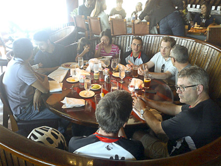</a></td>
  </tr>
  <tr>
   <td class="tr-caption" style="text-align: center;">Dinner in Sausalitos</td>
  </tr>
 </tbody>
</table>
<table align="center" cellpadding="0" cellspacing="0" class="tr-caption-container" style="margin-left: auto; margin-right: auto; text-align: center;">
 <tbody>
  <tr>
   <td style="text-align: center;"><a href="IMG-20120929-00489.jpg" imageanchor="1" style="margin-left: auto; margin-right: auto;">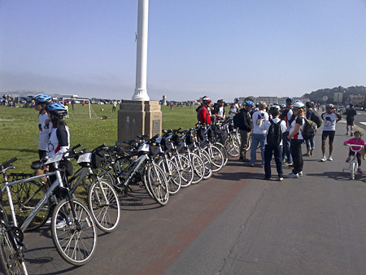</a></td>
  </tr>
  <tr>
   <td class="tr-caption" style="text-align: center;">All the bikes :)</td>
  </tr>
 </tbody>
</table>
 
<table align="center" cellpadding="0" cellspacing="0" class="tr-caption-container" style="margin-left: auto; margin-right: auto; text-align: center;">
 <tbody>
  <tr>
   <td style="text-align: center;"><a href="IMG-20120929-00490.jpg" imageanchor="1" style="margin-left: auto; margin-right: auto;">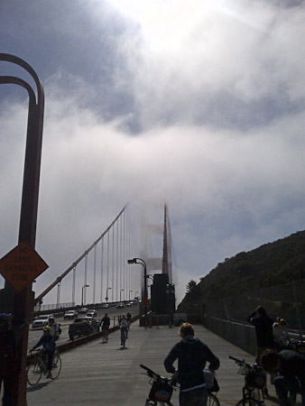</a></td>
  </tr>
  <tr>
   <td class="tr-caption" style="text-align: center;">Fog over the bridge</td>
  </tr>
 </tbody>
</table> I was completely worn out afterwards and I was glad, we made it to the last ferry which would eventually bring us back timely to join the Java Leads Dinner. We meet Debra and Alex on the ferry (<a href="http://debrasoracle.blogspot.de/2012/10/dont-tell-larry-he-thinks-were-working.html" target="_blank">compare debra's blogpost</a>&nbsp;she has a nice picture of me and Simon Haslam). After a quick shower I joined the java.net community leaders for their dinner. Thanks to Sonya for organizing it.
 

  
 <table align="center" cellpadding="0" cellspacing="0" class="tr-caption-container" style="margin-left: auto; margin-right: auto; text-align: center;">
  <tbody>
   <tr>
    <td style="text-align: center;"><a href="IMG-20120929-00494.jpg" imageanchor="1" style="margin-left: auto; margin-right: auto;">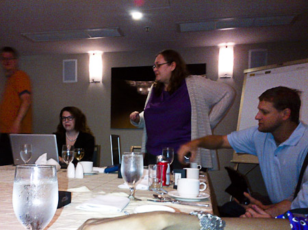</a></td>
   </tr>
   <tr>
    <td class="tr-caption" style="text-align: center;">Sonya and Frank in action</td>
   </tr>
  </tbody>
 </table> I meet soo many new faces these days. Heather van Cura is only one example. Beside this many fellows from the online world which you meet once a year on a conference far away from home. John Yeary is one of those guys.
  
  
 <table cellpadding="0" cellspacing="0" class="tr-caption-container" style="float: right; margin-left: 1em; text-align: right;">
  <tbody>
   <tr>
    <td style="text-align: center;"></td>
   </tr>
   <tr>
    <td class="tr-caption" style="text-align: center;">John and Cagatay</td>
   </tr>
  </tbody>
 </table>
 

 
 After the official part was over he took me over to the NetBeans party. This is where I first meet&nbsp;Cagatay Civici the PrimeFaces lead. A nice guy. We had some very interesting discussions and I believe we&nbsp;buried&nbsp;all our disputes finally. Thanks for some good discussions to both! And this actually was also the time for the annual Munich get-together. I ran into Adam Bien. Even if we know each other since an unbelievable long time now, we meet&nbsp;exclusively at conferences. Most often at JavaOne. Paul Bakker and Bert Ertmann also have been around the corner in the pub and this was a&nbsp;&nbsp;very nice community evening. Thanks for the invitation! The evening ended like everyone of the following in my hotel room. One sentence about jetlag and sleep: No matter what you do you feel like running on 90% until you aren't completely adjusted to the timezone. So this was an issue for the complete week. Even if I managed to get around like a normal person and not like a zombie.
  
  <b>Sunday - Breakfast, GlassFish, ACE and Keynote Day</b>
  
  Starting with the annual &nbsp;DOAG breakfast in the Marriott the JUG and Java Champion Breakfast made this morning perfect. Sharat introduced the speaker of the day and everybody was listening carefully to the upcoming&nbsp;announcements&nbsp;to be made.
  
 

  <a href="_MG_3288.jpg" imageanchor="1" style="clear: right; float: right; margin-bottom: 1em; margin-left: 1em;">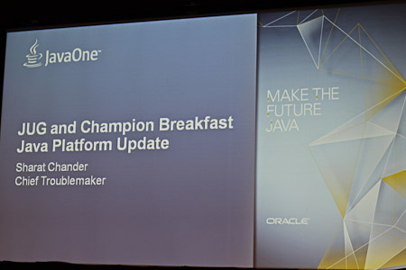</a>
 
 Most of them have been disclosed during the week and I believe the details got enough coverage. It was great to meet all the Java Champions and JUG leaders again. Thanks to Martijn, Stephan, Regina, Donald, Dalibor, Tori, Mattias, Kirk, Arun, Fabiene. Can't name them all. one breakfast isn't enough to catch up with everybody. A big thank you to Oracle for bringing all the relevant leads there. Simon Ritter, Mark Reinhold, Mike Lehmann, Cameron Purdy, Georges Saab, Nandini Ramani, Henrik Stahl to name but a few.
  
  After the breakfast I walked down to the Moscone area to attend the GlassFish Community event. Arun gave a nice introduction to all the happenings and roadmap of GlassFish. He introduced the new Java EE evangelists (welcome Reza Rahman and Bruno Borges to the team). John moderated the executives QA which was well attended and the new GlassFish t-shirt was given away! Great day!
  
 

  <a href="_MG_3345.jpg" imageanchor="1" style="margin-left: 1em; margin-right: 1em;">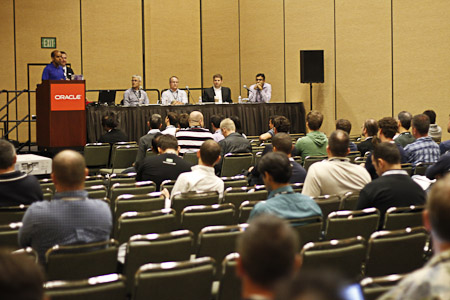</a>
 

  
  Unlike the years before this&nbsp;Sunday was also the official starting point for JavaOne this year. Somebody decided to move the keynotes from Monday to Sunday to free some additional rooms and give meaning to the day. This probably wasn't too bad. Except the fact, that they were held far away from the Hilton in the&nbsp;Nob Hill Masonic Center. Far away is not the right description. This are actually less than 7 blocks. But all uphill. After I made my peace with hills after the bike-ride this was a $5 ride with a cab to get there. There has been good coverage about the keynote already, so I am not going to repeat this here. My personal highlight was Cameron Purdy reflecting about Java EE and the shift towards cloud for EE 8. And yes, this was only because of my avatar on the slides ;)
  
  
 

  
 

  
  And of course Arun wearing the new GlassFish T-Shirt! Believe it or not: I like it! Great shirt! Already looking forward to next years contest :)
  
  
 <table align="center" cellpadding="0" cellspacing="0" class="tr-caption-container" style="margin-left: auto; margin-right: auto; text-align: center;">
  <tbody>
   <tr>
    <td style="text-align: center;"></td>
   </tr>
   <tr>
    <td class="tr-caption" style="text-align: center;">Arun wearing the GlassFish T-Shirt of 2012</td>
   </tr>
  </tbody>
 </table> The one thing I didn't like was, that I had to leave early because of the annual ACE dinner. It was held in the&nbsp;St. Francis Yacht Club. An awesome location. Next to the shore with a free and direct view to the Golden Gate Bridge. Overwhelming is not the right word to describe it.
  
  
 <table align="center" cellpadding="0" cellspacing="0" class="tr-caption-container" style="margin-left: auto; margin-right: auto; text-align: center;">
  <tbody>
   <tr>
    <td style="text-align: center;"><a href="IMG-20120930-00532.jpg" imageanchor="1" style="margin-left: auto; margin-right: auto;">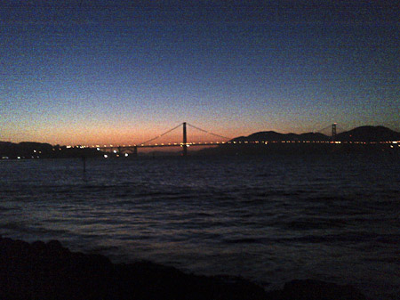</a></td>
   </tr>
   <tr>
    <td class="tr-caption" style="text-align: center;">View from the Yacht Club to the Golden Gate Bridge</td>
   </tr>
  </tbody>
 </table> I only had a few red whine because I had to give my three sessions tomorrow and I don't want to pay for that. And there was another problem: The GlassFish party. This was a day made of colliding appointments. After we managed to get a cab Todd and Bjoern joined me for a ride to the Thirsty Bear. We managed to get in for a last few drinks and saying hello to a couple of people which I didn't bump into before. Only this day would have been good for three separate days. But this is how conferences go, right? Off to bed far too late.
  
 <table align="center" cellpadding="0" cellspacing="0" class="tr-caption-container" style="margin-left: auto; margin-right: auto; text-align: center;">
  <tbody>
   <tr>
    <td style="text-align: center;"><a href="IMG-20120930-00534.jpg" imageanchor="1" style="margin-left: auto; margin-right: auto;">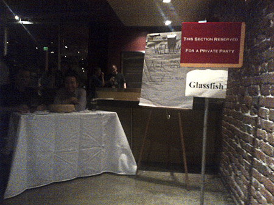</a></td>
   </tr>
   <tr>
    <td class="tr-caption" style="text-align: center;">Shaun Smith (EclipseLink) guarding the door ;)</td>
   </tr>
  </tbody>
 </table><b>Monday - My Day!</b>
  
  Believe it or not: I was a little bit excited. Not as much as I should have been probably but enough to make this kind of an adventure. I have spoken on different conferences before and even English wasn't a problem anymore after spending a few days with native speakers already. I can't remember if I had breakfast. The whole morning was dedicated to polish the slides and walk around the Zone for a coffee or two and prepare my 11am slot with Masoud.
  
 <table align="center" cellpadding="0" cellspacing="0" class="tr-caption-container" style="margin-left: auto; margin-right: auto; text-align: center;">
  <tbody>
   <tr>
    <td style="text-align: center;"><a href="IMG-20121001-00537.jpg" imageanchor="1" style="margin-left: auto; margin-right: auto;">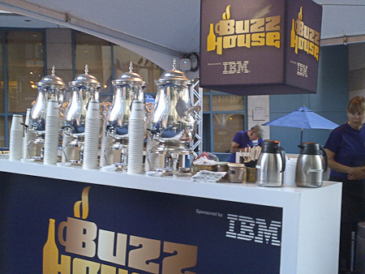</a></td>
   </tr>
   <tr>
    <td class="tr-caption" style="text-align: center;">Thank you IBM for all the #Coffee+++</td>
   </tr>
  </tbody>
 </table>
 

  <a href="IMG-20121001-00540.jpg" imageanchor="1" style="clear: right; float: right; margin-bottom: 1em; margin-left: 1em;">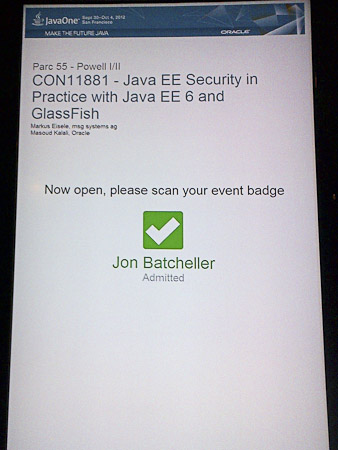</a>
 
 Staying at the Hilton with most of the buzz happening there it is still a challenge to reach out to Nikko and Park55 for the other sessions. We have been put to the Park55 with our session and it took me quite some time to find the room. The on-site direction-guys did send me from one to the other and I managed to get there more or less in time. After some preparations with the A/V guy, we started timely and had more than 40 attendees listening to what we had to say about security, OWASP and GlassFish. It was my second run through the first part but I managed to polish some of the rough edges and could hand over the second half to Masoud. After all I was happy with the show and hope that the attendee feedback will mirror this to a certain extend. Thanks everybody for listening. You can download the slides and audio recording from the session on the <a href="https://oracleus.activeevents.com/connect/sessionDetail.ww?SESSION_ID=11881" target="_blank">conference website</a>.
  
  
 

  <a href="IMG-20121001-00544.jpg" imageanchor="1" style="clear: left; float: left; margin-bottom: 1em; margin-right: 1em;">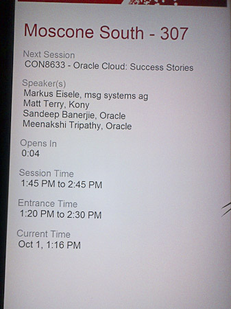</a>
 
 The next presentation was scheduled for 13:15. This was an Oracle Open World break out session for which I had to prepare my experiences with the Oracle Java Cloud Service from a customers perspective. Oracle's Sandeep Banerjie lead the session and gave a more general introduction into Oracle's new offerings. Followed by Matt Terry (Kony) who gave an overview about their product and how they run it on the Oracle cloud. After that I had my 8 minutes to talk about Java EE capabilities and influences by the cloud offering for projects in general.
  
  The session went well but we didn't had too many attendees. Which wasn't surprising after all because it was more like a marketing session. I don't want to judge here, it is also possible that there are far too many parallel sessions at OpenWorld which makes it very very hard for everybody to get a working schedule with all the right interests. A big "Thank you" goes to Björn who was sitting in the audience and showing his support! :)
  
 

  
 

  
  A hurry back to "The Zone" to the pre-briefing of the Webframework Smackdown BOF later the day. It was a pleasure to meet James Ward and&nbsp;Graeme Rocher. Ed and Santiago didn't manage to meet us but we synced earlier to talk about the stuff to come and how I want to do this. The following few hours were dedicated to walking around the exhibition hall and checking back with distant friends from different companies. The exhibition halls were located at last years keynote location and looked very good. Condensed information by the usual suspects. But also some (at least to me) more unknown companies. Thanks to the Cloudbees guys for some nice t-shirts and great chats with Steven and Mark, thanks to the JRebel guys for some awesome games and entertaining demos. RedHat was doing the annual booth conference thing. To me this didn't work this year. To less space, too much distracting things happening around. The whole thing taken to a next level happened at Moscone West. The Oracle OpenWorld exhibition hall was packed and all the major companies attending JavaOne had a double to tenth the size booth over there. But back to my Monday. 20:30 was smackdown time. The latest BOF I ever attended. But, believe it or not between 350 and 400 attendees made this a great event. Missing a panorama feature in my stupid BlackBerry I can only show you the right half of the room minutes prior to the start. And people were still flowing in. Awesome! Thanks to all the panelists and the great audience who made my job as a moderator easy. The Audio recording has been posted to the <a href="https://oracleus.activeevents.com/connect/sessionDetail.ww?SESSION_ID=4149" target="_blank">conference website</a>.
  
  

 

  <a href="IMG-20121001-00550.jpg" imageanchor="1" style="margin-left: 1em; margin-right: 1em;">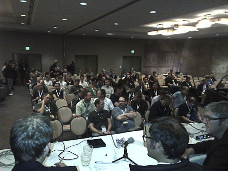</a>
 

  
  What is left after such a&nbsp;successful&nbsp;day? A great party! First the JUG and Java Champions get-together which was nearly over as I arrived and afterwards the legendary&nbsp;JRebel guys which gave a nice little party in the presidential suite of the Hilton. The&nbsp;"RebelHideout VIP party" was a success. Great people, great drinks, great discussions. A little noisy ... and we had to leave early :)
  
  
 <table align="center" cellpadding="0" cellspacing="0" class="tr-caption-container" style="margin-left: auto; margin-right: auto; text-align: center;">
  <tbody>
   <tr>
    <td style="text-align: center;"></td>
   </tr>
   <tr>
    <td class="tr-caption" style="text-align: center;">JRebel meets Jelastic :)</td>
   </tr>
  </tbody>
 </table>

<b>Tuesday Technical Keynote</b>
 
 Tuesday started relaxed. A nice breakfast and nothing exciting beside some sessions and some personal appointments. Followed by the OpenWorld technical keynote about&nbsp;&nbsp;Oracle's Cloud Platform and Applications Strategy given by&nbsp;Thomas Kurian, Executive Vice President, Product Development. Normally I wouldn't count this as too exciting but this time I had to play a tiny little role in there. As a customer reference. The recording took place a week before OpenWorld in Munich and I was excited to see my face on the big screens. You probably know what it feels like watching a recording of yourself. It was the same with this one. But it was huge :) Thanks again to Björn for taking this short video. If you are interested in the complete keynote get it from <a href="http://www.oracle.com/openworld/live/on-demand/index.html" target="_blank">Oracle On Demand</a>.
 
 <iframe class="twitvid-player" frameborder="0" height="360" src="http://telly.com/embed.php?guid=I2WSQ&amp;autoplay=0" title="Telly video player " type="text/html" width="480"></iframe>
 
 
 The "meet the Java EE 7 Spec-Leads BOF" lead by Linda and Bill was the next highlight on the schedule. Most of the Java EE spec leads attended a great panel discussion and received plenty of feedback from the audience.
 

 

 
 Directly afterwards we moved to the JCP annual gathering which was combined with the JCP awards ceremony. I had a nice chat with Mark Little and Pete Muir over a beer and together with Alex we moved over to the RedHat party which should be the final point for the evening. It was good to join Aslak, Lincoln and all the other RedHat guys for a beer or two. I wish I have had more time talking to Jevgeni and Martijn and Ben and Trisha. And the RedHat community guys Rayme and Ray. But we all have the same problem during those events. Too many people to say hello to and too less time for a longer talk. Anyway, thanks for hosting the party RedHat! It was great!
 
 

 

 <b>Wednesday - Appreciation Event</b>
 
 The Wednesday was all about personal meetings and some sessions. Running into people everywhere. The most exciting aspect of JavaOne. I had nice discussions with strangers about the right web framework, about the future direction of Java EE (why cloud?) about JSF and ADF and last but not least with some of the nicest persons in the universe: The WebLogic PMs! Thank you sooo much Frances! It was great meeting you! After a day of walking between Moscone and Hilton I was worn out and the party didn't even start over. I meet David Blevins for a beer in "The Zone" and we had a great chat which ended by teaming up with his wife Amelia and Bruno Borges. Together we headed over to the big party on the little Island.
 
 

 <a href="IMG-20121003-00583.jpg" imageanchor="1" style="margin-left: 1em; margin-right: 1em;">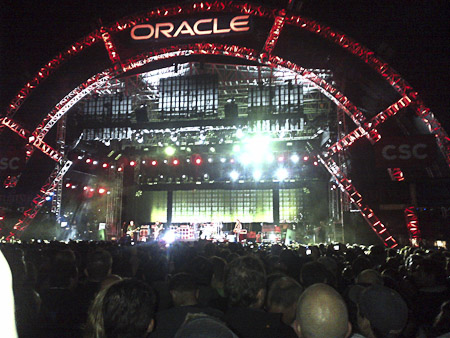</a>

 
 
<table align="center" cellpadding="0" cellspacing="0" class="tr-caption-container" style="margin-left: auto; margin-right: auto; text-align: center;">
 <tbody>
  <tr>
   <td style="text-align: center;"></td>
  </tr>
  <tr>
   <td class="tr-caption" style="text-align: center;">Bruno, Markus, David</td>
  </tr>
 </tbody>
</table> A marvelous evening! We had a great time with a couple of red wines and beer and great music! You guys rock! Thanks for that night! If you ever need someone to party with, give me a call!
 
 <b>The rest of the week</b>
 
 JavaOne was basically over for me after that. The following days were reserved for sightseeing and some DOAG internal discussions and preparations. Thanks for your fellowship Björn! OpenWorld and JavaOne wouldn't be the same without you! I'll leave you with some impressions from a city which get's turned upside down during a few days in September!
 
 
<table align="center" cellpadding="0" cellspacing="0" class="tr-caption-container" style="margin-left: auto; margin-right: auto; text-align: center;">
 <tbody>
  <tr>
   <td style="text-align: center;"><a href="IMG-20121005-00597.jpg" imageanchor="1" style="margin-left: auto; margin-right: auto;">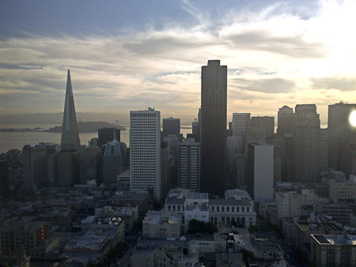</a></td>
  </tr>
  <tr>
   <td class="tr-caption" style="text-align: center;">Wonderful view on the skyline</td>
  </tr>
 </tbody>
</table>
 
<table align="center" cellpadding="0" cellspacing="0" class="tr-caption-container" style="margin-left: auto; margin-right: auto; text-align: center;">
 <tbody>
  <tr>
   <td style="text-align: center;"></td>
  </tr>
  <tr>
   <td class="tr-caption" style="text-align: center;">A nice car plate</td>
  </tr>
 </tbody>
</table>

  

<table align="center" cellpadding="0" cellspacing="0" class="tr-caption-container" style="margin-left: auto; margin-right: auto; text-align: center;">
 <tbody>
  <tr>
   <td style="text-align: center;"></td>
  </tr>
  <tr>
   <td class="tr-caption" style="text-align: center;">Oracle Music Festival on Union Square</td>
  </tr>
 </tbody>
</table>

  

<table align="center" cellpadding="0" cellspacing="0" class="tr-caption-container" style="margin-left: auto; margin-right: auto; text-align: center;">
 <tbody>
  <tr>
   <td style="text-align: center;"></td>
  </tr>
  <tr>
   <td class="tr-caption" style="text-align: center;">The Blue Angels flying over SF</td>
  </tr>
 </tbody>
</table>
 