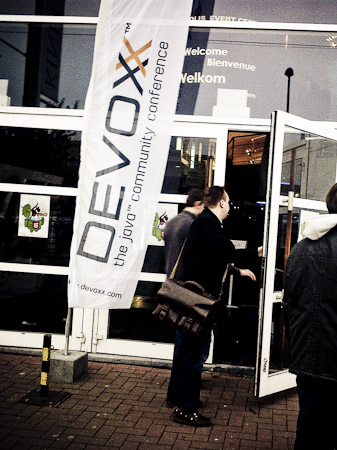
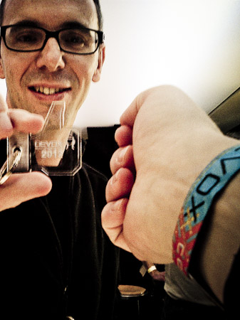
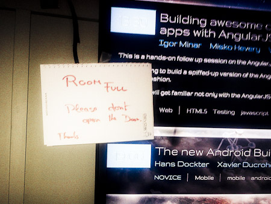
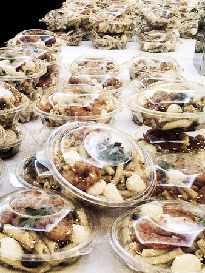
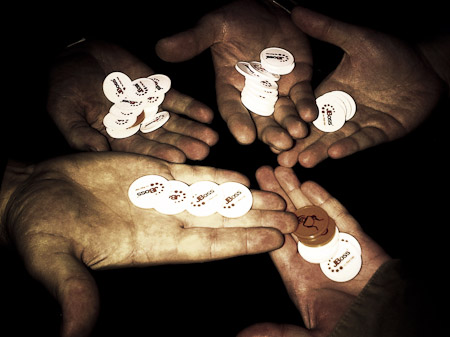

This has been an exciting week. After leaving JavaOne this was the next conference on my schedule. Somehow insane given the fact, that I hardly had a chance to clear all the work that has been left over. Leaving for <a href="" target="_blank">Devoxx</a> on a Sunday was a good thing. No rush hour. Everybody was relaxed and I had a perfect pre-event check-in which all the required things at hand.
 

 

 
 The venue is for sure special. What is a big cinema center normally turns into a conference venue for this special week in November. Stephan and his crew have been hard at work to deliver all the needed connectivity and infrastructure. A little bit sad to see, that we had to use the side entrance and therefore many cab drivers dropped the passengers to the main entrance which leaves you stumbling around without any true indicator where to go. But this obviously is a first-timer problem only. Which was true for me. During the last few years Devoxx used to be in parallel with the German Oracle User Group conference DOAG Conference. Not this year and it gave me a good chance to take on the challenge of traveling to Belgium.
 
 

 

 After I had the pleasure to receive my wrist-band from Stephan himself I was walking around a bit and took the cab back to my hotel. The Scandic Antwerp was far off from anything. Nearly 45minutes public transfer to ride to the center. Probably more than an hour to walk to the venue. Given the fact that it looked better on the map, it turned out to be a&nbsp;disaster. Cold rooms, limited breakfast. I need to remember to give them a 1* rating somewhere.
 
 <b>Monday 12th of November - University</b>
 
 Was the start of the conference. All the cinema rooms have been equipped with wifi and a speakers desc and tons of cables and further recording things. The crowd instantly build up in-front of the registration desks and it took a while until everybody was done. It was the first of two <a href="http://www.devoxx.com/display/DV12/University" target="_blank">university days</a>. With 18 talks in two days you could imagine that those are longer than usual and contain a more detailed analysis of the topics. I had the pleasure to listen to Paul Bakker and Bert Ertmann and Kirk Knoernschild about modularity today. Very impressive talks with a broad coverage of all the basic principles. Anyway, three hours is a brave thing to do as a speaker. If someone messes up something here you are loosing your audience for the rest of the talk. This is scary and the limited diversification with the long talks didn't work too good for me. Anyway, I believe I wasn't the target audience at all. All in all the lineup was good, the rooms very impressive for a first-timer and &nbsp;I also liked the tweet wall that was running in-between the talks. All room panels were powered by beagle-boards and JavaFX. Very cool technology.
 

 

 Monday night was beer-walk time. With 40 registered speakers this could have been a huge crowd walking through the ancient Antwerp on the beer-hunt. At the end of the day it was a smaller group of 20 people walking around and learning about the beer tradition and some of the historic buildings. Thanks to all the attendees for the nice chats and great atmosphere. And thanks to the Devoxx team for&nbsp;organizing&nbsp;this. It was big fun!
 
 <b>Tuesday, 13th of November - University</b>
 
 Another University day on Tuesday. Same rules, same criticism. I should mention the "<a href="http://www.devoxx.com/display/DV12/Tools+in+Action" target="_blank">Tools in Action Talks</a>". Those are&nbsp;30 minute talks during the University days in the later afternoon.&nbsp;Here speakers get the opportunity to demonstrate a Java tool that they've created and are passionate about! The rooms have been packed. The same was true for the "<a href="http://www.devoxx.com/display/DV12/Labs" target="_blank">Labs Track</a>". The feedback I got was very passionate and positive. Give n the fact, that you get the chance to attend a couple of labs&nbsp;trainings along the conference this is added value for anybody paying the ticket. You normally only get one training for the price of a Devoxx pass.
 
 

 

 Let's talk briefly about food. It was conference food. Breakfast mostly consists of pastries. Lunch was a&nbsp;baguette kind of thing or little salads. And a soup. Don't ask me about the little pre-packaged sweets for coffee.
 

 

 Thank god there are a couple of restaurants around the venue. Even for those which doesn't rely on anything else than coffee, this was hard. The good part: There was plenty of coffee around. From early morning until late evening. Same for all kind of soft-drinks and water. That is awesome! Bottom-line is that you are not going to Devoxx for food. Period.
 
 I should mention the <a href="http://www.devoxx.com/display/DV12/BOFs" target="_blank">BOFs</a>. Happening every evening&nbsp;throughout&nbsp;the whole conference beginning 19:00 lasting to 22:00. The most impressive schedule I have seen going more than 12h per day. Given that, you should prepare yourself with a good night sleep before you come here. If you get 6h during the day you are a lucky person.&nbsp;Tuesday also was the day the <a href="http://www.devoxx.com/display/DV12/Exhibition+Floor+Plan" target="_blank">Exhibition Floor</a> opened. Located in the basement surrounded by some nice and quite places to hide and some boxes you could easily walk along the booths in a few minutes. But some nice vendors with a couple of raffles and giveaways.&nbsp;
 

 

 <b>Wednesday 14th of November - The start of the sessions</b>
 
 This was the part of the <a href="http://www.devoxx.com/display/DV12/Conference" target="_blank">conference</a> I had waited for. A lot of big names on the schedule and the most exciting part is, that Google is allowing their speakers to attend this conference other than they do for JavaOne. The setting changed a bit. We had another impressive line at the registration and the conference got crowded.
 

 

 If you were wondering where the 3000 people are, you finally knew. All in one place running around from one talk to the other and trying to get one of the mentioned lunch things or drinks. The soft-drink coolers started to empty faster than they were refilled, the afternoon sweets became a reason to wrangle with each other and the bins in the session rooms started to fill up.
 
 The content? One word: Amazing! 97 session. Well known names. A RedHat and Google Keynote. Oracle all over the place with a booth next to Google. How cool was that? Nighthacking with Stephen Chin and interviews and hackers-garden and meetings and networking. Meeting people and talking about upcoming stuff. Nearly all have been there. A true international conference. It was a pleasure to meet sooo many people. If I would try to name them here, I would fail. Thank you all for taking some of the precious time to contribute to the Java community by listening and trying to shape it. This also was the day for David's and my BOF. We had quite a few spec leads around and also the JCP was there. Beside the fact, that we didn't discuss any technical topics we had a nice hour which could have gone for another if we would have been the last BOF of the day.
 

 

 <b>Thursday 15th of November - More conference</b>
 
 After another short night sleep the Thursday also promised some very interesting sessions. And it had some more stuff in stock. We have seen the short-list of the new names for RedHat's JBoss Application Server (BaseJump, WildFly, jBeret, Petasos, Jocron - jboss.org/vote) and a nice keynote with Nandini Ramini and Tim Bray. My secret favorites were the Naos. Awesome but expensive toys.
 

 

 The exhibition floor was already partly taken down and the running interviews by the Arquillian team ended up having not enough light and power. It was a rough end for the day.
 
 The good parts were, that we had some nice BOFs. One run by Sonya Barry about Java.Net and I also attended the JBoss AS BOF which was followed by a nice dinner with all the RedHat server guys. Thanks for that Ray and Mark! It was a pleasure meeting you and I need to thank you once again for making this whole Java EE thing even more valuable with all your great OSS projects!
 
 After that it was party time at Devoxx. Stephan rented the <a href="" target="_blank">Noxx Antwerp</a>&nbsp;which is one of the more famous clubs around. We had a good start with a couple of RedHat sponsored beers and good music. Overall it was a very noisy location and even the announced "more silent room" was still too noisy to have a nice chat. At the end of the day it ended up with a couple of geeks having a great disco night. 
 
 

 

 <b>Friday 16th of November - It's all over now.</b>
 
 The final day of the conference. Still half a day full of sessions but mostly done now. The exhibition floor has been rebuild completely, some rooms have been closed down. And the remaining attendees tried to make sense from&nbsp;themselves. A typical last day of a conference. I had to leave before noon to catch my flight back. It was a fun week overall. Last but not least my two coworkers added to that with all their jokes and entertaining ideas and problems. Thanks Ralf for the great companion! Thanks Jürgen for the location knowledge and your excitement! I am really looking forward to next years <a href="http://www.devoxx.com/display/UK13/Home" target="_blank">Devoxx UK</a>.&nbsp;&nbsp;Find some more picture impressions on my <a href="https://plus.google.com/100362024804331957185/#100362024804331957185/photos" target="_blank">G+ page</a>.