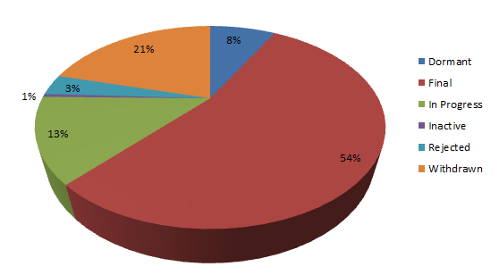

You all know about the <a href="" target="_blank">Java Community Process</a> (JCP), don't you? The JCP is the mechanism for developing standard technical specifications for Java technology. Anyone can register for the site and participate in reviewing and providing feedback for the Java Specification Requests (JSRs), and anyone can sign up to become a JCP Member and then participate on the Expert Group of a JSR or even submit their own JSR Proposals. The ongoing works on transparency is a good sign for this institution and all the individual JSRs to become more relevant to the community finally. But did you ever wonder how many JSRs are there? In which state they are? Or who is the spec-lead? I collected some public information and run some analysis on them.
 
 <b>How many JSRs are there?</b>
 
 According to the <a href="http://jcp.org/en/jsr/platform" target="_blank">JCP Website</a> we have 192 JSRs in the three different platforms. Java EE (47 JSRs), Java SE (60 JSRs) and Java ME (85 JSRs). If you parse the complete list of all JSRs you get a total of 388. 
 
 

 

 
 In numbers this means: 31 Dormant, 209 Final, 52 In Progress, 2 Inactive 13 Rejected, 81 Withdrawn. I don't have a good explanation for the difference here. There are even more final JSRs than the 192. Might be an out-dated number.
 
 <b>How many of them are lead by Oracle?</b>
 
 With that impressive Numbers it would be interesting to see, how many of them are actually lead by Oracle:
 

 

 More than 68 % (177) out of 261 (Final and In Progress State) are lead by Oracle or together with Oracle. The 32% (84). The next biggest number of JSRs run by a company is provided by IBM which leads 9 JSRs followed by&nbsp;North Sixty-One Ltd and Nokia Corporation (7). &nbsp;RedHat owns 5. Google still has one JSRs sitting in there.
 
 
 
 