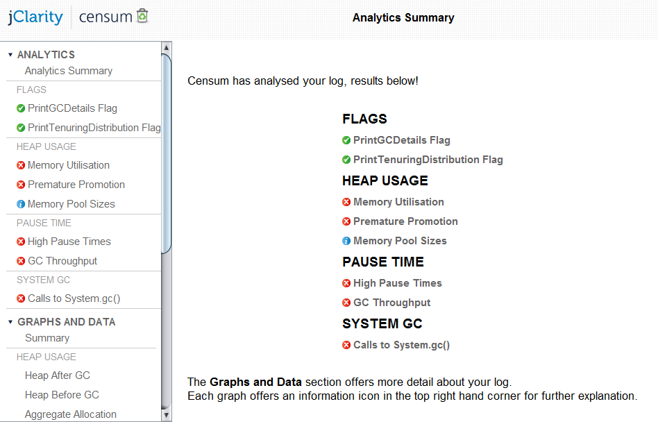
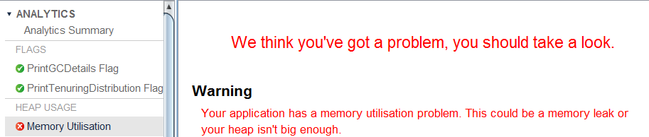

Have you heard about jClarity? This is a new start-up with some great ideas and solutions around Java Performance. You probably know the team behind that: Both London Java User Group leaders Ben Evans (CEO) and Martijn Verburg (CTO) joint forces with Mr. Performance Kirk Pepperdine (Chief Scientist) 
 

 

 and are willing to provide some freaking tools to analyze and monitor your performance java struggles. <a href="" target="_blank">Their first product Censum</a>&nbsp;is in closed beta since a while now and with the release only a few days away the jClarity guys kindly allowed me to publish this little summary about it.
 
 <b>What is Censum?</b>
 
 Censum by the original translation means the estimate of property value by a census or censor. Taken into the Java world, Censum is the analysis tool that tells you in plain English what your Garbage Collection (GC) performance problem is and how to fix it. Instead of having to read the GC log entries produced by -verbose:gc -XX:+PrintTenuringDistribution -XX:+PrintGCDetails which is very condensed and hard to interpret
 
 3.491: [GC Desired survivor size 29360128 bytes, new threshold 1 (max 15) [PSYoungGen: 672297K-&gt;22814K(666496K)] 727139K-&gt;91144K(753792K), 0.0285996 secs] [Times: user=0.13 sys=0.00, real=0.03 secs] you simply import the logfile to Censum and let the smart guys do the work for you. Censum does all of the parsing, number crunching and statistical analysis for you, so you don't have to go and get that PhD in Computer Science in order to solve your GC performance problem.
 
 <b>How does it look like?</b>
 
 First thing to do is to get some decent gc logs. All you have to do is to enable the GC details with the above mentioned arguments and write them to a logfile with the additional option -Xloggc:d:\gc.log. After importing it to censum you are presented with a nice and clear analytics summary. 
 

 

 
 This summary presents an overview of the findings. You can dig into any of those via the tree on the left and get further details about the individual finding. Beside the fact, that you get the findings in plain English
 

 

 
 You also get some hints on the solution. Honestly there is not much Censum could read from a high utilized heap but it points you to some things to dig into. It does a better job with proposing generation sizes. Generated from the memory profile of the analyzed snapshot you get a recommendation for the Tenured and YoungGen pool sizes (with the serial collector). It also detects high pause times and calls to System.gc().
 
 But that isn’t all. You also have some nice visualizations to assist you with the analysis.
 

 

 
 Censum is a lightweight Java native client. The beta has a size of roughly 6mb and can be launched from your desktop.
 
 <b>What is next?</b>
 
 Censum left private beta today and you can get hand on that stuff yourself at <a href="">their shop</a>. If you ever had to deal with gc logs you will see a high productivity boost by using Censum. And I personally can’t help myself: Using it feels like having Kirk himself sitting next to you and telling you where to look at. A great new way for garbage collection optimization.
 
 Good luck to the team! I am really curious for all the other upcoming stuff!