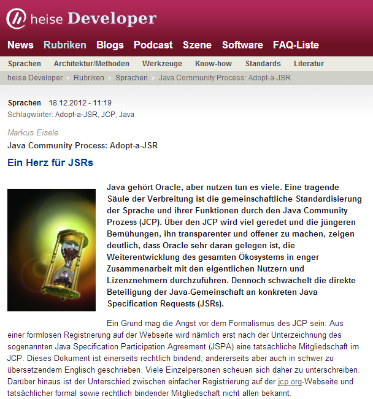

A short information for my German audience. My latest article was published today. It is about the Adopt-a-JSR program and describes all the details and motivations behind it.
 
 Read it <a href="http://heise.de/-1771091" target="_blank">online free of charge in German</a> on the <a href="http://heise.de/developer">heise.de/developer</a> website.
 
 

 

 Java Community Process: Adopt-a-JSR
 <b>A soft spot for JSRs</b>
 
 Java belongs to Oracle, but it is used by a lot of developers. A key pillar of its success is the joint standardization of language and its features through the Java Community Process (JCP). A lot has been talked about the JCP, and the more recent efforts to make it more transparent and open, clearly show that Oracle is keen to carry out the development of the entire ecosystem in close collaboration with the actual users and licensees. Nevertheless the direct participation of the Java community on individual Java Specification Requests (JSRs) is too weak. 
 
 
 Curious about your feedback!
 
 
 You're free to try <a href="http://translate.google.com/translate?sl=de&amp;tl=en&amp;js=n&amp;prev=_t&amp;hl=en&amp;ie=UTF-8&amp;eotf=1&amp;u=http%3A%2F%2Fwww.heise.de%2Fdeveloper%2Fartikel%2FJava-Community-Process-Adopt-a-JSR-1771091.html&amp;act=url" target="_blank">translate.google.com</a> on this one. Its not as nice as it could be :)