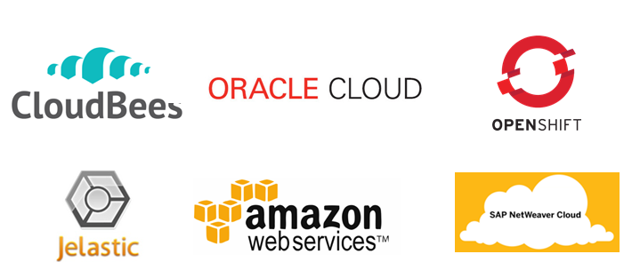

Have you ever wondered what it takes to get your Java EE up and running somewhere? I did. For years. Started with hosting my own, moved on to some <a href="https://blogs.oracle.com/arungupta/entry/totd_153_glassfish_hosting_options">hosting offerings</a> and finally stumbled upon the PaaS movement. Honestly I didn't take all that too serious. I simply wanted to run my stuff somewhere and didn't care too much about the solution. That changed over the past couple of months with the emerging offerings around. Especially with the many different offerings which label themselves XaaS. Seems to be the right time for a closer look.
 
 <b>From XaaS to Java EE – Which damn cloud is right for me? </b>
 
<table cellpadding="0" cellspacing="0" class="tr-caption-container" style="float: right; margin-left: 1em; text-align: right;">
 <tbody>
  <tr>
   <td style="text-align: center;"></td>
  </tr>
  <tr>
   <td class="tr-caption" style="text-align: center;">(c)2012 msg systems ag</td>
  </tr>
 </tbody>
</table> Ever single presentation on that topic starts with a general overview about XaaS offerings and how they compare. Given that I believe that there is still some need to introduce the different four letter acronyms. This nice little picture originated in kind of an innovation project done for <a href="http://www.msg-systems.com/unt_technological_co.0.html" target="_blank">my company</a>. It basically tells you all you need to know about XaaS. Starting from the plain iron (IaaS, Infrastructure as a Service) you go up the latter to candyfloss (SaaS, Software as a Service). Somewhere in-between is PaaS (Platform as a Service) which basically addresses some kind of pre-packaged stack to manage and run you applications on. And this category is exactly the one where you would fit application platform like Java EE in. I'm not going to drill that further down. There is plenty of theory around different sub-categories for <a href="http://en.wikipedia.org/wiki/Platform_as_a_service" target="_blank">PaaS</a>. I simply don't care about that because I'm not willing to write a master thesis but a practical guide.
 
 <b>PaaS isn't PaaS. The Selection process and the Candidates</b>
 
 What I do want to do is to separate the many available offerings a bit. I decided not to accept anything but offerings with a clear and certified&nbsp;pre-configured&nbsp;Java EE container. This is the reason why you will not find GAE or CloudFoundry or heroku in here. They all offer some kind of Java application hosting but no Java EE container. Here are the candidates.
 
 

 

 <i>Amazon ElasticBeanstalk</i>
 
 Amazon Web Services (abbreviated AWS) is a collection of remote computing services (also called web services) that together make up a cloud computing platform. One of them, Amazon Elastic Beanstalk provides quick deployment and management of applications in the cloud. Running Tomcat 6+7 only doesn't qualify for this shootout normally. But I am making an exception here because it is the most well known cloud offering and one of the oldest ones. Lets look at it as kind of a reference in this comparison. Register your account via&nbsp;<a href="" target="_blank">aws.amazon.com/elasticbeanstalk/</a>
 
 <i>Oracle Cloud - Java Service</i>
 
 One of the new kids on the block. Announced two years back at Oracle's annual trade fair it is now slightly rolling out to the public. Honestly I don't have an account at the time of writing but I participated in the early access program and had a chance to test it extensively. The Java service is only one part of the extensive offering. It basically comes down to a WebLogic Server to host your applications on. Access it via <a href="" target="_blank">cloud.oracle.com</a>.
 
 <i>CloudBees RUN@cloud</i>
 
 One among the established providers. CloudBees was founded in early 2010, is incorporated in the United States and lead by a couple of former JBoss, Oracle and VMware people. Their most prominent move was to join the JCP (Java Community Process). They offer a Java EE Web Profile stack based on JBoss AS 7. Learn more about their offerings on <a href="" target="_blank">www.cloudbees.com</a>
 
 <i>RedHat OpenShift</i>
 
 OpenShift is Red Hat's free, auto-scaling Platform as a Service (PaaS) for applications. This includes many different stacks for many languages. One among them is the AS 7 with the Java EE 6 Full Profile features. You can find all offerings on <a href="" target="_blank">openshift.redhat.com</a>
 
 <i>Jelastic</i>
 
 I meet the guys two years back at JavaOne. A very tiny booth and they were handing out business cards with trial codes on them. It has been a ride for them since then. DukesChoice Award winner this year and more and more hosting providers as partners. Beside the Java EE offering (GlassFish 3) they also run jetty and Tomcat in the cloud. Find out more at <a href="" target="_blank">jelastic.com</a>
 
 <i>SAP NetWeaver Cloud</i>
 
 This wasn't on my initial list but some of their developer advocates pointed me to the Apache Virgo based Java EE Web Profile offering they have. Enough to find out more and add it to the list. Find out more&nbsp;<a href="http://bit.ly/sapnwcloud" target="_blank">bit.ly/sapnwcloud</a>
 
 <b>The Rating</b>
 
 Now that we do know a little about the candidates it is time for a first look at the rating. First assumption I made was that I am comparing the different "free offerings". So this might not completely reflect the truth if free and purchased tiers do differ too much. The one exception is Amazon. They don't offer a free tier.
 
 One remark: I have been asked to include SLA or pricing information in this rating. I decided not to do it. The reasons are obvious. The focus was on functionality and the free offerings. Looking into pricing would open another door I am not willing to open as of today.
 
 The rating happened with 35 individual metrics ordered in&nbsp;five different categories:
 
 <i>Administration (10)</i>
 
 Metrics that describe the registration process and the overall experience with instance creation and configuration. It also weights the&nbsp;accessibility of pricing information and the time it takes to get the environment up and running.
 
 <i>Development (11)</i>
 
 This category contains metrics around the number of different servers products, Java EE features (WP, FP), included services (e.g. database), SDK behaviour, Security, custom JVM args and more.
 
 <i>Deployment (7)</i>
 
 Metrics asking for IDE support, build support (maven, ant), usability of the web consoles and access to logfiles.
 
 <i>Operations (4)</i>
 
 Captures some few metrics around monitoring.
 
 <i>Ecosystem (3)</i>
 
 Weights in the available support options and community sizes and activity.
 
 
 Given the distribution of the metrics this is clearly administration and development centered. I didn't&nbsp;weighted&nbsp;this further because I simply like it to be like this.&nbsp;Every metric had three different characteristics where one was assigned. Depending on the question most of them could be answered following the following scheme:
 
 0: Not possible / low end / Unusable / Slow / No
 
 1: Average / Usable
 
 2: Top notch / Fast / Yes
 
 <b>The Results at a Glance</b>
 
 After everything has been ranked there was a total of 70 points (100%) to&nbsp;achieve.
 

 

 
 Jelastic clearly leads the crowd here with 73 % of the possible points. Direct follower is Cloudbees with their RUN@cloud offering. OpenShift takes the proud third place in this ranking. The detailed and normalized breakdown by category reveals where everybody has it's strength and weaknesses.
 

 

<b>Summary and Outlook</b>
 
 I know that this rating has very few concrete data-points to hold on to. And I'm going to disclose them over the next few months. I am also willing to do a more detailed review of the individual candidates.&nbsp;So consider this as a first round for late 2012 which will get updated during the next year. Happy to read your thoughts and ideas!