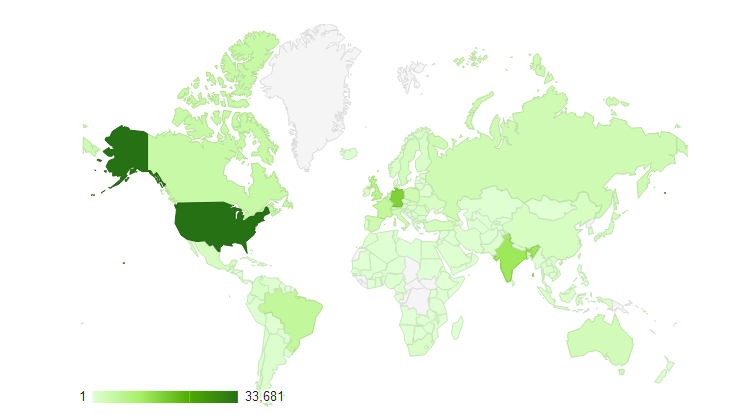

...and I'm honored to have the&nbsp;opportunity to write a short recap of this great year at close to 5am in the Morning while mostly everybody in Germany is still asleep. It was an intense year. In terms of travel, conferences and even the business side of my life was very&nbsp;challenging. Lets look at some numbers.
 
 <b>Visitors and some Demographics</b>
 

 

 115,419 unique people visited this blog during the last year! Awesome! Thanks a lot for your time and I am glad to receive any feedback you have. Altogether they produced 209,435 Pageviews. The majority of my readers is based in the US, with Germany and India as close follower. Visitors from different countries do not differ in other metrics like pages per visit or length of their visits.
 
 <b>Browsers and Technologies</b>
 

 

 I was a bit surprised to see a strong Firefox presence on my blog. After Chrome it is the second most frequently used browser. Internet Explorer marks the third place followed by the Safari brand.
 
 Looking at the mobile devices is a bit more interesting. A total of 284 different devices identified&nbsp;themselves and the crowd was lead by Apple's iPad and iPhone. Second place goes to a bunch of Android powered flagship phones.
 
 <b>Content</b>
 
 What content are you guys here for? The top the pages this year are responsible of roughly 1/4th of the overall traffic. Beginning with the January Heroes of Java Interview with <a href="http://blog.eisele.net/2012/02/heroes-of-java-ward-cunningham.html" target="_blank">Ward Cunningham</a>&nbsp;(9,932 Pageviews) the <a href="http://blog.eisele.net/2012/03/java-ee-6-galleria-example-part-1.html" target="_blank">Galleria kick-off posting</a>&nbsp;(6,573) also had some fans. The form <a href="http://blog.eisele.net/2011/01/jdbc-security-realm-and-form-based.html" target="_blank">based&nbsp;authentication&nbsp;example with GlassFish and PrimeFaces</a> was the third most viewed post on the blog.
 
 <b>Seven Conferences in 12 Months</b>
 
 It all started with <a href="http://blog.eisele.net/2012/02/jfokus-2012-trip-report.html" target="_blank">Jfokus in February</a>. Followed by my <a href="http://blog.eisele.net/2012/06/judcon-trip-report-2012.html" target="_blank">JUDCon trip to Boston</a>, the <a href="http://blog.eisele.net/2012/09/some-javazone-2012-impressions.html" target="_blank">JavaZone in Oslo</a>&nbsp;and <a href="http://blog.eisele.net/2012/10/trip-report-oracle-openworld-and.html" target="_blank">JavaOne together with Oracle OpenWorld</a> in September. <a href="http://blog.eisele.net/2012/11/devoxx-2012-trip-report.html" target="_blank">Devoxx Belgium</a>&nbsp;in between&nbsp;and &nbsp;Doag Conference in Nuremberg and finally Jay-Day in Munich made this an exhausting but wonderful year. Given the fact, that it is not officially part of my job description to be part of the conference circus I enjoy talking about my favorite topics and I'm glad you like to listen! So, thanks to everybody attending one of two of my sessions! Looking forward meeting you somewhere next year!
 
 <b>Its a wrap! Happy new year!</b>
 

 

 Time for me to close the 2012 edition of this blog. I would be very honored to welcome you back next year which has some fancy new stuff and upcoming technologies in stock!
 
<blockquote>
 “We will open the book. Its pages are blank. We are going to put words on them ourselves. The book is called Opportunity and its first chapter is New Year's Day.” <i>― Edith Lovejoy Pierce</i>
</blockquote>