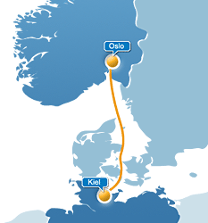

I'm very proud to announce that I will be speaking at this year's Norwegian Oracle User Group (OUGN) <a href="http://www.ougn.no/vrseminar-2013" target="_blank">Vårseminar</a>. Not only because I am excited to visit Oslo again but mostly because of the unique venue. A full day at the Radisson Blu Scandinavia Hotel in Oslo is followed by the main part of the conference which is held on the <a href="http://www.colorline.com/ships_and_sailings/kiel_-_oslo" target="_blank">Colour Magic Cruise Ferry</a> sailing from Oslo to Kiel and back. 
 
 

 

 As far as I know, this is the only conference happening on a cruise ferry. I have seen the reports about last years conference and was always wondering what cool event this would be. This year it is on me to bring Java and Java EE to another Oracle User Group Conference. And I can tell you, I have a bag full of stuff to talk about.
 
 
 Thursday, April 18, 5pm-6pm
 <b>The Java EE Cloud Smackdown (P37)</b>
 
 With Java EE 7 cloud should have been added to the specification. Allowing for a broad ecosystem of PaaS providers to jump on the train. Because of the missing maturity and field experiences this has been delayed to EE 8. However there are some offerings on the market already. This talk throws light onto how they differentiate from each other and which ones are the right ones for Java EE. Featuring: CloudBees, OpenShift, Elastic Beanstalk, Jelastic and Oracle Java Service.
 
 
 Friday, April 19, 5:45pm-6:45pm
 <b>WebLogic in the Cloud (P44)</b>
 
 The new Oracle Cloud offering has been launched at last year's OpenWorld. Now it is finally time to get your hands dirty and learn everything you need to know to develop your own applications for Oracle's Java Service.
 
 
 Additionally there will be plenty of time to talk and exchange experiences. Thanks for the invitation! I am very much looking forward seeing you there! Don't forget to have a look at the <a href="http://www.ougn.no/vrseminar-2013" target="_blank">complete schedule and register</a> if you haven't done so!