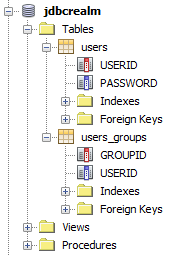

One of the most popular posts on my blog is the short tutorial about the <a href="http://blog.eisele.net/2011/01/jdbc-security-realm-and-form-based.html" target="_blank">JDBC Security Realm and form based Authentication on GlassFish with Primefaces</a>. After I received some comments about it that it isn't any longer working with latest GlassFish 3.1.2.2 I thought it might be time to revisit it and present an updated version. Here we go:
 
 <b>Preparation</b>
 
 As in the original tutorial I am going to rely on some stuff. Make sure to have a recent NetBeans 7.3 beta2 (which includes GlassFish 3.1.2.2) and the MySQL Community Server (5.5.x) installed. You should have verified that everything is up an running and that you can start GlassFish and the MySQL Server also is started.
 
 <b>Some Basics</b>
 
 A GlassFish authentication realm, also called a security policy domain or security domain, is a scope over which the GlassFish Server defines and enforces a common security policy. GlassFish Server is preconfigured with the file, certificate, and administration realms. In addition, you can set up LDAP, JDBC, digest, Oracle Solaris, or custom realms. An application can specify which realm to use in its deployment descriptor. If you want to store the user credentials for your application in a database your first choice is the JDBC realm.
 
 <b>Prepare the Database</b>
 

 

 Fire up NetBeans and switch to the Services tab. Right click the "Databases" node and select "Register MySQL Server". Fill in the details of your installation and click "ok". Right click the new MySQL node and select "connect". Now you see all the already available databases. Right click again and select "Create Database". Enter "jdbcrealm" as the new database name. Remark: We're not going to do all that with a separate database user. This is something that is highly recommended but I am using the root user in this examle. If you have a user you can also grant full access to it here. Click "ok". You get automatically connected to the newly created database. Expand the bold node and right click on "Tables". Select "Execute Command" or enter the table details via the wizard.
 
 
<pre>CREATE TABLE USERS ( &nbsp; `USERID` VARCHAR(255) NOT NULL, &nbsp; `PASSWORD` VARCHAR(255) NOT NULL, &nbsp; PRIMARY KEY (`USERID`) ); CREATE TABLE USERS_GROUPS ( &nbsp; `GROUPID` VARCHAR(20) NOT NULL, &nbsp; `USERID` VARCHAR(255) NOT NULL, &nbsp; PRIMARY KEY (`GROUPID`) ); </pre>
 
 That is all for now with the database. Move on to the next paragraph.
 
 <b>Let GlassFish know about MySQL</b>
 
 First thing to do is to get the latest and greatest MySQL Connector/J from the <a href="" target="_blank">MySQL website</a> which is 5.1.22 at the time of writing this. Extract the mysql-connector-java-5.1.22-bin.jar file and drop it into your domain folder (e.g. glassfish\domains\domain1\lib). Done. Now it is finally time to create a project.
 
 <b>Basic Project Setup</b>
 
 Start a new maven based web application project. Choose "New Project" &gt; "Maven" &gt; Web Application and hit next. Now enter a name (e.g. secureapp) and all the needed maven cordinates and hit next. Choose your configured GlassFish 3+ Server. Select Java EE 6 Web as your EE version and hit "Finish". Now we need to add some more configuration to our GlassFish domain.Right click on the newly created project and select "New &gt; Other &gt; GlassFish &gt; JDBC Connection Pool". Enter a name for the new connection pool (e.g. SecurityConnectionPool) and underneath the checkbox "Extract from Existing Connection:" select your registered MySQL connection. Click next. review the connection pool properties and click finish. The newly created Server Resources folder now shows your sun-resources.xml file. Follow the steps and create a "New &gt; Other &gt; GlassFish &gt; JDBC Resource" pointing the the created SecurityConnectionPool (e.g. jdbc/securityDatasource).You will find the configured things under "Other Sources / setup" in a file called glassfish-resources.xml. It gets deployed to your server together with your application. So you don't have to care about configuring everything with the GlassFish admin console.Additionally we still need Primefaces. Right click on your project, select "Properties" change to "Frameworks" category and add "JavaServer Faces". Switch to the Components tab and select "PrimeFaces". Finish by clicking "OK". You can validate if that worked by opening the pom.xml and checking for the Primefaces dependency. 3.4 should be there. Feel free to change the version to latest 3.4.2.
 
 <b>Final GlassFish Configuration</b>
 
 Now it is time to fire up GlassFish and do the realm configuration. In NetBeans switch to the "Services" tab again and right click on the "GlassFish 3+" node. Select "Start" and watch the Output window for a&nbsp;successful&nbsp;start. Right click again and select "View Domain Admin Console", which should open your default browser pointing you to http://localhost:4848/. Select "Configurations &gt; server-config &gt; Security &gt; Realms" and click "New..." on top of the table. Enter a name (e.g. JDBCRealm) and select the com.sun.enterprise.security.auth.realm.jdbc.JDBCRealm from the drop down. Fill in the following values into the textfields:
 
<table>
 <tbody>
  <tr>
   <td>JAAS</td>
   <td>jdbcRealm</td>
  </tr>
  <tr>
   <td>JNDI</td>
   <td>jdbc/securityDatasource</td>
  </tr>
  <tr>
   <td>User Table</td>
   <td>users</td>
  </tr>
  <tr>
   <td>User Name Column</td>
   <td>username</td>
  </tr>
  <tr>
   <td>Password Column</td>
   <td>password</td>
  </tr>
  <tr>
   <td>Group Table</td>
   <td>groups</td>
  </tr>
  <tr>
   <td>Group Name Column</td>
   <td>groupname</td>
  </tr>
 </tbody>
</table> Leave all the other defaults/blanks and select "OK" in the upper right corner. You are presented with a fancy JavaScript warning window which tells you to _not_ leave the Digest Algorithm Field empty. I field a bug about it. It defaults to SHA-256. Which is different to GlassFish versions prior to 3.1 which used MD5 here. The older version of this tutorial didn't use a digest algorithm at all ("none"). This was meant to make things easier but isn't considered good&nbsp;practice&nbsp;at all. So, let's stick to SHA-256 even for development, please.
 
 <b>Secure your application</b>
 
 Done with configuring your environment. Now we have to actually secure the application. First part is to think about the resources to protect. Jump to your Web Pages folder and create two more folders. One named "admin" and another called "users". The idea behind this is, to have two separate folders which could be accessed by users belonging to the appropriate groups. Now we have to create some pages. Open the Web Pages/index.xhtml and replace everything between the h:body tags with the following:
 
 
<pre class="brush:xml">&nbsp;&lt;h:body&gt; &nbsp; &nbsp; &nbsp; &nbsp; Select where you want to go: &nbsp; &nbsp; &nbsp; &nbsp; &lt;br /&gt; &nbsp; &nbsp; &nbsp; &nbsp; &lt;h:link outcome="admin/index" value="To the admin section" /&gt;&lt;br /&gt; &nbsp; &nbsp; &nbsp; &nbsp; &lt;h:link outcome="users/index" value="To the user section" /&gt; &nbsp; &nbsp; &lt;/h:body&gt;</pre>
 
 Now add a new index.xhtml to both users and admin folders. Make them do something like this:
 
<pre class="brush:xml">&nbsp;&lt;h:body&gt; &nbsp; &nbsp; &nbsp; &nbsp; &lt;h1&gt;Hello Admin|User&lt;/h1&gt; &nbsp; &nbsp; &nbsp; &nbsp; &lt;br /&gt; &nbsp; &nbsp; &nbsp; &nbsp; &lt;h:link outcome="/index" value="Back to Homepage" /&gt; &nbsp; &nbsp; &lt;/h:body&gt; </pre>
 
 On to the login.xhtml. Create it with the following content in the root of your Web Pages folder.
 
<pre class="brush:xml">&lt;?xml version='1.0' encoding='UTF-8' ?&gt; &lt;!DOCTYPE html PUBLIC "-//W3C//DTD XHTML 1.0Transitional//EN" "http://www.w3.org/TR/xhtml1/DTD/xhtml1-transitional.dtd"&gt; &lt;html xmlns="http://www.w3.org/1999/xhtml" &nbsp; &nbsp; &nbsp; xmlns:p="http://primefaces.org/ui" &nbsp; &nbsp; &nbsp; xmlns:h="http://java.sun.com/jsf/html"&gt; &nbsp; &nbsp; &lt;h:head&gt; &nbsp; &nbsp; &nbsp; &nbsp; &lt;title&gt;Login Form&lt;/title&gt; &nbsp; &nbsp; &lt;/h:head&gt; &nbsp; &nbsp; &lt;h:body&gt; &nbsp; &nbsp; &nbsp; &nbsp; &lt;p:panel header="Login From"&gt; &nbsp; &nbsp; &nbsp; &nbsp; &nbsp; &nbsp; &lt;form method="POST" action="j_security_check"&gt; &nbsp; &nbsp; &nbsp; &nbsp; &nbsp; &nbsp; &nbsp; &nbsp; Username: &lt;input type="text" name="j_username" /&gt; &nbsp; &nbsp; &nbsp; &nbsp; &nbsp; &nbsp; &nbsp; &nbsp; Password: &lt;input type="password" name="j_password" /&gt; &nbsp; &nbsp; &nbsp; &nbsp; &nbsp; &nbsp; &nbsp; &nbsp; &lt;br /&gt; &nbsp; &nbsp; &nbsp; &nbsp; &nbsp; &nbsp; &nbsp; &nbsp; &lt;input type="submit" value="Login" /&gt; &nbsp; &nbsp; &nbsp; &nbsp; &nbsp; &nbsp; &nbsp; &nbsp; &lt;input type="reset" value="Reset" /&gt; &nbsp; &nbsp; &nbsp; &nbsp; &nbsp; &nbsp; &lt;/form&gt; &nbsp; &nbsp; &nbsp; &nbsp; &lt;/p:panel&gt; &nbsp; &nbsp; &lt;/h:body&gt; &lt;/html&gt; </pre>
 
 As you can see, whe have the basic Primefaces p:panel component which has a simple html form which
 
 points to the predefined action j_security_check. This is, where all the magic is happening. You also have to include two input fields for username and password with the predefined names j_username and j_password. Now we are going to create the loginerror.xhtml which is displayed, if the user did not enter the right credentials. (use the same DOCTYPE and header as seen in the above example).
 
<pre class="brush:xml">&nbsp;&lt;h:body&gt; &nbsp; &nbsp; &nbsp; &nbsp; &lt;p:panel header="Login Error"&gt; &nbsp; &nbsp; &nbsp; &nbsp; &nbsp; &nbsp; Sorry, you made an Error. Please try again: &lt;a href="#\{facesContext.externalContext.requestContextPath\}/" &gt;Login&lt;/a&gt; &nbsp; &nbsp; &nbsp; &nbsp; &lt;/p:panel&gt; &nbsp; &nbsp; &lt;/h:body&gt; </pre>
 
 The only magic here is the href link of the Login anchor. We need to get the correct request context and this could be done by accessing the faces context. If a user without the appropriate rights tries to access a folder he is presented a 403 access denied error page. If you like to customize it, you need to add it and add the following lines to your web.xml:
 
<pre class="brush:xml">&lt;error-page&gt; &lt;error-code&gt;403&lt;/error-code&gt; &lt;location&gt;/faces/403.xhtml&lt;/location&gt; &lt;/error-page&gt;</pre>
<pre class="brush:xml"></pre> That snipped defines, that all requests that are not authorized should go to the 403 page. If you have the web.xml open already, let's start securing your application. We need to add a security constraint for any protected resource. Security Constraints are least understood by web developers, even though they are critical for the security of Java EE Web applications. Specifying a combination of URL patterns, HTTP methods, roles and transport constraints can be daunting to a programmer or administrator. It is important to realize that any combination that was intended to be secure but was not specified via security constraints, will mean that the web container will allow those requests. Security Constraints consist of Web Resource Collections (URL patterns, HTTP methods), Authorization Constraint (role names) and User Data Constraints (whether the web request needs to be received over a protected transport such as TLS).
 
<pre class="brush:xml">&nbsp;&lt;security-constraint&gt; &nbsp; &nbsp; &nbsp; &nbsp; &lt;display-name&gt;Admin Pages&lt;/display-name&gt; &nbsp; &nbsp; &nbsp; &nbsp; &lt;web-resource-collection&gt; &nbsp; &nbsp; &nbsp; &nbsp; &nbsp; &nbsp; &lt;web-resource-name&gt;Protected Admin Area&lt;/web-resource-name&gt; &nbsp; &nbsp; &nbsp; &nbsp; &nbsp; &lt;description&gt;&lt;/description&gt; &nbsp; &nbsp; &nbsp; &nbsp; &nbsp; &nbsp; &lt;url-pattern&gt;/faces/admin/*&lt;/url-pattern&gt; &nbsp; &nbsp; &nbsp; &nbsp; &nbsp; &nbsp; &lt;http-method&gt;GET&lt;/http-method&gt; &nbsp; &nbsp; &nbsp; &nbsp; &nbsp; &nbsp; &lt;http-method&gt;POST&lt;/http-method&gt; &nbsp; &nbsp; &nbsp; &nbsp; &nbsp; &nbsp; &lt;http-method&gt;HEAD&lt;/http-method&gt; &nbsp; &nbsp; &nbsp; &nbsp; &nbsp; &nbsp; &lt;http-method&gt;PUT&lt;/http-method&gt; &nbsp; &nbsp; &nbsp; &nbsp; &nbsp; &nbsp; &lt;http-method&gt;OPTIONS&lt;/http-method&gt; &nbsp; &nbsp; &nbsp; &nbsp; &nbsp; &nbsp; &lt;http-method&gt;TRACE&lt;/http-method&gt; &nbsp; &nbsp; &nbsp; &nbsp; &nbsp; &nbsp; &lt;http-method&gt;DELETE&lt;/http-method&gt; &nbsp; &nbsp; &nbsp; &nbsp; &lt;/web-resource-collection&gt; &nbsp; &nbsp; &nbsp; &nbsp; &lt;auth-constraint&gt; &nbsp; &nbsp; &nbsp; &nbsp; &nbsp; &nbsp; &lt;description/&gt; &nbsp; &nbsp; &nbsp; &nbsp; &nbsp; &nbsp; &lt;role-name&gt;admin&lt;/role-name&gt; &nbsp; &nbsp; &nbsp; &nbsp; &lt;/auth-constraint&gt; &nbsp; &nbsp; &nbsp; &nbsp; &lt;user-data-constraint&gt; &nbsp; &nbsp; &nbsp; &nbsp; &nbsp; &nbsp; &lt;transport-guarantee&gt;NONE&lt;/transport-guarantee&gt; &nbsp; &nbsp; &nbsp; &nbsp; &lt;/user-data-constraint&gt; &nbsp; &nbsp; &lt;/security-constraint&gt; &nbsp; &nbsp; &lt;security-constraint&gt; &nbsp; &nbsp; &nbsp; &nbsp; &lt;display-name&gt;All Access&lt;/display-name&gt; &nbsp; &nbsp; &nbsp; &nbsp; &lt;web-resource-collection&gt; &nbsp; &nbsp; &nbsp; &nbsp; &nbsp; &nbsp; &lt;web-resource-name&gt;None Protected User Area&lt;/web-resource-name&gt; &nbsp; &nbsp; &nbsp; &nbsp; &nbsp; &nbsp; &lt;description/&gt; &nbsp; &nbsp; &nbsp; &nbsp; &nbsp; &nbsp; &lt;url-pattern&gt;/faces/users/*&lt;/url-pattern&gt; &nbsp; &nbsp; &nbsp; &nbsp; &nbsp; &nbsp; &lt;http-method&gt;GET&lt;/http-method&gt; &nbsp; &nbsp; &nbsp; &nbsp; &nbsp; &nbsp; &lt;http-method&gt;POST&lt;/http-method&gt; &nbsp; &nbsp; &nbsp; &nbsp; &nbsp; &nbsp; &lt;http-method&gt;HEAD&lt;/http-method&gt; &nbsp; &nbsp; &nbsp; &nbsp; &nbsp; &nbsp; &lt;http-method&gt;PUT&lt;/http-method&gt; &nbsp; &nbsp; &nbsp; &nbsp; &nbsp; &nbsp; &lt;http-method&gt;OPTIONS&lt;/http-method&gt; &nbsp; &nbsp; &nbsp; &nbsp; &nbsp; &nbsp; &lt;http-method&gt;TRACE&lt;/http-method&gt; &nbsp; &nbsp; &nbsp; &nbsp; &nbsp; &nbsp; &lt;http-method&gt;DELETE&lt;/http-method&gt; &nbsp; &nbsp; &nbsp; &nbsp; &lt;/web-resource-collection&gt; &nbsp; &nbsp; &nbsp; &nbsp; &lt;user-data-constraint&gt; &nbsp; &nbsp; &nbsp; &nbsp; &nbsp; &nbsp; &lt;transport-guarantee&gt;NONE&lt;/transport-guarantee&gt; &nbsp; &nbsp; &nbsp; &nbsp; &lt;/user-data-constraint&gt; &nbsp; &nbsp; &lt;/security-constraint&gt; </pre>
 
 If the constraints are in place you have to define, how the container should challenge the user. A web container can authenticate a web client/user using either HTTP BASIC, HTTP DIGEST, HTTPS CLIENT or FORM based authentication schemes. In this case we are using FORM based authentication and define the JDBCRealm
 
<pre class="brush:xml">&lt;login-config&gt; &nbsp; &nbsp; &nbsp; &nbsp; &lt;auth-method&gt;FORM&lt;/auth-method&gt; &nbsp; &nbsp; &nbsp; &nbsp; &lt;realm-name&gt;JDBCRealm&lt;/realm-name&gt; &nbsp; &nbsp; &nbsp; &nbsp; &lt;form-login-config&gt; &nbsp; &nbsp; &nbsp; &nbsp; &nbsp; &nbsp; &lt;form-login-page&gt;/faces/login.xhtml&lt;/form-login-page&gt; &nbsp; &nbsp; &nbsp; &nbsp; &nbsp; &nbsp; &lt;form-error-page&gt;/faces/loginerror.xhtml&lt;/form-error-page&gt; &nbsp; &nbsp; &nbsp; &nbsp; &lt;/form-login-config&gt; &nbsp; &nbsp; &lt;/login-config&gt; </pre>
 
 The realm name has to be the name that you assigned the security realm before. Close the web.xml and open the sun-web.xml to do a mapping from the application role-names to the actual groups that are in the database. This abstraction feels weird, but it has some reasons. It was introduced to have the option of mapping application roles to different group names in enterprises. I have never seen this used extensively but the feature is there and you have to configure it. Other appservers do make the assumption that if no mapping is present, role names and group names do match. GlassFish doesn't think so. Therefore you have to put the following into the glassfish-web.xml. You can create it via a right click on your project's WEB-INF folder, selecting "New &gt; Other &gt; GlassFish &gt; GlassFish Descriptor"
 
<pre class="brush:xml">&nbsp; &nbsp; &lt;security-role-mapping&gt; &nbsp; &nbsp; &nbsp; &nbsp; &lt;role-name&gt;admin&lt;/role-name&gt; &nbsp; &nbsp; &nbsp; &nbsp; &lt;group-name&gt;admin&lt;/group-name&gt; &nbsp; &nbsp; &lt;/security-role-mapping&gt; </pre>
 
 That was it _basically_ ... everything you need is in place. The only thing that is missing are the users in the database. It is still empty ...We need to add a test user:
 
 <b>Adding a Test-User to the Database</b>
 
 And again we start by right clicking on the jdbcrealm database on the "Services" tab in NetBeans. Select "Execute Command" and insert the following:
 
 
<pre>INSERT INTO USERS VALUES ("admin", "8c6976e5b5410415bde908bd4dee15dfb167a9c873fc4bb8a81f6f2ab448a918"); INSERT INTO USERS_GROUPS VALUES ("admin", "admin"); </pre>
 
 You can login with user: admin and password: admin and access the secured area. Sample code to generate the hash could look like this:
 
<pre class="brush:java">&nbsp;try \{ &nbsp; &nbsp; &nbsp; &nbsp; &nbsp; &nbsp; MessageDigest md = MessageDigest.getInstance("SHA-256"); &nbsp; &nbsp; &nbsp; &nbsp; &nbsp; &nbsp; String text = "admin"; &nbsp; &nbsp; &nbsp; &nbsp; &nbsp; &nbsp; md.update(text.getBytes("UTF-8")); // Change this to "UTF-16" if needed &nbsp; &nbsp; &nbsp; &nbsp; &nbsp; &nbsp; byte[] digest = md.digest(); &nbsp; &nbsp; &nbsp; &nbsp; &nbsp; &nbsp; BigInteger bigInt = new BigInteger(1, digest); &nbsp; &nbsp; &nbsp; &nbsp; &nbsp; &nbsp; String output = bigInt.toString(16); &nbsp; &nbsp; &nbsp; &nbsp; &nbsp; &nbsp; System.out.println(output); &nbsp; &nbsp; &nbsp; &nbsp; \} catch (NoSuchAlgorithmException | UnsupportedEncodingException ex) \{ &nbsp; &nbsp; &nbsp; &nbsp; &nbsp; &nbsp; Logger.getLogger(PasswordTest.class.getName()).log(Level.SEVERE, null, ex); &nbsp; &nbsp; &nbsp; &nbsp; \} </pre>

 

 
 Have fun securing your apps and keep the questions&nbsp;coming! In case you need it, the complete source code is on <a href="https://github.com/myfear/JDBCRealmExample" target="_blank">https://github.com/myfear/JDBCRealmExample</a>