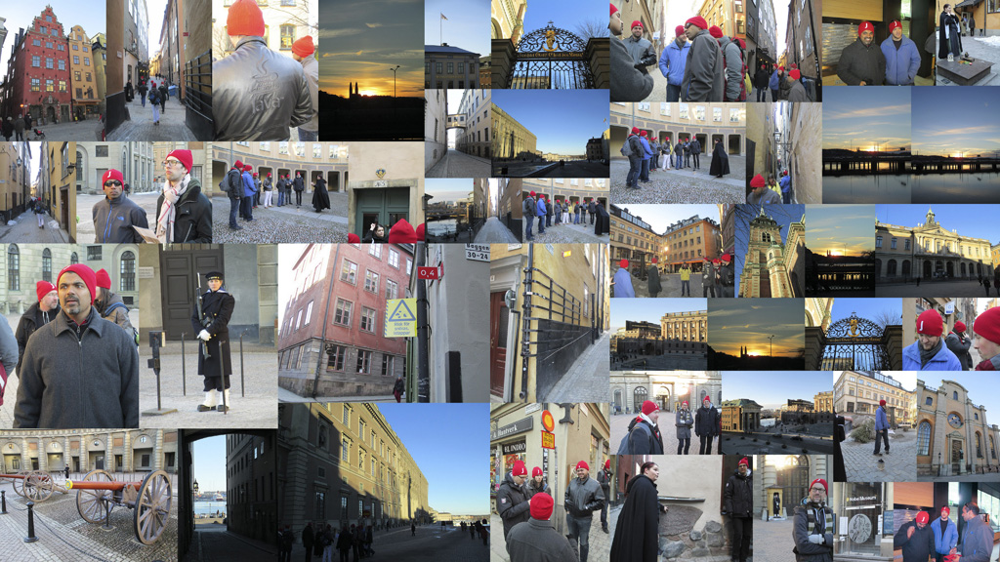
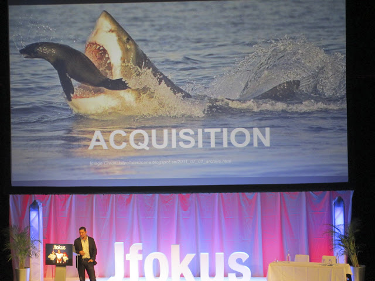
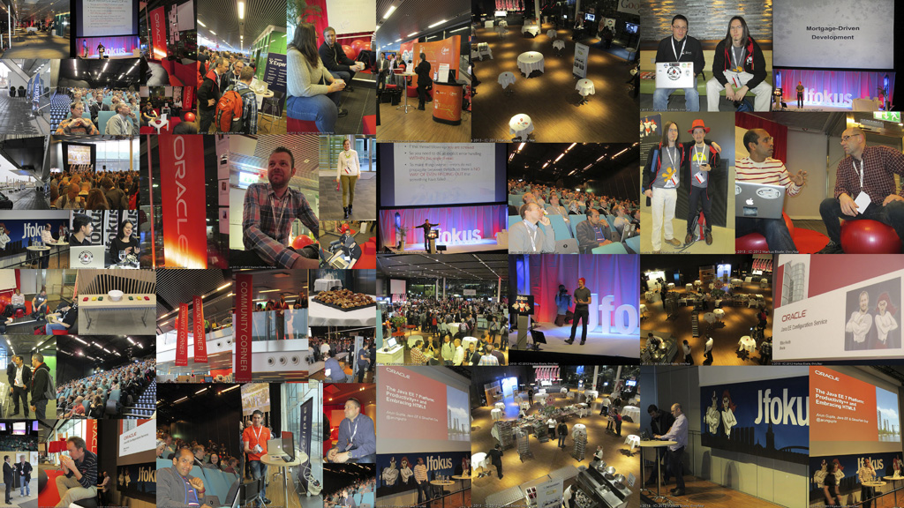

I'm back since two days from my Jfokus trip. After visiting them for the first time back in <a href="http://blog.eisele.net/2012/02/jfokus-2012-trip-report.html" target="_blank">2012</a>&nbsp;it was a pleasure to catch up with the team lead by Mattias Karlsson. They continued to make Stockholm and the conference venue the hottest place for Java developers in Northern Europe in February. It was sold out two weeks before the official start and looking at the amazing speaker line-up this absolutely wasn't a big surprise. For myself I count myself one of the lucky program committee members which had the pleasure and pain of selecting the right sessions for you. Hope it did work out for you and you was among the 1550 attendees from more than 20 countries which were able to enjoy the conference.
 
 <b>Travelling and Speaker Walk</b>
 

 

 The first day always is about traveling. Getting to Stockholm is easy for Europeans. After a 2h flight I jumped on the famous Arlanda Express which directly brought me to&nbsp;Stockholm's&nbsp;Central Station. After a 10 minute walk I quickly reached the <a href="http://www.radissonblu.com/waterfronthotel-stockholm" target="_blank">Radisson Blue Waterfront</a> which is the hotel directly attached to the venue. Even if it is a little more expensive it is all worth it. Great staff, awesome rooms, wonderful view and the best part is, that you are only a few steps away from the venue. That gives you some precious extra minutes to sleep in the morning. Arriving the day before the conference is always a good thing to do. My timing was exactly right to came in time to attend the speaker walk in Gamla-Stan which is the old part of Stockholm. Together with 10+ other fearless speakers we took the one hour guided tour and learned a lot about the History and visited some nice places around. All this was topped by warming up again with a nice cup of Coffee. Followed by an awesome dinner with the most vocal parts of the JavaPosse back in the hotel.
 
 

<table align="center" cellpadding="0" cellspacing="0" class="tr-caption-container" style="margin-left: auto; margin-right: auto; text-align: center;">
 <tbody>
  <tr>
   <td style="text-align: center;"></td>
  </tr>
  <tr>
   <td class="tr-caption" style="text-align: center;">Collage of the Speaker-Walk <a href="https://picasaweb.google.com/100362024804331957185/JfokusSpeakerCityWalkFebruary32013?authuser=0&amp;feat=directlink" target="_blank">Pictures</a>.</td>
  </tr>
 </tbody>
</table>
 <b>Monday Tutorial Day&nbsp;and Speaker Dinner</b>
 
 The first day of the conference started with the "<a href="http://www.jfokus.se/jfokus/talks.jsp#Hands-on%20Lab%3A%20Developing%20JAX-RS%20Web%20Applications%20Utilizing%20Server-Sent%20Events%20and%20WebSocket" target="_blank">Developing JAX-RS Web Applications Utilizing Server-sent Events and WebSockets</a>" which Arun and I gave. It was all about GlassFish, WebSockets and latest Java EE 6 and 7. Head over to Arun's <a href="https://blogs.oracle.com/arungupta/entry/jfokus_2013_trip_report_a" target="_blank">trip report</a> to get hands on the <a href="https://github.com/jersey/hol-sse-websocket/blob/master/lab-guide.pdf?raw=true" target="_blank">latest lab-guide</a>&nbsp;(PDF) and the <a href="https://github.com/jersey/hol-sse-websocket" target="_blank">code for the Java EE 7 parts</a>. It is always a pleasure to work with you, Arun! You are great! Thanks for being around. I am very proud of being a part of this! And a big thank you goes out to all the attendees! We have been working with latest NetBeans RC1 and GlassFish 4.0 nightly builds! Indeed, everything worked like a charm!
 
<table align="center" cellpadding="0" cellspacing="0" class="tr-caption-container" style="margin-left: auto; margin-right: auto; text-align: center;">
 <tbody>
  <tr>
   <td style="text-align: center;"></td>
  </tr>
  <tr>
   <td class="tr-caption" style="text-align: center;">Collage of some HoL <a href="https://picasaweb.google.com/100362024804331957185/JavaEE7HoLWithArunFebruary42013?authuser=0&amp;feat=directlink" target="_blank">Impressions</a></td>
  </tr>
 </tbody>
</table> After that was done it was time to attend some other sessions myself and catch up with some folks I haven't seen in a while. Famous speaker dinner at the <a href="" target="_blank">F12</a> restaurant in Stockholm was also that evening. It was marvelous, entertaining and full of information.
 
 
<table align="center" cellpadding="0" cellspacing="0" class="tr-caption-container" style="margin-left: auto; margin-right: auto; text-align: center;">
 <tbody>
  <tr>
   <td style="text-align: center;"></td>
  </tr>
  <tr>
   <td class="tr-caption" style="text-align: center;">Speaker Dinner <a href="https://picasaweb.google.com/100362024804331957185/JfokusSpeakerDinnerFebruary42013" target="_blank">Impressions</a></td>
  </tr>
 </tbody>
</table>
 <b>Tuesday packed with Sessions</b>
 
 The official start of the real conference was on Tuesday. All the 1550 attendees started to show up and everything got finally crowded. But I liked it. Soo many sessions to attend. The <a href="https://vaadin.com/blog/-/blogs/vaadin-is-going-cruising-jfokus-2013-here-we-come" target="_blank">Vaadin Cruise from Finland</a> arrived early and brought in some more well know names. It all started with Georges Saab's Oracle Keynote. Honestly I was a little bit&nbsp;disappointed&nbsp;to see his name there. I was looking for something more exciting and my expectations have been very low on this one. But indeed: He managed to deliver an entertaining session with a decent humor and all the serious parts as expected. Thank you Georges for doing it like this! Very brave! Very valuable!
 
 

 

 
 Find some more impressions on my&nbsp;<a href="https://picasaweb.google.com/100362024804331957185/JfokusDay2February52013?authuser=0&amp;authkey=Gv1sRgCOe0452p7p7g_QE&amp;feat=directlink" target="_blank">picassa foto-set</a>. After free beer, wine, soda, and buffet food provided by Atlassian the day closed with a marvelous dinner (in a Belgian restaurant, which has some British humor in it :-)) and some awesome discussions in the hotel lobby.
 
 <b>Wednesday Heading Home</b>
 
 The last day at a conference always is kind of sad. Trying to catch up with everybody to say good-bye, having all the luggage around. Anyway, a good place to do all this was the Oracle Community Red District aehm .. Corner :) Always plenty of folks around and a good meeting place. You also come across some people you might not have expected to see at an European conference. Some more pictures for you to look at are at the <a href="https://picasaweb.google.com/100362024804331957185/JfokusDay3February62013" target="_blank">foto-set of the last day</a>.
 
 

<table align="center" cellpadding="0" cellspacing="0" class="tr-caption-container" style="margin-left: auto; margin-right: auto; text-align: center;">
 <tbody>
  <tr>
   <td style="text-align: center;"></td>
  </tr>
  <tr>
   <td class="tr-caption" style="text-align: center;">Third day impressions.</td>
  </tr>
 </tbody>
</table>
 <b>Takeaway</b>
 
 It was a great time! I enjoyed it! Thank you for organizing Jfokus! I will try to come back next year, too!
 
 