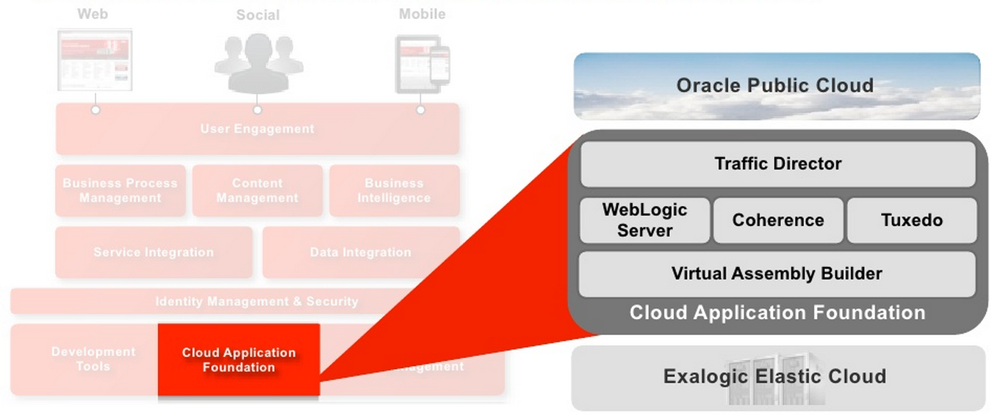
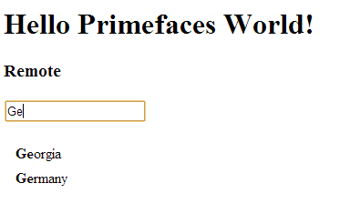

The Oracle Cloud is around everywhere these days. It had a rough start with Larry denying the need for a cloud for a very (too) long time and some very early announcements and a very bad availability after last year's Open World nobody seems to be interested anymore. But for me it still has it's hidden treasures and I believe it has a fair chance of winning it's customers. Before I dive into the example which will show you how to use JAX-RS with Jersey on the Oracle Cloud Service I want to introduce you to the service a little bit. Feel free to skip this first section.
 
 <b>What the hell is the Oracle Cloud and why do you care?</b>
 
 The Oracle Cloud is a marketing term. It tries to capture a couple of different services sharing a common base called the platform services. Those two basically are the <a href="https://cloud.oracle.com/mycloud/f?p=service:java:0" target="_blank">Java</a> and the <a href="https://cloud.oracle.com/mycloud/f?p=service:database:0" target="_blank">Database</a> Service. Technically this isn't too new. We are talking about Oracle's "<a href="http://www.oracle.com/us/products/middleware/cloud-app-foundation/overview/index.html" target="_blank">Cloud Application Foundation</a>" which is out there since a while.
 
<table align="center" cellpadding="0" cellspacing="0" class="tr-caption-container" style="margin-left: auto; margin-right: auto; text-align: center;">
 <tbody>
  <tr>
   <td style="text-align: center;"></td>
  </tr>
  <tr>
   <td class="tr-caption" style="text-align: center;">Oracle's Cloud Application Foundation</td>
  </tr>
 </tbody>
</table> It is down at the bottom of the whole Oracle Fusion Middleware Stack (at least in the available marketing slides) and is the basic software stack that runs on the Exalogic appliances. Most relevant parts for Java developers are the Java EE 5 WebLogic Server and a load balancing solution called Traffic Director. The neat part here is, that you literally can have your personal share of a real Exalogic machine in the cloud for a fraction of the costs that even the smallest rack costs. And it is running in data centers around the world. Fully managed and including the licenses. So, with paying your monthly mite you are done with the administrative parts. And if you ever had the questionable pleasure to deal with licensing and supported platforms you know a little about the added value in it. Technically speaking the Java Service is of little interest at all. EE 5 is outdated and even the Java SE 6 based JRockit feels like a stranger from the past with all the new features in Java SE 7 and the <a href="https://blogs.oracle.com/java/entry/end_of_public_updates_for" target="_blank">end-of-public-updates policy for SE 6</a>. But I still consider it a good start and I am very looking forward about having latest WebLogic 12c and a decent Java 7 in the cloud.
 
 <b>WebLogic Server and JAX-RS</b>
 
 Do you remember the ancient days? Java EE 5? Running around with the latest EE 6 specification since a couple of years now it feels like you have to drive the car you had as a student again. Believe it or not: JAX-Rs wasn't part of EE 5 at all. And this is exactly the reason why JAX-RS doesn't run out of the box on the Oracle Java Service. But you might know that the Weblogic team is very aware of the fact that they are running late with EE adoption and so they are rolling out features which will be included into the base server with the next specification version bit by bit to earlier versions. The same happened with JAX-RS back in early 2011. Since 10.3.4 you've been able to&nbsp;facilitate Jersey as JAX-RS implementation&nbsp;&nbsp;by simply adding a library dependency or packaging it to your application. This also works for the Java Service. Simply start a new Maven project in your favorite IDE (might be latest NetBeans 7.3 which is hot off the press) and add
 
 
<pre class="brush:xml">&nbsp; &lt;dependency&gt; &nbsp; &nbsp; &nbsp; &nbsp; &nbsp; &nbsp; &lt;groupId&gt;com.sun.jersey&lt;/groupId&gt; &nbsp; &nbsp; &nbsp; &nbsp; &nbsp; &nbsp; &lt;artifactId&gt;jersey-server&lt;/artifactId&gt; &nbsp; &nbsp; &nbsp; &nbsp; &nbsp; &nbsp; &lt;version&gt;1.9&lt;/version&gt; &nbsp; &nbsp; &nbsp; &nbsp; &nbsp; &nbsp; &lt;scope&gt;provided&lt;/scope&gt; &nbsp; &lt;/dependency&gt; </pre> Jersey as a dependency with scope provided. Another pointer is the Java Version you should compile against. Make sure SE 7 doesn't slip in somewhere and set the mavven compiler-plugin to use source and target version 1.6. Sad as it is ... Next thing to add is the weblogic.xml library ref for Jersey:
 
 
<pre class="brush:xml">&nbsp;&lt;library-ref&gt; &nbsp; &nbsp; &nbsp; &nbsp; &lt;library-name&gt;jax-rs&lt;/library-name&gt; &nbsp; &nbsp; &nbsp; &nbsp; &lt;specification-version&gt;1.1&lt;/specification-version&gt; &nbsp; &nbsp; &nbsp; &nbsp; &lt;implementation-version&gt;1.9&lt;/implementation-version&gt; &lt;/library-ref&gt; </pre> Which simply tells the container to add this to the class-loader. Typically you would have to deploy it to your domain first. But believe me: It is already there and you simply can use it. If you are using NetBeans and you start with the new "RESTful Web Services from Patterns" wizard you might end up with a couple of more (unneeded) dependencies but this would save you from adding the Jersey configuration to your web.xml which should look like the following:
 
 
<pre class="brush:xml">&nbsp;&lt;servlet&gt; &nbsp; &nbsp; &nbsp; &nbsp; &lt;servlet-name&gt;ServletAdaptor&lt;/servlet-name&gt; &nbsp; &nbsp; &nbsp; &nbsp; &lt;servlet-class&gt;com.sun.jersey.spi.container.servlet.ServletContainer&lt;/servlet-class&gt; &nbsp; &nbsp; &nbsp; &nbsp; &lt;init-param&gt; &nbsp; &nbsp; &nbsp; &nbsp; &nbsp; &nbsp; &lt;description&gt;Multiple packages, separated by semicolon(;), can be specified in param-value&lt;/description&gt; &nbsp; &nbsp; &nbsp; &nbsp; &nbsp; &nbsp; &lt;param-name&gt;com.sun.jersey.config.property.packages&lt;/param-name&gt; &nbsp; &nbsp; &nbsp; &nbsp; &nbsp; &nbsp; &lt;param-value&gt;net.eisele.primeui.cloud&lt;/param-value&gt; &nbsp; &nbsp; &nbsp; &nbsp; &lt;/init-param&gt; &nbsp; &nbsp; &nbsp; &nbsp; &lt;init-param&gt; &nbsp; &nbsp; &nbsp; &nbsp; &nbsp; &nbsp; &lt;param-name&gt;com.sun.jersey.api.json.POJOMappingFeature&lt;/param-name&gt; &nbsp; &nbsp; &nbsp; &nbsp; &nbsp; &nbsp; &lt;param-value&gt;true&lt;/param-value&gt; &nbsp; &nbsp; &nbsp; &nbsp; &lt;/init-param&gt; &nbsp; &nbsp; &nbsp; &nbsp; &lt;load-on-startup&gt;1&lt;/load-on-startup&gt; &nbsp; &nbsp; &lt;/servlet&gt; &nbsp; &nbsp; &lt;servlet-mapping&gt; &nbsp; &nbsp; &nbsp; &nbsp; &lt;servlet-name&gt;ServletAdaptor&lt;/servlet-name&gt; &nbsp; &nbsp; &nbsp; &nbsp; &lt;url-pattern&gt;/webresources/*&lt;/url-pattern&gt; &nbsp; &nbsp; &lt;/servlet-mapping&gt; </pre> And simply registers the REST servlet together with the package scanning path for your annotated implementation. Choose whatever mapping you like. Following this example closely you should be aware, that I'm going to hard-code the URL to the service in JavaScript later. Watch out for the "/webresources" part.
 
 <b>Adding some JSON</b>
 
 You for sure noticed the et.eisele.primeui.cloud package reference. Let's look at the class:
 
 
<pre class="brush:java">@Path("countries") public class RestResource \{ //... @GET &nbsp; &nbsp; @Produces("application/json") &nbsp; &nbsp; public String getJson(@QueryParam("query") String query) \{ &nbsp; &nbsp; &nbsp; &nbsp; String[] raw = \{ &nbsp; &nbsp; &nbsp; &nbsp; &nbsp; &nbsp; "Albania", "Algeria", //... \}; &nbsp; List&lt;ValueHolder&gt; countries = new ArrayList&lt;ValueHolder&gt;(); &nbsp; for (int i = 0; i &lt; raw.length; i++) \{ &nbsp; countries.add(new ValueHolder(raw[i])); \} &nbsp; &nbsp;Gson gson = new Gson(); &nbsp; return gson.toJson(countries); &nbsp; &nbsp; \} \} </pre>
<pre class="brush:java">//...</pre>
<pre class="brush:java">public class ValueHolder \{ public ValueHolder() \{\} public ValueHolder(String label) \{ this.label = label; this.value = "v_" + label; \} private String label; private String value; \}</pre> This basically contains a String[] of countries. Each entry gets converted to a ValueHolder object and added to an ArrayList which gets converted to JSON with the help of Google's gson library. This is the second dependency we need to include with the pom.xml
 
 
<pre class="brush:xml">&lt;dependency&gt; &nbsp; &nbsp; &nbsp; &nbsp; &nbsp; &nbsp; &lt;groupId&gt;com.google.code.gson&lt;/groupId&gt; &nbsp; &nbsp; &nbsp; &nbsp; &nbsp; &nbsp; &lt;artifactId&gt;gson&lt;/artifactId&gt; &nbsp; &nbsp; &nbsp; &nbsp; &nbsp; &nbsp; &lt;version&gt;2.2.2&lt;/version&gt; &lt;scope&gt;compile&lt;/scope&gt; &nbsp; &nbsp; &nbsp; &nbsp; &lt;/dependency&gt; </pre> Make sure this is packaged with your application by using the compile scope. Mostly done now. You noticed the @QueryParam("query"). I build some more logic around selecting the right entries from the String[] to decide which ValueHolder to return. For the complete example refer to the <a href="https://github.com/myfear/primeui-cloud/blob/master/src/main/java/net/eisele/primeui/cloud/RestResource.java" target="_blank">RestResource on github</a>. Now we are in need of a nice front-end.
 
 <b>Prime-UI to the rescue</b>
 
 Everybody is talking about JavaScript these days and I thought it might be a good way of showing off some of the things possible with latest Primefaces offspring called Prime-UI. Those guys do a great job pushing out their already well known and widely used JSF library PrimeFaces to the jQuery world by providing a widget library. Get everything you need from the <a href="" target="_blank">PrimeFaces website</a>&nbsp;by downloading the prime-ui zip file. If you started with a web project in NetBeans and you did not add JSF you end up by having a nice little jsp file in the webapp folder. Open it and make some changes and tweaks to it. The most important ones are the HTML5 doctype declaration and the needed JavaScript imports:
 
<pre class="brush:xml">&lt;%@page contentType="text/html" pageEncoding="UTF-8"%&gt; &lt;!DOCTYPE html&gt; &lt;!-- header, title, all the other stuff you need --&gt; &lt;!-- jQuery --&gt; &nbsp; &lt;script src="js/vendor/jquery.js"&gt;&lt;/script&gt;</pre>
<pre class="brush:xml"> &lt;!-- jQuery UI --&gt; &nbsp; &lt;script src="js/vendor/jquery-ui.js"&gt;&lt;/script&gt;</pre>
<pre class="brush:xml"> &lt;!-- Prime UI Core --&gt; &nbsp; &lt;script src="js/core/core.js"&gt;&lt;/script&gt;</pre>
<pre class="brush:xml"> &lt;!-- Prime UI Input Text --&gt; &lt;script src="js/inputtext/inputtext.js"&gt;&lt;/script&gt;</pre>
<pre class="brush:xml"> &lt;!-- Prime UI Autocomplete --&gt; &nbsp; &lt;script src="js/autocomplete/autocomplete.js"&gt;&lt;/script&gt; </pre> The Auto complete example binds an input text field to a backend and gives you type-ahead features. Lets assume you have the rest service above running you now simply add the following JavaScript to your head section: 
 
<pre class="brush:xml">&lt;script type="text/javascript"&gt; $(function() \{ $('#remote').puiautocomplete(\{ effect: 'fade', effectSpeed: 'fast', completeSource: function(request, response) \{ $.ajax(\{ type: "GET", url: './webresources/countries', data: \{query: request.query\}, dataType: "json", context: this, success: function(data) \{ response.call(this, data); \}, error: function(jqXHR, textStatus, errorThrown) \{ console.log(textStatus, errorThrown); \} \}); \} \}); \}); &lt;/script&gt;</pre>
 
 And add the input tag to your body section of the page:
 
<pre class="brush:xml">&lt;input id="remote" name="remote" type="text"/&gt;</pre> That is all you have to do. One little remark. If you are going to deploy the app as it is, you will be prompted with a login screen in front of it. In order to open it to the public you have to add an empty
 
<pre class="brush:xml">&nbsp;&lt;login-config/&gt;</pre> element to your web.xml. Now go on and add the <a href="http://blog.eisele.net/2012/08/oracle-public-cloud-java-netbeans.html" target="_blank">cloud to your IDE</a>&nbsp;and deploy the application to your trial instance. If you are using my <a href="" target="_blank">github sources</a>, it should look like this:
 

 

 depending on the query it returns the more qualified results. Going the postman way it looks like this:
 

 

 <b>Take away</b>
 
 I hope, you didn't expect this to be kind of rocket science at all. It is a basic post along the lines of what most of the WebLogic server developers might have know already. This is one of the biggest advantages but also a big disadvantage of the Oracle Java Cloud Service. If you know WebLogic you are most likely going to love it. If you are on the Open Source side of things you might run into issues that are well known to the Oracle Middleware guys but not to you. EE 5 isn't that complete than EE 6 and EE 7 will only be slightly better in closing the vendor specific gabs between all the different implementations. But again: This isn't something new for you, right? Now go: Give it a test-drive and share your experiences! Looking forward reading about them!
 
 &nbsp;