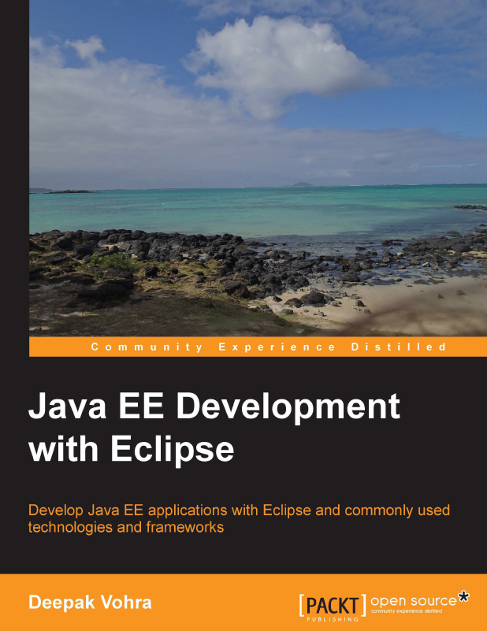

Jumping around with Java EE development I naturally get the chance to review books in this area. And I really appreciate the chance to do this. Not only to get a chance to possibly learn something new but also to give the best possible guidance on new releases for my readers. Today it is time for another Packt book review. Published back in December 2012 this is a fresh new take on latest Java EE together with Eclipse.
 
 <b>Abstract</b>
 

 

 Java Platform, Enterprise Edition (Java EE) 6 is the industry standard for enterprise Java computing. Eclipse IDE for Java EE developers is the most commonly used Java IDE for Java EE development. Eclipse IDE for Java EE developers supports Java EE 5 completely and also supports several features from Java EE 6. The Oracle WebLogic Server product line is the industry's most comprehensive platform for developing, deploying, and integrating enterprise applications. Oracle Enterprise Pack for Eclipse provides a set of plugins (project facets) for Eclipse development with WebLogic Server. While a number of books are available on Eclipse IDE for Java Developers, none or very few are available on Eclipse IDE for Java EE Developers. In this book, we shall discuss Java EE development in Eclipse IDE for Java EE developers. While it is not feasible to cover all of the more than 30 technologies in the Java EE stack , we shall discuss the most commonly used Java EE technologies, especially the ones Eclipse IDE for Java EE developers (or Oracle Enterprise Pack for Eclipse) provides Project for Facets. Oracle Enterprise Pack for Eclipse is just an enhancement of Eclipse IDE for Java EE developers with integrated support for Oracle WebLogic Server.
 
 
 Book: <a href="http://www.packtpub.com/java-ee-development-with-eclipse/book" target="_blank">Java EE Development with Eclipse </a>
 
 Language : English
 
 Paperback : 426 pages [ 235mm x 191mm ] 
 
 Release Date : December 2012
 
 ISBN-10: 1782160965
 
 ISBN-13: 978-1782160960
 
 <b>About the Author</b>
 
 Deepak Vohra is a consultant and a principal member of the NuBean.com software company. Deepak is a Sun Certified Java Programmer and Web Component Developer, and has worked in the fields of XML and Java programming and J2EE for over five years. Deepak is the co-author of the Apress book Pro XML Development with Java Technology and was the technical reviewer for the O'Reilly book WebLogic: The Definitive Guide. Deepak is also the author of the Packt Publishing books JDBC 4.0 and Oracle JDeveloper for J2EE Development; Processing XML documents with Oracle JDeveloper 11g; EJB 3.0 Database Persistence with Oracle Fusion Middleware 11g; and Java 7 JAX-WS Web Services.
 
 <b>The Content</b>
 
 If you remove preface and index you end up with 400 pages in 10 chapters. That is reasonable. I'm not digging into every chapter more detailed (see my conclusion for the details)
 
 
 Chapter Outline:
 
 Chapter 1: EJB 3.0 Database Persistence
 
 Chapter 2: O/X Mapping with JAXB 2.x
 
 Chapter 3: Developing a Web Project for JasperReports
 
 Chapter 4: Creating a JSF Data Table
 
 Chapter 5: Templating with Facelets
 
 Chapter 6: Creating Apache Trinidad User Interfaces
 
 Chapter 7: Creating an AJAX Application
 
 Chapter 8: Creating a JAX-WS Web Service
 
 Chapter 9: RESTful Web Services Using the JAX-RS API
 
 Chapter 10: Spring
 
 <b>Writing and Style</b>
 
 Generally the instructions are clear and the screen-shots are helpful. The overall level of detail and mixed in complexity is appropriate and in case you need it you can download the source code from Packt. 
 
 <b>Conclusion and recommendation</b>
 
 The book is aimed at intermediate to advanced Java EE developers. With Eclipse at version 3.7 (and Oracle Enterprise Pack for Eclipse), Ant and manual dependency management on top of Java SE 5 it is outdated today. Even if it uses Oracle's WebLogic 12c as server for the examples (which would be Java EE 6 capable) and some Java EE 6 technologies (e.g. JSF2) this is a mixture between the worlds and not very helpful for beginners. The topics and chapters look weird and it is hard to understand the concept behind it if you only look on them. A decent introduction to the overall plot would have been helpful. Bottom line: You get a decent overview about Java EE with Eclipse but the details are outdated and no longer appropriate to learn. Further on, the selection and mixture in technologies (Java EE 5/6, Spring, Jasper, Trinidad) makes it very hard to separate the standard from the add-ons, which is a no-go for me.