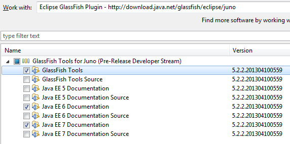

Java EE 7 is hot. The first four JSRs passed the final approval ballot recently and GlassFish 4 reached promoted build 83 in the meantime. If you are following my blog you know, that I do most of my work with NetBeans. But I indeed&nbsp;recognize, that there are other IDE users out there which also have a valid right of also testdriving the latest and greatest in enterprise Java.
 
 <b>The GlassFish Eclipse Plugins</b>
 
 The starting place for Eclipse are the GlassFish Eclipse plugins. They moved into the Oracle Enterprise Pack for Eclipse (OEPE) project a while back and are still there to be installed and configured separately. The easiest way to get them is to use the <a href="http://www.oracle.com/technetwork/developer-tools/eclipse/overview/index.html" target="_blank">pre-packaged OEPE</a> bundle. Simply download the suitable version and get started. If you already have you favorite Java EE Eclipse version you can also use the <a href="http://download.java.net/glassfish/eclipse/juno" target="_blank">java.net update site for Eclipse Juno</a>. The OEPE package contains oficial releases (more stable, tested) of GF plugins and new releases come one or two times per year. The update sites on java.net contain developer builds that are released as needed, typically a lot more often then OEPE. You can download from whatever meets your needs.
 
 <b>Install the Plugin</b>
 

 

 This works as expected. If you stick to the update site you simply go to&nbsp;Preferences-&gt;Install/Update-&gt;Available Software Sites and make sure that the above mentioned site is defined and checked. Install the GlassFish Tools and the Java EE 6 and/or Java EE 7 documentation and sources according to your needs. Click next two times, read through the license and check accept. Click Finish to install. The download gets everything in place and you have to finish the installation with a re-start.
 
 <b>Starting a new Java EE 7 Project</b>
 
 Once that it done you can start with configuring your GlassFish 4.0 domain. The simplest way is to create a New Project &gt; Other &gt; Web &gt; New Dynamic Web Project and select the "New Runtime" button next to target runtime. The New Server Runtime Environment dialogue pops up and you can select "GlassFish 4.0" from the GlassFish folder. Make sure to select a Java SE 7 JDK and the appropriate GlassFish Server Directory to use (or even install). In this example I am using the latest <a href="" target="_blank">promoted build 83 freshly</a> downloaded from the GlassFish website. Click Finish. Now add a simple servlet which does nothing spectacular but use some&nbsp;<a href="http://blog.eisele.net/2013/02/test-driving-java-api-for-processing.html" target="_blank">Java API for Processing JSON</a>&nbsp;to write a simple JSON string.
 
 
<pre class="brush:java">protected void doGet(HttpServletRequest request, HttpServletResponse response) throws ServletException, IOException \{ response.setContentType("application/json"); PrintWriter out = response.getWriter(); JsonObjectBuilder builder = Json.createObjectBuilder(); builder.add( "person", Json.createObjectBuilder().add("firstName", "Markus") .add("lastName", "Eisele")); JsonObject result = builder.build(); StringWriter sw = new StringWriter(); try (JsonWriter writer = Json.createWriter(sw)) \{ writer.writeObject(result); \} out.print(sw.toString()); \} </pre>
 

 

 Right click the project and select "Run as .." &gt; "Run on Server" &gt; GlassFish 4.0. Now point your browser to&nbsp;<a href="http://localhost:8080/ee7test/JsonServlet">localhost</a>&nbsp;and see the result working. The server view gives you the well know overview about your instance. And there you go. Have fun doing your Java EE 7 developments with Eclipse :)