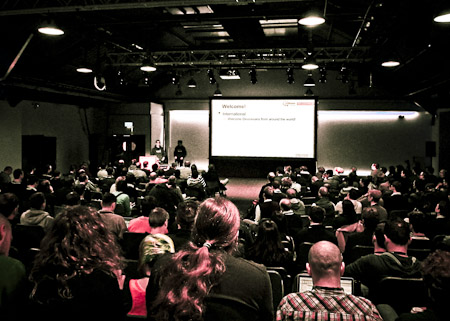
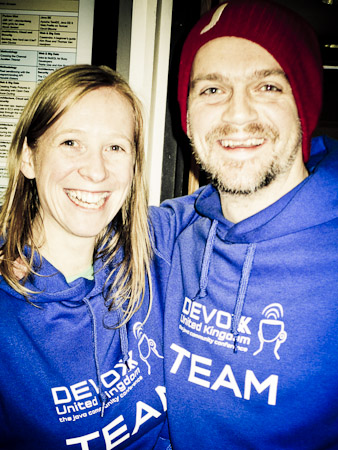

After my first Devoxx in Belgium last year I decided to give the new UK spin-off a try. Martijn and Ben have been the perfect hosts for a couple of Java related activities close to the London Java Community and I was really looking forward meeting this incredible community in London.
 
 <b>Day 0 - My first day in London</b>
 
 I've never been to London or even the UK before. Don't ask me why, it simply never happened. Even if some of the fellow ACEs have their home-bases there and the UKOUG also is very active in the Oracle User Group space I was very excited to finally see a bit of London. It turns out that I had planned my trip too short. Bottom-line: There was no time left at all to see a bit of the city. Once more I've only seen the nice little Airport, parts of the public transport system, the hotel and the conference venue. No, I'm not complaining. The travel was easy for me and finding the way to the BDC and the hotel next by not a bit challenge. A nice informal Meet and Greet sponsored by Atlassian was followed by a nice speakers-dinner. Thank you, DevoxxUK team!
 
 <b>Day 1 - Meet and Greet</b>
 

 

 The conference itself started on Monday morning. Roughly 500 attendees started to roll in to see the 75 speakers giving 50 sessions in 7 tracks about cloud, Java SE, methodologies, Java EE, web &amp; big data, new languages on the JVM, and future Devoxx. Many familiar faces and the UK version of Devoxx clearly profited from the overall Devoxx connections. It was a pleasure to meet many Oracle peers and twitter follower I haven't meet before. Yolande did an interview with me about my role in the Java EE EG, the German Java User Groups and the differences between the Java Champions and ACE Directors. So, I am truly looking forward seeing this published. I&nbsp;initially intended to help Arun with the Java EE 7 HOL. It turns out that I had a bad timing and enjoyed talking to Aslak and David about some upcoming activities. Arun will hold this against me for a while I guess; I'll promised to do better next time :)
 
 With Devoxx UK, the number of Devoxxians will reach 5,500 across Europe this year. The hands-on labs, talks, quickies, birds-of-a-feather and bash run from 9:30am to 10:00pm and this has been long days for everybody with still plenty of time to hang around and talk to the luminaries in the Java world. Only draw-back was, that some of the speakers left early to catch trains to Paris. DevoxxFR started overlapping.
 
 <b>Day 2 - Wrapping Up</b>
 
 The second day started over with plenty of engagement from anybody. The speakers full of energy were there to fully entertain the crowd. Fellow ACED Simon came in early to help with the UKOUG booth duty and we had some time to talk. I also enjoyed talking to Milton Smith about Java security topics. Not to mention the many others. It always is a pleasure catching up with you and attending the great session on the schedule. Close to noon I had to give my own session about Java EE sins. It is uploaded to <a href="http://www.slideshare.net/myfear/devoxx-uk-sevendeadlysins" target="_blank">slideshare</a> and <a href="http://www.parleys.com/#play/515946aae4b0c779d7881457/chapter0/about" target="_blank">parleys</a> (embedded below) in the meantime. Thank you to the roughly 50 attendees. It has been a pleasure. I am looking forward to the recording.
 <object height="395" width="395"><param name="movie" value="http://www.parleys.com/dist/share/parleysshare.swf"> <param name="allowFullScreen" value="true"> <param name="wmode" value="direct"> <param name="bgcolor" value="#222222"> <param name="flashVars" value="sv=true&amp;pageId=515946aae4b0c779d7881457"> <embed src="http://www.parleys.com/dist/share/parleysshare.swf" type="application/x-shockwave-flash" flashvars="sv=true&amp;pageId=515946aae4b0c779d7881457" allowfullscreen="true" bgcolor="#222222" width="395" height="395"></object>
 
 After a nice closing keynote by both RedHat and Oracle I had some time to enjoy the local bar scene and talk to Tomas. Leaving London the next morning very early.
 
 <b>Some further Thank-You's</b>
 

 

 Especially to German Oracle User Group DOAG (<a href="http://www.doag.org/en/doag/communities/development.html" target="_blank">Development Community</a>) which made it possible for me to attend. With Oracle closing down their fiscal year the budget for the ACED is empty and it is a pleasure to see, that even the original Oracle User Groups start pushing community with their presence at Java Conferences. Thank you! Another big one goes out to the program committee at DevoxxUK for having me. I am thrilled to see that my content and ideas work out for others. Thanks to Kerry and Martijn! You both are doing an amazing job! Looking forward to other opportunities working with you! A complete photo-set of my impressions at DevoxxUK can be found on Google+ (<a href="https://plus.google.com/photos/100362024804331957185/albums/5859656740031329921" target="_blank">Day 1</a>, <a href="https://plus.google.com/photos/100362024804331957185/albums/5860483651232453777" target="_blank">Day 2</a>)
 
 <iframe allowfullscreen frameborder="0" height="253" mozallowfullscreen="" src="http://player.vimeo.com/video/62905094?byline=0&amp;portrait=0" webkitallowfullscreen="" width="450"></iframe>
 <a href="http://vimeo.com/62905094">Devoxx UK 2013 - Long mellow version</a> from <a href="http://vimeo.com/royvanrijn">Roy van Rijn</a> on <a href="">Vimeo</a>.