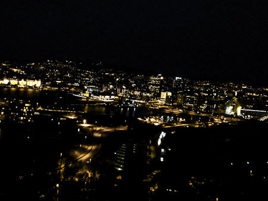
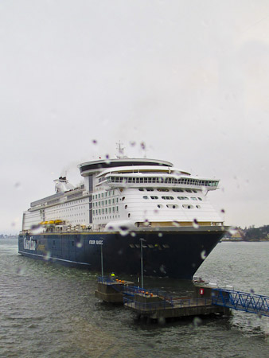
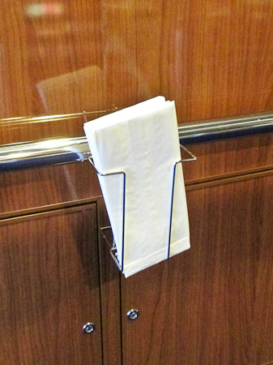
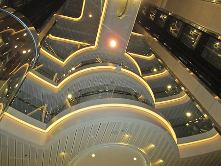

That was a packed week. After a few days at home I had to jump on a plane again to visit Oslo. This was my second time there after last year's JavaZone. This time I was invited to speak at the famous Oracle User Group Norway (OUGN) <a href="http://www.ougn.no/vrseminar-2013" target="_blank">Vårseminar</a>. Which turned out to be a <a href="http://blog.eisele.net/2013/01/im-speaking-at-ougn-varseminar-17th.html" target="_blank">surprising conference experience</a> for me.
 
 <b>Day 0/1 - Getting into the mood</b>
 
<table cellpadding="0" cellspacing="0" class="tr-caption-container" style="float: right; margin-left: 1em; text-align: right;">
 <tbody>
  <tr>
   <td style="text-align: center;"></td>
  </tr>
  <tr>
   <td class="tr-caption" style="text-align: center;">Registration Desk and helpful staff</td>
  </tr>
 </tbody>
</table> Every conference starts with traveling. Europe is easy for me. I mostly jump on a plane in Munich and after a little more than two hours I'm everywhere I like to be. Same was true again for Oslo. The <a href="" target="_blank">Flytoget</a> brought me to Central Oslo and I enjoyed walking a bit to the&nbsp;<a href="http://www.radissonblu.com/scandinaviahotel-oslo" target="_blank">Radisson Blu Scandinavia Hotel</a>. Strange fact because I thought that this conference is held on a boat.
 
<table cellpadding="0" cellspacing="0" class="tr-caption-container" style="float: right; margin-left: 1em; text-align: right;">
 <tbody>
  <tr>
   <td style="text-align: center;"></td>
  </tr>
  <tr>
   <td class="tr-caption" style="text-align: center;">View over Oslo at night</td>
  </tr>
 </tbody>
</table> Anyway, I learned that the first day always happens at the hotel and I should learn why... The day finished with a great dinner together with a bunch of folks I hadn't seen in a while. It was a pleasure. Reasonable late on the second day the conference started. I attended Simon Haslam's session about WebLogic and got some work done. It is a more or less typical conference hotel. But everyone has been nice and the atmosphere was great. A perfect speakers dinner with a wonderful view over Oslo made this a perfect day. A big thanks to the organizers
 
 <b>Day 2 - The boat</b>
 

 

 Getting up too early but it was worth it. Packing up stuff and jumping on a big cab to be taken to the harbor. This was exactly what I had waited for. The Colorline Terminal is build for one thing. Get people on or off the ship and check their tickets. The <a href="http://www.colorline.com/ships_and_sailings/kiel_-_oslo/technical_facts_m_s_color_magic" target="_blank">M/S Color Magic</a> arrived timely and it was impressive to see the big thing coming into the harbor. Some of the international star guests came in late and the organizers where quite happy about every single one who made it in time. Cary Milsap was one of them but it also was a pleasure to have <a href="" target="_blank">Arun Gupta</a> on board this time. After the guests left the ship we could jump on it. Very easy to walk around and spend some time.
 

 

 The cabins haven't been ready yet so there was plenty of time for a short welcome event followed by a Keynote. The rooms did fit my expectations. A not too big cabin with a nice window to look at the water. Awesome. Until now everything wasn't much different than in a hotel. The ship hosts a great conference center on deck 12 which actually is bigger than the one in the hotel before. The best part is, that all the conference rooms have big windows so you feel like sitting next to the water. Great. The true fun started when the ship was leaving for Kiel. Around 3pm, together with the first sessions you actually realized that it was a ship. Things started to feel like it finally :)
 
 My first session went well. It wasn't that much attended. Not unexpected given the fact that there has been 90% DBAs on that boat and Java and Java EE are still something that really are different topics to cover for Oracle User Groups.
 

 

 Conference days last until 7pm and everything worked out well. The 6 parallel tracks gave plenty of options to the attendees. To me it felt like it was a bit too much. There was some spare time from 7 to 8:30 and the evening program started just right before a too late dinner. That is where the real fun started. The sea got rough and we're not talking about some small waves. Rumors said it has been 4 to 5m ones and even the M/S Color Magic started to roll a bit more than expected. I was doing fine and actually enjoyed it. Not everybody does :)
 
 <b>Day 3 - Back to Germany take one&nbsp;</b>
 

 

 Arriving in Kiel in the early morning was strange. Back on a fast dataplan I had some calls to do. Leaving the ship for 4 hours wouldn't have made sense at all. Anyway it was nice chatting with the other speakers and attendees and after we left Kiel again some were really not looking forward to another rough night. But it turned out to be good without any more heavy waves at all. My second session ended while we've be going under the&nbsp;<a href="http://www.storebaelt.dk/english" target="_blank">Storebælt bridge</a>. It was a true pleasure. Without the usual conference hectic and the need to go back to your hotel everything was tight much closer together and there was plenty networking opportunity for everybody around.
 
 <b>Day 4 - Back to Germany take two</b>
 

 

 After a very silent night we arrived back in Oslo perfectly on time and I had to leave among the first to catch my flight back to Germany. Thanks Mark for the ride! Wouldn't have been possible without you! Sorry to everybody I wasn't able to say good bye to. I really underestimated the time left for catching the plane!
 
 <b>Coming back?</b>
 
 For sure! I felt in very good hands during the whole conference. The organizers did a fantastic job looking after their speakers and there was not a moment I would change. Except the fact that I would love to have seen more attendees in my sessions but .. yeah, I mean ... that probably still is something I have seen with many other Oracle User Groups also. It is a different world and that is still very DB centered after all. Need to try to get GlassFish or WebLogic running in the JVM on the DB .. that might finally catch more attention :) No, jut kidding, I have ever been a big fan of WebLogic and the middleware offerings that came into Oracle with the BEA&nbsp;acquisition&nbsp;and I am willing to&nbsp;continue&nbsp;my journey to spread the word about them. If you want to get more picture impressions you can have a look at the different photo sets on G+: <a href="https://plus.google.com/photos/100362024804331957185/albums/5867805461910826385" target="_blank">Day 1</a>, <a href="https://plus.google.com/photos/100362024804331957185/albums/5868194797032005745" target="_blank">Day 2</a>, <a href="https://plus.google.com/photos/100362024804331957185/albums/5868478105830154945" target="_blank">Day 3</a>&nbsp;and&nbsp;<a href="https://plus.google.com/photos/100362024804331957185/albums/5868997857076589953" target="_blank">Day 4</a>. My presentations have been <a href="" target="_blank">uploaded to Speaker Deck</a> and I hope to see them up at the <a href="" target="_blank">ougn website</a> shortly, too.
 
 A final&nbsp;hearty "Thank you!" to the OUGN board for having me! It was a pleasure and I truly enjoyed the company!&nbsp;&nbsp; 
 
 <b>UPDATE 24.04.13:</b>
 

 

 