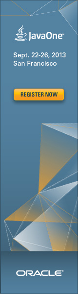

Another year another JavaOne. Even if the conference experience gets spread over the world with many more regional JavaOnes there is still the original one happening once a year to celebrate Java and community in San Francisco.
 

 

 I'm proud to announce that I will be speaking again at this years flagship event. During the rolling acceptance process my proposal:
 
 <b>"Don't be that guy! Developer Security Awareness" <a href="https://oracleus.activeevents.com/2013/connect/sessionDetail.ww?SESSION_ID=2570" target="_blank">[</a></b><b><a href="https://oracleus.activeevents.com/2013/connect/sessionDetail.ww?SESSION_ID=2570" target="_blank">CON2570]</a></b>
 
 Venue / Room: Hilton - Golden Gate 6/7/8
 
 Date and Time: 9/26/13, 14:00 - 15:00
 
 <a href="http://spoofzu.blogspot.de/2013/05/javaone-2013-security-track-sneak-peak.html" target="_blank">was accepted</a>&nbsp;already and I am happy to shape the new <a href="http://spoofzu.blogspot.de/2013/03/new-javaone-security-track-cfp-is-open.html" target="_blank">JavaOne Security Track</a> with my contribution.
 
 
 Update: 25.06.13 Another talk made it into the schedule.
 <b>"Seven Deadly Sins" <a href="https://oracleus.activeevents.com/2013/connect/sessionDetail.ww?SESSION_ID=1924" target="_blank">[</a></b><b><a href="https://oracleus.activeevents.com/2013/connect/sessionDetail.ww?SESSION_ID=1924" target="_blank">CON1924]</a></b>
 
 Venue / Room: Parc 55 - Mission
 
 Date and Time: 9/24/13, 10:00 - 11:00
 
 <strike>The review for the complete program is still ongoing. As far as I know the acceptance emails are still not out completely. Might be, that a BOF or something else will pop up at the horizon. Anyway, </strike>I am quite pleased with the outcome and I am truly looking forward speaking again at the original JavaOne.
 
 
 Update: 27.06.13 And I will also be at Oracle OpenWorld.
 <b>"Oracle Java Cloud Service for Java EE Developer" <a href="https://oracleus.activeevents.com/2013/connect/sessionDetail.ww?SESSION_ID=1926" target="_blank">[</a></b><b><a href="https://oracleus.activeevents.com/2013/connect/sessionDetail.ww?SESSION_ID=1926" target="_blank">CON1926]</a></b>
 
 Venue / Room: Marriott Marquis - Golden Gate C1
 
 Date and Time: 9/25/13, 11:45 AM - 12:45 PM
 
 
 There is plenty of content available. Some numbers: OpenWorld has&nbsp;1272 sessions and 1552 speakers. JavaOne holds 507 Sessions and 482 speakers. The <a href="https://oracleus.activeevents.com/2013/connect/search.ww?eventRef=openworld#loadSearch-event=null&amp;searchPhrase=&amp;searchType=session&amp;tc=0&amp;sortBy=&amp;p=&amp;i(11180)=20800" target="_blank">content catalog for both events is online</a>. Most of the content will be free afterwards so it is a good idea to already bookmark this link.
 
 
 Update: 23.07.13: I will be on a panel together with Cary Millsap
 <b>Software Development in the Oracle Ecosystem</b>, <a href="https://oracleus.activeevents.com/2013/connect/sessionDetail.ww?SESSION_ID=9932" target="_blank">Part 1 [UGF9932]</a>&nbsp;and <a href="https://oracleus.activeevents.com/2013/connect/sessionDetail.ww?SESSION_ID=9948" target="_blank">Part 2 [UGF9948]</a>
 
 Room / Venue: Moscone West - 2009
 
 Date and Time: 09/22/13, 2:15 PM - 3:15 PM
 
 
 Update: 26.07.13: Another Panel rolled in: Together with Adam Bien and John Yeary:
 <b>&nbsp;Cool NetBeans Tips and Tricks for Java EE 7 Development</b> <a href="https://oracleus.activeevents.com/2013/connect/sessionDetail.ww?SESSION_ID=10369" target="_blank">[UGF10369]</a>
 
 Venue / Room: Moscone West - 3024
 
 Date and Time: 9/22/13, 16:45 - 17:45
 
 
 This finally makes six :) A good number!
 
 
 There is still time&nbsp;<a href="http://www.oracle.com/go/?&amp;Src=7328808&amp;Act=33&amp;pcode=WWMK11054239MPP004" target="_blank">to register</a>. Looking forward to an awesome conference!