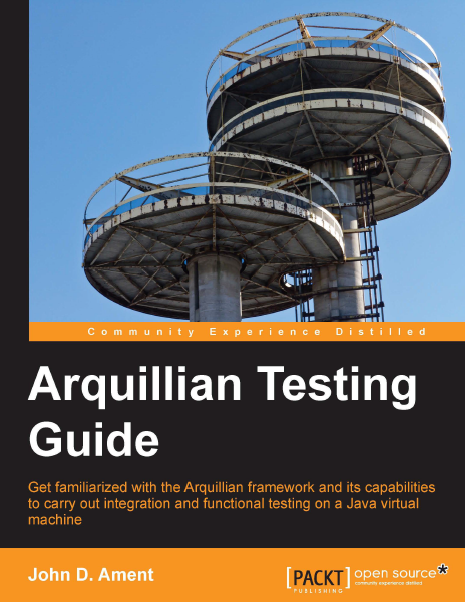

I've been involved with the Arquillian project since some time now. After I received the <a href="http://blog.eisele.net/2012/04/thank-you-im-jboss-community-leader.html" target="_blank">JBoss Community Leader Award for my work with the Arquillian project in the category documentation</a> back in April 2012 everybody was expecting me to write a book on it. Honestly I never felt like having the time to write a book at all. So I was really glad that John took the efforts putting a book together about my favorite integration testing tool. Time to review his work. Thanks to Packt for giving me the opportunity to do this.
 
 <b>Abstract</b>
 Integration testing sometimes involves writing complex codes. This book introduces you to the capabilities of Arquillian to enable you to write simple code with a broad range of integration tests for java applications. Arquillian Testing Guide serves as an introductory book to writing simple codes for testing java applications. This book will help you to develop richer test cases which can be run automatically while performing rigorous testing of the software. Arquillian Testing Guide introduces you to Arquillians features and capabilities. This book will help you understand the mechanism of creating deployments and test against those deployments. The book begins with basic JUnit test cases beginning with an enterprise test case, which then go on to discuss remote testing. During the course of the book, you will also learn how to mix container and non-container tests into a single test case. By the end of the book, you will have learned how to extend JUnit tests to work with Arquillian and deploy them to a container automatically.
 
 
 Book: <a href="http://link.packtpub.com/1kkLt7" target="_blank">Arquillian Testing Guide</a>
 
 Language : English
 
 Paperback : 242 pages [ 9.1 x 7.5 x 0.7 inches ] 
 
 Release Date : April 17, 2013
 
 ISBN-10: 1782160701
 
 ISBN-13: 978-1782160700
 
 <b>About the Author</b>
 
 John D. Ament (<a href="http://www.twitter.com/JohnAment" target="_blank">@JohnAment</a>) was born to a beautician and a taxi driver in the warm summer of 1983 in Ridgewood, New York. At the age of six his family moved to the northern suburbs of New Jersey. After graduating from the Rutgers University and working a few short-term IT jobs, he moved to the southern side of New Jersey just outside of Philadelphia, where he has been located for the last seven years. In 2008, he started participating in the open source community. After working with Spring a bit here and there, he started investigating the Seam framework. After finding use of the framework in a few applications, he started participating more and more with the community. Eventually, he became the module lead for a couple of components in Seam 3 and started working more and more with open source technologies. This led to more and more community involvement, including participation in the JMS 2.0 Expert Group. After following through on some test-driven trends, he decided to try out a new framework called Arquillian to help automate some of the testing being performed on a few work-related projects. It surprisingly worked well, to the point of being used to perform all of the automated testing against container deployments of applications he was working on. This drove a lot of passion for the framework and his continued use of the tool today.
 
 <b>The Content</b>
 
 Removing everything else (Preface, Index, etc.) leaves you with 212 content pages in 10 chapters. That is a reasonable amount of information and the chapters cover every interesting part of Arquillian. 
 
 
 The first chapter "The Aliens Have Landed!" is meant to get your feet wet. You will be writing tests with your code, and deploying using embedded Weld, OpenWebBeans, and Glassfish.
 
 The second chapter "The Evolution of Testing" focuses on the technologies that have existed for many years to support our testing efforts. In some cases, these are introductions to technologies that Arquillian can
 
 extend and others that Arquillian may compete with.
 
 The third chapter "Container Testing" introduces you to the three types of containers supported in Arquillian (embedded, managed and remote) and guides you through the configuration.
 
 Chapter four "Why Did the Test Fail?" gives you some troubleshooting advices when nothing works.
 
 The fifth chapter "Enriching the Enterprise Test Case" focuses on test cases, and the enrichment that occurs when using Arquillian in those test cases.
 
 Just a little after the first half you get introduced to "Arquillian Extensions" in chapter six.
 
 UI Testing is covered in chapter seven "Functional Application Testing" and directly followed by "Service Testing" in chapter eight. Chapters nine and ten focus on lesser documented areas of the ecosphere. "Arquillian and OSGi" and "ShrinkWrap in Action".
 
 <b>Writing and Style</b>
 
 Generally the instructions are clear, the code is readable and there are some very rare screen-shots which actually are of questionable help. The overall level of detail and mixed in complexity is appropriate and in case you need it you can download the source code from Packt. As a non native reader I didn't found any issues while reading the book. Honestly I haven't read every single page but browsed through some of the stuff I had blogged about before.
 
 <b>Conclusion and recommendation</b>
 
 The goal of this book is to help understand how and where to use Arquillian with enterprise applications. It provides an in-depth overview of Arquillian throughout the book, as well as overall strategies for how to add Arquillian to your standards at work. If you're not that kind of guy willing to gather everything from the various sources on the net this is your number one source of information and a must have in your collection.