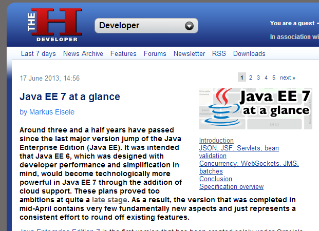
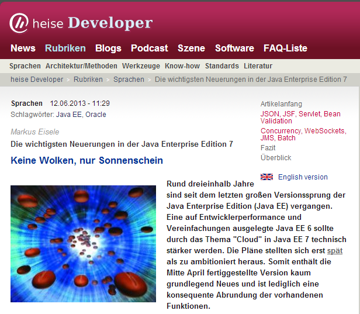
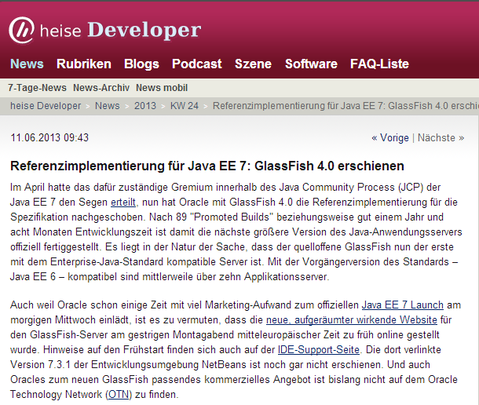

Java EE 7 is a couple of days old already. We all have had a chance to either watch the live launch events or the <a href="https://blogs.oracle.com/theaquarium/entry/view_on_demand_replay_of" target="_blank">available replays</a>. The last MR releases finished pushing their stuff to the JCP and it basically is a wrap. Time to reflect on what happened and what I think about it.
 
 <b>Community Participation within the Launch</b>
 
 Its not a big secret. Even if Oracle's Java EE 7 launch can be called a success and was very nicely arranged I was comparable unhappy that the highly praised community participation ended consequently before the launch. Not a single message was send to the FishCat members or the closed "Friends of GlassFish" list. Not a big surprise that a revamped glassfish.org draws some attention even if it jumped the gun and obviously haven't heard that the launch was scheduled a day later.
 
 Might be the time to realize that "GlassFish is paying the bills for WebLogic" (free after Cameron Purdy) and it simply was a product launch. And let me emphasize that I'm not unhappy about the launch event at all. It was awesome to have the opportunity to chat to so many spec leads and ask questions. If all this would have happened without the crappy Flash front-end it would have been incredible. Can't help myself; Duke in an Ironman suite would have been the ultimate thing here.
 
 <b>Press Coverage about Java EE 7</b>
 
 Some 20 something press releases, blogs and articles made it to the <a href="https://blogs.oracle.com/theaquarium/entry/java_ee_7_glassfish_4" target="_blank">official GlassFish</a> blog. Nothing compared to the 3.0 launch which was celebrated together with the community in form of a blogfest. Two of mine also made it into the list. I finally managed to catch up with everything I had prepared and most of the stuff is published by now. Happy reading!
 
 
 The H-Online (17 June 2013, 14:56)
 <a href="http://h-online.com/-1889207" target="_blank">Java EE 7 at a glance</a>
 
 

 

 Around three and a half years have passed since the last major version jump of the Java Enterprise Edition (Java EE). It was intended that Java EE 6, which was designed with developer performance and simplification in mind, would become technologically more powerful in Java EE 7 through the addition of cloud support. These plans proved too ambitions at quite a late stage. As a result, the version that was completed in mid-April contains very few fundamentally new aspects and just represents a consistent effort to round off existing features.
 
 
 Heise Developer (German,&nbsp;12.06.2013 - 11:29)
 <a href="http://heise.de/-1886333" target="_blank">Die wichtigsten Neuerungen in der Java Enterprise Edition 7 - Keine Wolken, nur Sonnenschein</a>
 
 

 

 Rund dreieinhalb Jahre sind seit dem letzten großen Versionssprung der Java Enterprise Edition (Java EE) vergangen. Eine auf Entwicklerperformance und Vereinfachungen ausgelegte Java EE 6 sollte durch das Thema "Cloud" in Java EE 7 technisch stärker werden. Die Pläne stellten sich erst spät als zu ambitioniert heraus. Somit enthält die Mitte April fertiggestellte Version kaum grundlegend Neues und ist lediglich eine konsequente Abrundung der vorhandenen Funktionen.
 
 
 Heise Developer (German,&nbsp;11.06.2013 09:43)
 <a href="http://heise.de/-1886175" target="_blank">Referenzimplementierung für Java EE 7: GlassFish 4.0 erschienen</a>
 
 

 

 Im April hatte das dafür zuständige Gremium innerhalb des Java Community Process (JCP) der Java EE 7 den Segen erteilt, nun hat Oracle mit GlassFish 4.0 die Referenzimplementierung für die Spezifikation nachgeschoben. Nach 89 "Promoted Builds" beziehungsweise gut einem Jahr und acht Monaten Entwicklungszeit ist damit die nächste größere Version des Java-Anwendungsservers offiziell fertiggestellt.
 
 
 DOAG Online (German)
 <a href="http://www.doag.org/de/de/home/aktuelle-news/article/fruehstart-fuer-glassfish-40-still-und-leise-veroeffentlicht.html" target="_blank">Frühstart für GlassFish 4.0</a>
 
 

 

 Die siebte Version der Java-EE-Spezifikation hat im JCP (Java Community Process) grade erst die Zielgrade genommen, Oracle vermarktet aktuell mit viel Energie den offiziellen „Java EE 7“-Launch am morgigen Mittwoch – und gestern Abend ist es dann passiert: Still und leise – und offensichtlich viel zu früh – tauchte die für den morgigen Launch komplett überarbeitete Webseite des GlassFish-Projekts online auf.