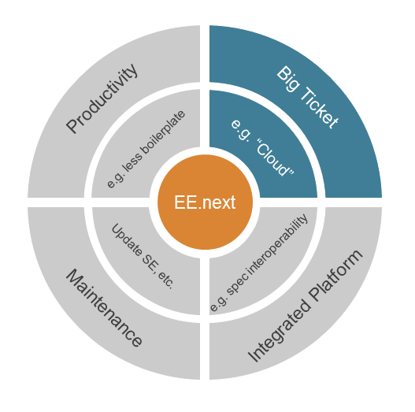

It took us a little less than three years to get the next <a href="http://www.jcp.org/en/jsr/detail?id=342" target="_blank">Java EE version</a> out the door. On April 16th this year the <a href="http://www.jcp.org/en/jsr/results?id=5513" target="_blank">JCP EC voted on JSR 342</a> and approved it. This is kind of a success story because the initial idea of having a cloud ready platform <a href="http://blog.eisele.net/2012/08/realigning-java-ee-7-promise-is-cloud.html" target="_blank">was withdrawn at the very last possible moment</a> in late August last year. As a member of the EG it is more or less easy to write about upcoming features. Even if the umbrella EG only is responsible for the platform level stuff and not the individual contained JSRs you need to know a little more about the details than I expected at first. But I'm not going to recap what has already been written by <a href="" target="_blank">Arun</a> or the <a href="" target="_blank">Adopt-a-JSR</a> members. Instead I would like to give you some more behind the scenes and impressions. First of all: A heartily "Thank-You!" to all the hard working EGs and contributors of the individual JSRs! It was a pleasure contributing as an individual and I am thankful for the patience and respect I received for my views and ideas!
 
 <b>Platform Road-map</b>
 
 What started back in 1998 has been a tremendous success. The Java Enterprise Edition as we know it today started out with less than 10 individual specifications and grew over time to what it is today. Different topics started to form the versions with the beginning of what was called J2EE 1.4 in 2003.
 

 

 A more developer centered view came up with the re-branding towards Java EE (and yes: <a href="https://java.net/projects/javaee-spec/pages/JEE" target="_blank">There is nothing named JEE! Never use that name!</a>&nbsp;Please! :)&nbsp;) This was extended in the overly successful sixth version. Following that path for me it seemed as if the "cloud" topic initially proposed for 7 came out of nowhere. Reading Linda's email about the possible re-alignment was kind of a relief and the only thing I have to add is, that it probably came to late. The cloud things will come up again in the next version which will start somewhere in the future hopefully.
 
 <b>What I would Wish for</b>
 
 My personal wish would be to have a better and longer strategy here. Knowing that we are talking about comparably long time-frames this might stay a wish but instead of adopting latest industry trends all over and leaving it up to the individual JSRs to fill the buzz words, I would rather like to see a more platform centered approach. Given the different categories in which each of the new EE versions emerges this could look like this:
 

 

 With a maximum of 25% fore each of them it would be a reasonable way to fulfill the needs for every stakeholder. 75% for standards related work to keep the platform integrated, usable and up to date and only 25% of the work to slightly adopt to new things. To me it feels like this approach would invert the way it is done today. But someone with more insight might proof me wrong here.
 
 Further on I would suggest, that the "Big Tickets" need some kind of a visionary road-map, too. Lets say it might be related to Gartners&nbsp;Emerging Technologies Hype Cycle.
 
<table align="center" cellpadding="0" cellspacing="0" class="tr-caption-container" style="margin-left: auto; margin-right: auto; text-align: center;">
 <tbody>
  <tr>
   <td style="text-align: center;"></td>
  </tr>
  <tr>
   <td class="tr-caption" style="text-align: center;">Gartners Emerging Technologies Hype Cyle (Source: <a href="" target="_blank">Forbes.com</a>)</td>
  </tr>
 </tbody>
</table> So my personal road-map for EE's next big ticket topics would be the following:
 

 

 <b>Transparency and Community Contribution and Work in the EG</b>
 
 Even if I am complaining about the lack of transparency behind the overall planning I have to note that overall transparency and community contribution raised to a new level in EE 7. Starting with the <a href="http://blog.eisele.net/2012/12/java-ee-7-community-survey-results.html" target="_blank">official survey</a> which Linda launched at the EE-BOF at JavaOne last year on to the upgraded JCP version (<a href="http://jcp.org/en/resources/2.8" target="_blank">JCP 2.8</a>) which is in use for most of the EE JSRs and the incredible amount of people working in the <a href="" target="_blank">Adopt-A-JSR program</a>&nbsp;this has been the most <a href="https://blogs.oracle.com/arungupta/entry/transparency_and_community_participation_in" target="_blank">open EE specification effort of all time</a>. And for those willing to contribute further I suggest &nbsp;that you get familiar with the&nbsp;<a href="" target="_blank">Adopt-a-JSR program</a> and start contributing. This is a great way to give feedback to the individual EGs. You're of course free to pick whatever specification you want and contribute on the user-mailing-lists. They are open and the EGs monitor what is happening there. Further on, most of the EG members are publicly reachable and happy to receive feedback.
 
 Generally I am pleased to say that working in the EE 7 Expert Group was a pleasant experience. I am incredibly honored to have the chance to work with the brightest EE minds in the industry. This includes Bill and Pete and many others. Especially those who won this year's <a href="https://blogs.oracle.com/jcp/entry/new_star_spec_leads" target="_blank">Star Spec Lead award</a> are the ones I recall being open and responsive to any single question I had. Thank you.
 
 <b>Java Enterprise Edition 7 at a Glance</b>
 
 Enough of behind the scenes and crazy ideas. Here is what EE 7 looks like as of today:
 

 

 With four new specifications on board and four pruned ones (EJB Entity Beans, JAX-RPC 1.1, JAXR 1.0, und JSR-88 1.2) we're exactly where we've been in EE 6 according to the numbers. The complete specification now contains 34 individual specifications.
 
 
<table border="1" cellpadding="10" cellspacing="0">
 <tbody>
  <tr>
   <td>Spezifikation</td>
   <td>JSR</td>
   <td>Version</td>
   <td>Java.net Project</td>
  </tr>
  <tr>
   <td>Java&nbsp;Platform,&nbsp;Enterprise&nbsp;Edition&nbsp;</td>
   <td>342</td>
   <td>7</td>
   <td><a href="" target="_blank">javaee-spec</a></td>
  </tr>
  <tr>
   <td>Managed Beans</td>
   <td>342</td>
   <td>1.0</td>
   <td></td>
  </tr>
  <tr>
   <td>Java EE Web Profile (Web Profile)</td>
   <td>342</td>
   <td>1.0</td>
   <td></td>
  </tr>
  <tr>
   <td>Java API for RESTful Web Services (JAX-RS)</td>
   <td>339</td>
   <td>2.0</td>
   <td><a href="" target="_blank">jax-rs-spec</a></td>
  </tr>
  <tr>
   <td>Web Services for Java EE</td>
   <td>109</td>
   <td>1.4</td>
   <td></td>
  </tr>
  <tr>
   <td>Java API for XML-Based Web Services (JAX-WS)</td>
   <td>224</td>
   <td>2.2</td>
   <td><a href="" target="_blank">jax-ws</a></td>
  </tr>
  <tr>
   <td>Java&nbsp;Architecture&nbsp;for&nbsp;XML&nbsp;Binding&nbsp;(JAXB)</td>
   <td>222</td>
   <td>2.2</td>
   <td><a href="" target="_blank">jaxb</a></td>
  </tr>
  <tr>
   <td>Web Services Metadata for the Java Platform</td>
   <td>181</td>
   <td>2.1</td>
   <td></td>
  </tr>
  <tr>
   <td>Java&nbsp;API&nbsp;for&nbsp;XML-Based&nbsp;RPC&nbsp;(JAX-RPC)&nbsp;(Optional)</td>
   <td>101</td>
   <td>1.1</td>
   <td><a href="" target="_blank">jax-rpc</a></td>
  </tr>
  <tr>
   <td>Java API for XML Registries (JAXR) (Optional)</td>
   <td>93</td>
   <td>1.0</td>
   <td></td>
  </tr>
  <tr>
   <td>Servlet</td>
   <td>340</td>
   <td>3.1</td>
   <td></td>
  </tr>
  <tr>
   <td>JavaServer Faces(JSF)</td>
   <td>344</td>
   <td>2.2</td>
   <td><a href="" target="_blank">javaserverfaces</a></td>
  </tr>
  <tr>
   <td>JavaServer Pages (JSP)</td>
   <td>245</td>
   <td>2.3</td>
   <td></td>
  </tr>
  <tr>
   <td>JavaServer Pages Expression Language (EL)</td>
   <td>341</td>
   <td>3.0</td>
   <td><a href="" target="_blank">el-spec</a></td>
  </tr>
  <tr>
   <td>A Standard Tag Library for JavaServer Pages (JSTL)</td>
   <td>52</td>
   <td>1.2</td>
   <td><a href="" target="_blank">jstl</a></td>
  </tr>
  <tr>
   <td>Debugging Support for Other Languages</td>
   <td>45</td>
   <td>1.0</td>
   <td></td>
  </tr>
  <tr>
   <td>Contexts and Dependency Injection for the Java EE Platform (CDI)</td>
   <td>346</td>
   <td>1.1</td>
   <td><a href="https://github.com/jboss/cdi/wiki" target="_blank">github.com</a></td>
  </tr>
  <tr>
   <td>Dependency Injection for Java (DI)</td>
   <td>330</td>
   <td>1.0</td>
   <td></td>
  </tr>
  <tr>
   <td>Bean Validation</td>
   <td>349</td>
   <td>1.1</td>
   <td><a href="" target="_blank">http://beanvalidation.org</a></td>
  </tr>
  <tr>
   <td>Enterprise JavaBeans (EJB)</td>
   <td>345</td>
   <td>3.2</td>
   <td><a href="" target="_blank">ejb-spec</a></td>
  </tr>
  <tr>
   <td>Java EE Connector Architecture (JCA)</td>
   <td>322</td>
   <td>1.7</td>
   <td></td>
  </tr>
  <tr>
   <td>Java Persistence (JPA)</td>
   <td>338</td>
   <td>2.1</td>
   <td><a href="" target="_blank">jpa-spec</a></td>
  </tr>
  <tr>
   <td>Common&nbsp;Annotations&nbsp;for&nbsp;the&nbsp;Java&nbsp;Platform</td>
   <td>250</td>
   <td>1.2</td>
   <td></td>
  </tr>
  <tr>
   <td>Java Message Service API (JMS)</td>
   <td>343</td>
   <td>2.0</td>
   <td><a href="" target="_blank">jms-spec</a></td>
  </tr>
  <tr>
   <td>Java Transaction API (JTA)</td>
   <td>907</td>
   <td>1.2</td>
   <td><a href="" target="_blank">jta-spec</a></td>
  </tr>
  <tr>
   <td>JavaMail</td>
   <td>919</td>
   <td>1.5</td>
   <td><a href="" target="_blank">javamail</a></td>
  </tr>
  <tr>
   <td>Java Authentication Service Provider Interface for Containers (JASPIC)</td>
   <td>196</td>
   <td>1.1</td>
   <td><a href="" target="_blank">jaspic-spec</a></td>
  </tr>
  <tr>
   <td>Java Authorization Contract for Containers (JACC)</td>
   <td>115</td>
   <td>1.5</td>
   <td><a href="" target="_blank">jacc-spec</a></td>
  </tr>
  <tr>
   <td>Java EE Application Deployment (Optional)</td>
   <td>88</td>
   <td>1.2</td>
   <td></td>
  </tr>
  <tr>
   <td>Java Database Connectivity (JDBC)</td>
   <td>221</td>
   <td>4.0</td>
   <td></td>
  </tr>
  <tr>
   <td>Java Management Extensions (JMX)</td>
   <td>255</td>
   <td>2.0</td>
   <td><a href="" target="_blank">openjdk</a></td>
  </tr>
  <tr>
   <td>JavaBeans Activation Framework (JAF)</td>
   <td>925</td>
   <td>1.1</td>
   <td></td>
  </tr>
  <tr>
   <td>Streaming API for XML (StAX)</td>
   <td>173</td>
   <td>1.0</td>
   <td><a href="" target="_blank">sjsxp</a></td>
  </tr>
  <tr>
   <td>Java Authentication and Authorization Service (JAAS)</td>
   <td></td>
   <td>1.0</td>
   <td></td>
  </tr>
  <tr>
   <td>Interceptors</td>
   <td>318</td>
   <td>1.2</td>
   <td><a href="" target="_blank">interceptors-spec</a></td>
  </tr>
  <tr>
   <td>Batch Applications for the Java Platform</td>
   <td>352</td>
   <td>1.0</td>
   <td><a href="" target="_blank">jbatch</a></td>
  </tr>
  <tr>
   <td>Java API for JSON Processing</td>
   <td>353</td>
   <td>1.0</td>
   <td><a href="" target="_blank">json-processing-spec</a></td>
  </tr>
  <tr>
   <td>Java API for WebSocket</td>
   <td>356</td>
   <td>1.0</td>
   <td><a href="" target="_blank">websocket-spec</a></td>
  </tr>
  <tr>
   <td>Concurrency Utilities for Java EE</td>
   <td>236</td>
   <td>1.0</td>
   <td><a href="" target="_blank">concurrency-ee-spec</a></td>
  </tr>
 </tbody>
</table>
 <b>Free Online Launch Event for Java EE 7</b>
 

 

 If you're interested in first hand information about all the new specs<a href="https://event.on24.com/eventRegistration/EventLobbyServlet?target=registration.jsp&amp;eventid=615713&amp;sessionid=1&amp;key=453EBA948F6408FE613E61903CBAEBFA&amp;partnerref=Java_EE7_Launch_glassfishblogs_06122013&amp;sourcepage=register" target="_blank"> register for the Java EE 7 Launch Webcast: Jun 12th</a>.
 
 
 The introduction of Java EE 7 is a free online event where you can connect with Java users from all over the world as you learn about the power and capabilities of Java EE 7. Join Oracle for presentations from technical leaders and Java users from both large and small enterprises, deep dives into the new JSRs, and scheduled chats with Java experts.
 
 
 - Business Keynote (Hasan Rizvi and Cameron Purdy)
 
 - Technical Keynote (Linda DeMichiel)
 
 - Breakout Sessions on different JSRs by specification leads
 
 - Live Chat
 
 - Lots of Demos
 
 - Community, Partner, and Customer video testimonials