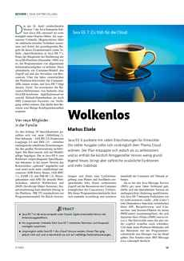

Another article hit the road today. This time a comprehensive introduction to Java EE 7 in <a href="" target="_blank">German iX Magazine 7/2013</a>.
 
 

 

<b>Cloudless</b>
 
 Java EE 7: Too early for the Cloud
 
 Java EE 6 scored with many simplifications for developers. The seventh edition should initially address PaaS and cloud topics. However, the plan turned out to be too ambitious, and the recently completed version contains little fundamentally new, but has numerous additional features and more stability.
 
 
 This is a German article and you can either grab the latest <a href="" target="_blank">issue online</a> or buy it at your favorite kiosk.
 
 
 If you're curious about an English version have a look at my "<a href="http://h-online.com/-1889207" target="_blank">Java EE 7 at a glance</a>" article published by The H-Online (17 June 2013, 14:56).
 
 
 Find some other articles of mine by searching this blog for posts labeled "article" and you get some results.