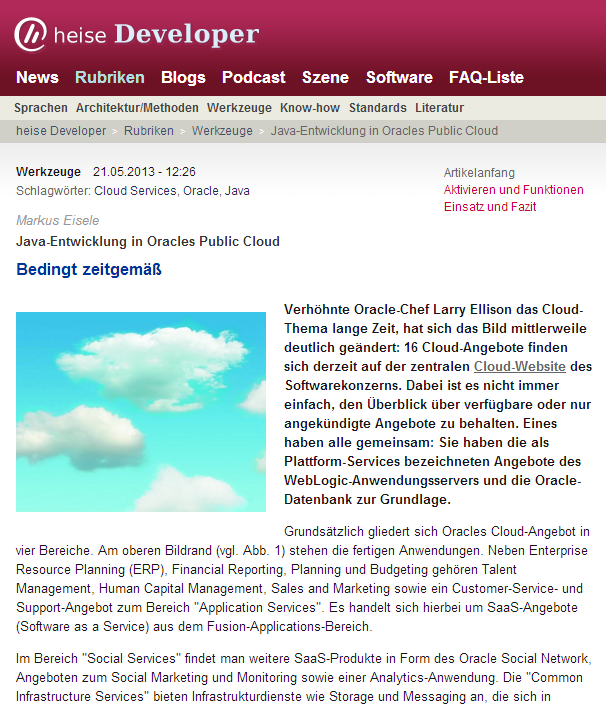

A short information for my German audience. A new article of mine was published a few days ago. Read it <a href="http://heise.de/-1866388" target="_blank">online free of charge</a> in German on the <a href="" target="_blank">heise.de/developer</a> website.
 
 

 

 Java EE Development with Oracle's Public Cloud
 <b>Only partly up to date </b>
 
 Oracle CEO Larry Ellison mocked the cloud topic for a long time. This has changed significantly in the meantime: 16 cloud offerings can be found on the central website for the cloud software company. It is not always easy to keep track of already available or pre-announced offerings. They all have one thing in common: They are based on the platform services offerings which are based on the WebLogic Application Server and the Oracle database. 
 
 
 Curious about your feedback!