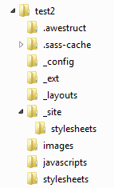

This blogpost has been sitting on my todo-list since some time. I've seen one of my favorite FOSS advocates <a href="https://twitter.com/mojavelinux">Dan Allen</a> working on Awestruct and Aciidoctor it since some time and even some Arquillian guys jumped on the train. Time to find out what the hell it actually is and what it takes to get a decent setup up and running.
 
 
 First let me briefly introduce what I understood about all the key parts of that awesome mix. The whole thing basically is about documentation. This is a wide area and has different flavors and processes. The most basic idea here is that writing documentation for developers should be a breeze. It should be text based and most likely not require any special IDE (like Word ;)).
 
 <b>Asciidoc? Asciidoctor? Documentation!</b>
 
 Starting with an easy way of writing and formatting directly leads to the introduction of Asciidoc which basically is a text document format for writing notes, documentation, articles, books, ebooks, slideshows, web pages, man pages and blogs. The initial <a href="http://www.methods.co.nz/asciidoc" target="_blank">AsciiDoc </a>is both a piece of software and kind of a markup language. To run it you need Python. Not exactly a commonly used thing on my side of the universe. But another nice port has been around since some time now. It is called AsciiDoctor which is an&nbsp;open source Ruby processor for converting AsciiDoc markup into HTML 5, DocBook 4.5 and other formats. That brings us one step closer to the Java ecosystem. Asciidoctor is a bit more than simply the processor and some stylesheets.&nbsp;The project provides plugins for Maven, Gradle and Guard and packages for operating systems such as Fedora. You can learn about <a href="" target="_blank">AsciiDoc </a>from the <a href="http://www.methods.co.nz/asciidoc/userguide.html" target="_blank">User Guide</a>. <a href="" target="_blank">Asciidoctor </a>also has&nbsp;a good bunch of <a href="" target="_blank">docs online</a>.
 
 <b>Other Markups - Ways to write without word.</b>
 
 There are other markup formats out there which do not require anything more than a solid text editor. Most relevant ones are&nbsp;<a href="" target="_blank">Haml</a> (HTML abstraction markup language), <a href="" target="_blank">Markdown</a>&nbsp;and probably also <a href="" target="_blank">YAML</a>. Basically you have a bunch of choices here. In addition to that you also find additional flavors like the <a href="" target="_blank">GitHub Flavored Markdown</a>. To make a long story the developer community has been fighting the need for heavyweight word processors since the very beginning and depending on the community you are in you are forced to use the one or the other.
 
 <b>Awestruct? Websites!</b>
 

 

 But documentation is basically nothing without publication. Most of the already mentioned processing approaches can publish a good bunch of different target formats. Stuff like&nbsp;&nbsp;ebooks, slideshows, PDF, word, web pages, man pages and blogs and many many more. But given the context we're most likely in it is not exactly sexy to run a Perl based solution during the more or less completely Java based build phase. This is where Awestruct and Asciidoctor come in. Awestruct is a tool for creating non-trivial static HTML sites in an easy way. The core concept of Awestruct is that of structures, specifically Ruby `OpenStruct` structures. The struct aspect allows arbitrary, schema-less data to be associated with a specific page or the entire site. Site-specific data is automatically loaded from simple YAML files, while data can be provided on pages using a front-matter prolog. In one sentence: "It builds webseits from different markup and configurations" in an easy way. As the complete project and ecosystem of Ruby is mostly build around Linux/Unix based systems you hardly find any documentation about setting this up on Windows.
 
 <b>Lets get rolling - on Microsoft Windows</b>
 
 This blog is there to fix this. It is going to be a step-by-step guide and should help you getting your initial environment up.
 
 First thing to do is to download JRuby. There are indeed native Ruby versions for Windows available but the package concept for third party libraries is mostly build to support native OS extensions. By using JRuby we take advantage of the Java Runtime as a machine adoption layer while still staying close to the Ruby ecosystem. You can download JRuby from <a href="http://jruby.org/download">http://jruby.org/download</a>. You find different releases and packaging formats there. I picked the 1.7.4 Windows x64 executable and installed it into a top level folder on my hdd:\jruby-1.7.4. If you allow JRuby to set the PATH variable automatically pointing to your&nbsp;\bin folder you're all set. A prerequisite is that you have a JRE installed. If not, you're most likely (reading the wrong blog) willing to use one of the JRuby+JRE&nbsp;installers.
 
 To make JRuby work with your already installed Java Version you should first check which version you're actually using by typing:
 
<pre>jruby -v</pre>
<pre>jruby 1.7.4 (1.9.3p392) 2013-05-16 2390d3b on Java HotSpot(TM) 64-Bit Server VM 1.7.0_25-b16 [Windows 7-amd64] </pre> The result shows exactly which JRE version is in use. You can change it by pointing the environment variable JAVA_HOME to another path. Sitting behind a corporate proxy will require another environment variable: 
 
<pre>set http_proxy=http://your.proxy.com:3128 </pre> Now you're almost set to actually install Awestruct. Installation is comparably easy. Find a command prompt and enter:
 
<pre>jruby -S gem install awestruct bundler</pre>
 
 This will contact the packaging manager and download the required libraries. That is all for now. Next step is to create a new folder somewhere which should host your website project. Go ahead and create one (named "test2" during this guide) and change to this directory with your command-line. Now it is time to initialize your project from default by entering:
 
<pre>awestruct --init --framework bootstrap </pre>
 

 

 It is safe to ignore the warnings for now. The command should come up with a directory structure as outlined on the <a href="">awestruct website</a>. I get a "Permission Denied" error on my system issuing this command. To me it seems as if it is safe to ignore also. I filed and <a href="https://github.com/awestruct/awestruct/issues/314">issue about it</a>. This gave you a basic layout with twitter-bootstrap support for your project. You also got a "Gemfile" in the root folder. Gemfiles are the bundler mechanism of fetching dependent libraries for a project. The initial version only contains the raw minimum which is needed to run a very basic setup. To execute awestruct with less warnings and noise you should add some additional dependencies. Un-comment the lines starting with by removing the "#":
 
<pre>gem 'coffee-script' gem 'asciidoctor' gem 'kramdown' gem 'uglifier' gem 'htmlcompressor'</pre>
 
 You install the new bundles by issuing a:
 
<pre>bundle install </pre> At the command line. This again fetches some additional libraries and puts them in your&nbsp;jruby-1.7.4\lib\ruby\gems\shared\gems folder for you to use. We're almost there. Now you can start the built-in awestruct server (WEBrick) with:
 
<pre>awestruct -d </pre> This still puts a bunch of warnings out but you can already access your website at&nbsp;<a href="">http://localhost:4242/</a>&nbsp;and you will see the awestruct-welcome page. Now we need to make some asciidoc files. Create a new file in your project root and name it hello.adoc&nbsp;with the following content:
 
<pre>= Hello, AsciiDoc! Doc Writer &lt;doc@example.com&gt; An introduction to http://asciidoc.org[AsciiDoc]. == First Section * item 1 * item 2 [source,ruby] puts "Hello, World!" </pre>
 
 Running in "-d" development mode should in theory automatically regenerate pages. This actually did not work with my setup. Instead kill the running awestruct process and restart it does. Also using <a href="" target="_blank">Rake </a>works very well. Anyway the outcome is the same:&nbsp;navigating to&nbsp;<a href="http://localhost:4242/hello.html">http://localhost:4242/hello.html</a>&nbsp;displays your nicely shiny new asciidoc based website. Congratulations. You're ready.
 
 
 There is a lot to learn from now on. You can have a look at the awestruct website and find you way through the documentation. You can also have a look at one of the examples from the <a href="" target="_blank">gallery</a>. There are a couple of extensions which make this even more interesting. If I find the time I am going to dig into details in later posts.
 
 
 