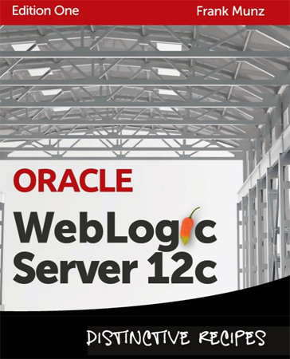

It has been some time since I last read a book about WebLogic. Also the coverage here on the blog has been a little weak in the last few years. Both due to various reasons I can not really talk about. Anyway I still enjoy working with this server and I am always on the hunt for new books covering different aspects. Frank Munz published his "WLS Distinctive Recipes" book early this year and I was more than happy that he send a review copy to me to have a detailed look. Thanks Frank!
 
 <b>Abstract</b>
 

 

 Imagine you need to know about a problem with your car's engine. You could plough through the 1000-page manual. Or you could chat to the mechanic over a cup of coffee.
 
 That's WebLogic 12c Advanced Recipes. It's WebLogic for software architects, administrators and developers. For people like you who know quite a bit about WebLogic. What you don't want is the typical 'recipe book' full of screenshots. Click here. Click there. Do this. Do that. That's WebLogic by numbers.
 
 What you really want are the things you won't find in the manual, like recommendations, discussions, best practices, deployable modules, NetBeans projects, more than 40 webcast videos and directions on when to use a feature - and when not to. With all this and more, this book is the perfect complement to official courses and manuals. In short, this gem of a book is almost as good as attending one of Frank's renowned workshops.
 
 
 Book: <a href="" target="_blank">Oracle WebLogic Server 12c: Distinctive Recipes</a>
 
 Language : English
 
 Paperback : 450 pages [ 0.9 x 7.4 x 9.1 inches ]
 
 Release Date : January 9, 2013
 
 ISBN-10: 0980798019
 
 ISBN-13: 978-0980798012
 
 <b>About the Author</b>
 
 Dr. Frank Munz (<a href="https://twitter.com/frankmunz" target="_blank">@frankmunz</a>) is an expert in middleware and distributed computing. He earned a Ph.D. in computer science from the "Technische Universität München" for his work on distributed computing and medical imaging in brain research. He published more than 20 peer reviewed scientific papers.
 
 In 2011 Frank received the Oracle Technologist of the Year award for cloud computing.
 
 Frank has over 15 years experience working for and on behalf of top middleware vendors and consultancies such as ConSol, Sun, BEA, TIBCO and Oracle, throughout Europe and Australia as a software architect, project manager and developer. In 2007 Frank founded <a href="" target="_blank">munz &amp; more</a> - a cutting-edge consultancy focusing on Oracle middleware and cloud computing. Based on over a decade of teaching experience with the big vendors, and its limitations, Frank is offering his own high-end training program world-wide now (Cloud Computing, Oracle Fusion Middleware, Oracle WebLogic Server Architecture, Operations and Development, Performance Tuning, Oracle Service Bus 11g).
 
 He loves to talk about features and showstoppers and frequently speaks at conferences all over the world.
 
 When Frank is not working, he enjoys travelling in Southeast Asia, skiing in the Alps, tapas in Spain, and scuba diving in Australia.
 
 <b>The Content</b>
 
 As the title suggests, the book features "recipes". 64 in total. If you remove the preface and the index you end up with 417 pages full of content which is a great value. The individual recipes are organized in four steps (Situation - Solution - Directions - More?). The situation describes the problem domain generally. The solution part gives a recommendation and dives a little deeper into it. The More? part finally points the reader to a bunch of links into the Oracle documentation, webcasts or even youtube for further information on the selected topic. The topics range from licensing to EJB covering SOA and individual products like JMeter, BadBoy and Grinder. So it is a colorful mix of WebLogic related topics without a true theme throughout the book. It would be good to follow the suggestion and use the individual recipes as you need them. Reading the book from front to back wouldn't make much sense at all. The length of the recipes highly depends on the covered topic. Clustering found it's place on eight pages which honestly isn't enough to describe the details but good for giving an overview together with some specific tips which require a deeper knowledge of the topic than the book provides.
 
 <b>Writing and Style</b>
 
 An easy read for me as a non-native speaker/reader. Common vocabulary from the WebLogic and Java EE domain and comparably short sentences which makes it easy to follow. You find a couple of screenshots and illustrations around which helps understanding the basics. The font is readable and plenty of space next to the heavy head- and sub-headlines makes it feel fluffy and light. As usual and recommended by the author himself I did not read every single recipe but picked a few that caught my attention.
 
 <b>Conclusion and recommendation</b>
 
 To make it short it is a great collection of various topics Enterprise Java developers tend to run into with a solid "More?" section for further details. The missing theme makes it hard for beginners to take advantage from it. The very basic overviews and brief outlines of the solutions makes it a questionable valuable for advanced WebLogic developers. This turns around if you try to put yourself into the admin domain. This book obviously hasn't been written to support developers on the first hand. It was probably meant for the guys doing WebLogic operations. Coming from this side of the pond much of the stuff starts making sense.