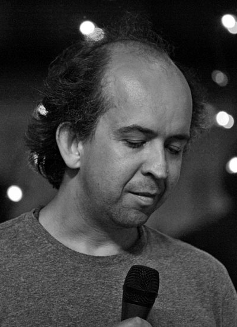

The "<a href="http://blog.eisele.net/2011/09/heroes-of-java.html">Heroes of Java</a>" series is back after a longer break. I'm somehow surprised about this interview. I occasionally run into Kevlin on conferences. And it is amazing to see him on stage. Asking him at last year's JavaZone was simple. Waiting nearly a year for the answers made me believe this is not going to happen. But it did. Thanks Kevlin! "Inbox 2!" :)
 
 <b>Kevlin Henney&nbsp;</b>
 

 

 is an author, presenter, and consultant on software development. He has written on the subject of computer programming and development practice for many magazines and sites, including Better Software, The Register, C/C++ Users Journal, Application Development Advisor, JavaSpektrum, C++ Report, Java Report, EXE, and Overload. He is a member of the IEEE Software Advisory Board. Henney is also coauthor of books on patterns and editor of 97 Things Every Programmer Should Know.
 
 <b>General part</b>
 <i>Who are you?</i> (Describe yourself in max three sentences)
 
 I am a software development consultant and trainer. I write and speak at conferences. I live in transit, online and, sometimes, at home in Bristol.
 
 <i>Your official job title at your company?</i>
 
 Anything I want it to be! One of the advantages of working for myself. That said, I have no reason to want or use one, so the only official title I've ever used is director, because legally that is what I am.
 
 <i>Do you care about it?</i>
 
 My job title? No. I've worn, worn through and outgrown many job titles, and have not found them to be a particularly useful currency. They are largely an organisational fetish.
 
 <i>Do you speak foreign languages? Which ones?</i>
 
 Yes. I'm part Brazilian, so I can speak and read Portuguese, although not with the fluency I'd like. My grammar and idiom are clumsy, my vocabulary doesn't extend to being able to hold technical conversations and my written skills are appalling! I have modest comprehension of French, German and Spanish, with varying degrees of fluency and incompetence. But I can order wine and beer in more languages than the ones I've just listed.
 
 <i>How long is your daily "bootstrap" process? (Coffee, news, email)</i>
 
 It can be anything from an hour to a whole day.
 
 <b>Twitter</b>
 <i>You have a twitter handle? Why?</i>
 
 It's hard to use Twitter effectively without one... [Ed: <a href="https://twitter.com/KevlinHenney" target="_blank">@KevlinHenney</a>]
 
 <i>Whom are you following in general?</i>
 
 A mix of friends, software developers, speakers, authors, miscellaneous geeks, science sites, news and business sources, writing journals, etc.
 
 <i>Do you have a personal "policy" for twitter?</i>
 
 I try to avoid being negative, so unless I can find humour or something constructive in a complaint, I'm not likely to tweet it. I prefer to stick to matters of technical and geeky interest, which sometimes means science, sometimes means code and sometimes is about one of my other interests, typically creative writing.
 
 <i>Does your company restricts or encourages you with your twitter usage?</i>
 
 I'm very fair with my employee. And my employer is very fair with me.
 
 <b>Work</b>
 <i>What's your daily development setup? (OS/IDE/VC/other Tools)</i>
 
 I normally carry a Windows laptop, although I have a few other things lying around at home from tablets to a Chromebook to old laptops in various states of old and odd OSs. Windows 8 is surprisingly good if you're a person who lives by keyboard shortcuts. I don't possess a mouse and I've found the touch screen to be surplus to requirements.
 
 
 As I don't specialise in developing every day and I deal with different languages in varying amounts, I have a mix of things installed and in use, from Eclipse to Visual Studio, from Java to Python. Some of these are for serious work and some are just for messing around with. An essential feature is some variation of Cygwin for command-line tools, although I also use PowerShell and the Ch shell. When it comes to editors outside the IDE I am likely to be found using Vim, Notepad2 or Notepad++.
 
 <i>Which is the tool providing most productivity to your work?</i>
 
 Realistically, given the number of hours in the day I spend using them, the award for most productive tool is going to go to one of Gmail, Chrome or PowerPoint!
 
 <i>Your preferred way of interacting with co-workers?</i>
 
 As I don't strictly speaking have any co-workers, I guess that my interactions are primarily around courses, workshops, meetings, etc. I prefer face-to-face interaction or email. I don't particularly like the phone and variations on that theme (e.g., Skype). These monopolise time without giving you either the presence and feedback of face-to-face interactions or the precision and asynchronicity of email.
 
 <i>What's your favorite way of managing your todo's?</i>
 
 Crossing them out! Seriously though, I prefer a physical list on A5 paper or index cards, with reminders for time-related events scattered throughout my calendar. I also use my inbox as a to-do list.
 
 <i>If you could make a wish for a job at your favorite company: What would that be?</i>
 
 I'll let you know when I know!
 
 <b>Java</b>
 <i>You're programming in Java. Why?</i>
 
 It offers a reasonable object-oriented lingua franca.
 
 <i>What's least fun with Java?</i>
 
 Either the verbosity or the type model.
 
 <i>If you could change one thing with Java, what would that be?</i>
 
 Less the language, more the development model: the reactive, snail's pace evolution of the language.
 
 <i>What's your personal favorite in dynamic languages?</i>
 
 Possibly Python, because of cleanliness, regularity and the proximity of the Pythonic ideal to functional programming. I've used it a little with my children. Without any dressing up in a hand-holding environment it offers a good entry level for non-programmers as well as being powerful and expressive for programmers.
 
 
 Alternatively, I have a growing appreciation for PowerShell. I've always had a soft spot for shell scripting, and what I've learnt about PowerShell has impressed me. It has made some good design decisions and well considered compromises, leaving it with a regular model and expressive syntax.
 
 
 And somewhere I will always have a soft spot for Lisp, although I haven't been doing much more than watching the recent renaissance of its family.
 
 <i>Which programming technique has moved you forwards most and why?</i>
 
 In my career and in my thinking there is little doubt that object-oriented programming gave me the greatest boost forward and the most insights, also helping to open up other approaches to programming once I realised the questions I could be asking of any approach. I first started getting into OOP around the time I was programming in Fortran and C, nearly quarter of a century ago.
 
 
 I really wish more people understood OO, because it would certainly stop them writing most of the Java legacy they are currently creating, and it would make them less surprised by functional programming when they properly understood that approach as well.
 
 <i>What was the biggest project you've ever worked on?</i>
 
 In terms of lines of code and potential effect on everyday life, I guess the biggest may have been a project I worked on many years ago to develop software to monitor and control electric power distribution. I have consulted on and contributed to larger systems, but have not been involved in developing those beyond short-term engagements.
 
 <i>Which was the worst programming mistake you did?</i>
 
 To the best of my knowledge, nothing catastrophic! Which suggests that I have yet to make my greatest programming mistake.