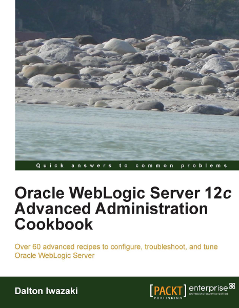

Another book crossed my desk. Following the latest hype around newly WebLogic Server release and Frank Munz's book there is another "recipe" driven administration book from Packt Publishing available. It was published in June this year and contains 60 advanced recipes to configure, troubleshoot and tune Oracle WebLogic Server.
 
 <b>Abstract</b>
 

 

 Oracle WebLogic Server 12c Advanced Administration Cookbook guides you through over 60 recipes covering right from the basics of the WebLogic Server 12c installation to JDBC, JMS, cluster configuration, and tuning. This book covers the day-to-day tasks of a WebLogic administrator, and is enhanced with a lot of tips to build a WebLogic production environment focused on stability, high availability, and performance.
 
 
 Book:&nbsp;<a href="http://www.packtpub.com/oracle-weblogic-server-12c-advanced-administration-cookbook/book" target="_blank">Oracle WebLogic Server 12c - Advanced Administration Cookbook</a>
 
 Language: English
 
 Paperback: 284 pages [9.2 x 7.5 x 0.6 inches]
 
 Release Date: June 18, 2013
 
 ISBN-10: 184968684X
 
 ISBN-13: 978-1849686846
 
 <b>About the Author</b>
 
 Dalton Iwazaki (<a href="https://twitter.com/xrxs" target="_blank">@xrcs</a>) lives in Sao Paulo, Brazil and started working with technology in 1994 in a school lab, at the age of 17. In 1999 he started working with Java development and server-side applications. In 2008, Dalton started working in partnership with Oracle Consulting on the infrastructure level of the WebLogic Server. Working together with Oracle's clients and projects, Dalton's solid expertise in infrastructure and Java development are a rare combination used in his specializations. He has&nbsp;19 years experience in Systems Administration, IT Infrastructure, Java Development, Systems Architecture and Troubleshooting.
 
 <b>The Content</b>
 
 I can't help but this books has something in common with Frank's book. One main difference is, that it is organized in chapters and does not only list the individual recipes but tries to order them a little bit more, which makes sense to me. In chapter one, installation and configuration is covered (11 recipes). Chapter two explains how to set up a WebLogic Cluster (9 recipes). In Chapter three you're guided through how to configure and tune JDBC resources focused on high availability (8 recipes). JMS configuration for clusters is covered in chapter four (11 recipes). Chapter five deals with monitoring and available tools (7 recipes). Followed by chapter six which covers some troubleshooting tips for common problems (8 recipes). Configuration for production environments with respect to resilience, stability, and performance is covered in chapter seven (9 recipes). And finally chapter eight dives into security configuration (5 recipes).
 
 If I didn't count wrong this makes 68 recipes on 260 content pages. Compared with the 64 recipes of <a href="http://blog.eisele.net/2013/07/review-oracle-weblogic-server-12c.html" target="_blank">Frank's book</a> this a bit more than half of his book. Every recipe Starts with a "Getting ready" preface which basically explains what is going to happen and what should be in place already. The "How to do it..." section gives a detailed, step-by-step explanation which is followed by the "How it works..." paragraph summarizing what exactly happened. The "There's more ..." and "See also" sections point you to related recipes or individual hints from the author.
 
 <b>Writing and Style</b>
 
 Another easy read. Thank you to the editors and the author for taking care of not native speakers. The step-by-step explanations make this easy to follow for beginners and occasional screenshots help with details. "Reading" from front to back surprisingly doesn't make lot of sense. It is more like a toolbox which solves your issues if you run into them. I did compare it with the "other" cookbook and reading this one wasn't equality surprising as Frank's book was. The main difference here is that it has word "Administration" in it's title. I guess it is clear that this is not primarily meant for developers. Even if it would be a good start for everyone which has to deal with WebLogic and really don't want to dive into administration too much.
 
 <b>Conclusion and recommendation</b>
 
 I like it. It covers all the basics and advanced topics I consider important for administrators but also for developers who need to understand the basic concepts and individual advanced topics like cluster configuration for production. I wasn't expecting a developer centered book which also added to this positive experience.