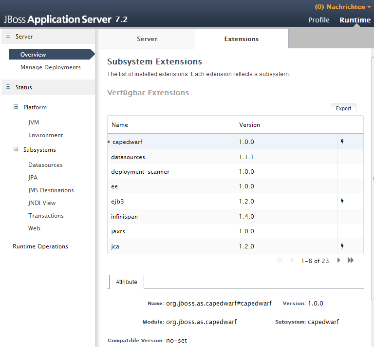
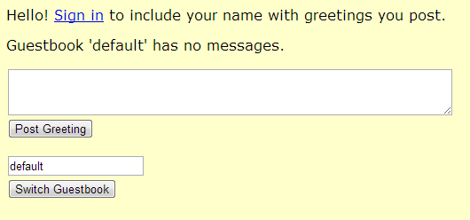
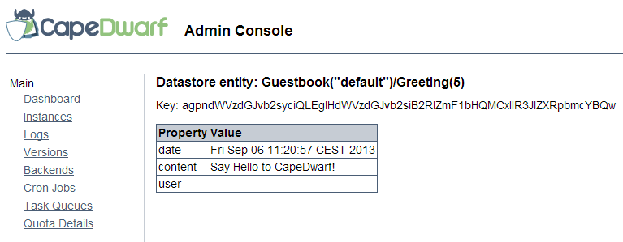

I have many hobbyhorses. Coming all the way from the early Java EE specifications and having done the "cloud" excursion with Java EE 7 I was curious to see what newly announced <a href="http://www.jboss.org/capedwarf" target="_blank">CapeDwarf</a> project has in stock to bring Google's Platform as a Service offering "<a href="https://cloud.google.com/products/app-engine" target="_blank">Google App Engine</a>" on premise.
 
 <b>The Story so Far</b>
 
 I did play around with App Engine. It was the first true PaaS offering for me back in the days. And I liked it. What I dislike is, that you have to check if <a href="https://code.google.com/p/googleappengine/wiki/WillItPlayInJava" target="_blank">GAE is playing nicely</a> with your flavor of Java. A couple of days back end of June <a href="http://googlecloudplatform.blogspot.de/2013/06/google-app-engine-running-in-private-cloud-with-capedrawf.html" target="_blank">Google and Red Hat announced</a> the official partnership working on the GAE TCK which sooner or later should bring the App Engine to Wildfly. 
 
 <b>Installing and Configuring your Environment</b>
 
 Let's start right away. Get CapeDwarf and play around with it. In the core there is Wildfly or AS7 as most of us still know the JBoss Applicationsserver. CapeDwarf is only an extension module and needs to be build in. There are basically two ways of getting it: Grep the latest build from the <a href="http://www.jboss.org/capedwarf/downloads" target="_blank">downloads page</a>&nbsp;which would be the Beta5 (released &nbsp;2013-07-10) or build it on your own. I tried the last way first and it is supported by a <a href="https://github.com/capedwarf/capedwarf-blue" target="_blank">very brief readme</a> on the github project page but I wouldn't recommend doing this. It takes roughly 30 minutes (pure build time) because you also have to build the AS&nbsp;7.2.0.Final yourself. If you get the zip distribution all you have to do is to unzip it and start the CapeDwarf enabled server via:
 
 
<pre>$JBOSS_HOME/bin/standalone.bat/.sh -c standalone-capedwarf.xml</pre>
 

  

 This looks like an AS 7 start at first beside the fact that it is taking much longer because of the JGroups startup. At least on my machine. Anyway after that you have to add an admin user and log-in to the server console at http://localhost:9090/ and check if the extension is there by visitin the "Extensions" tab. Now you're all set.
 
 

 

 
 <b>Using the Guestbook Example Application</b>
 
 All left to do now is to fire up the IDE of choice (NetBeans in my case) and get a nice little demo project up and running. Lets stick to the guestbook example which also is part of the <a href="https://developers.google.com/appengine/docs/java/gettingstarted/installing" target="_blank">official gae-sdk</a>. You should have Maven and Java 7 at hand already. The guestbook example is available as an official archetype and you can simply have it by using the following mvn command:
 
 
<pre> mvn archetype:generate -B -DarchetypeGroupId=com.google.appengine.archetypes -DarchetypeArtifactId=guestbook-archetype -DarchetypeVersion=1.7.7 -DgroupId=net.eisele.demo -DartifactId=guestbook -Dversion=1.0 -Dpackage=net.eisele.demo</pre>
 
 Everything you need in terms of dependencies is in central so you don't even have to configure another repository! Open the generated project right away and start to tweak some things. First you need to change the&nbsp;die appengine.target.version in the pom.xml to 1.8.3 Next thing is you need to add the relevant datastore indexes. As I understand it, GAE does this on it's own. CapeDwarf which relies on a couple of existing Red Hat technologies needs to be instructed to fire up the indexes. Add the&nbsp;datastore-indexes.xml to your src/main/webapp/WEB-INF/ folder with the following content:
 
 
<pre class="brush:xml"> &lt;?xml version="1.0" encoding="utf-8"?&gt; &lt;datastore-indexes autoGenerate="true"&gt; &nbsp; &nbsp; &lt;datastore-index kind="Greeting" ancestor="true" source="manual"&gt; &nbsp; &nbsp; &nbsp; &nbsp; &lt;property name="date" direction="asc"/&gt; &nbsp; &nbsp; &lt;/datastore-index&gt;  &lt;/datastore-indexes&gt;  </pre> If you add the&nbsp;&lt;finalName&gt;ROOT&lt;/finalName&gt; attribute to the &lt;build&gt; section of the pom you're ready to go. Deploy the app via the management console or put it to the $JBOSS_HOME/standalone/deployments folder. There you go. Navigate to <a href="">http://localhost:8080/</a> and watch the magic happen.
 
 

 

  

 You could post greetings or even login with an email-address and leave personalized comments. And everything without changing a single line of code. You could even deploy the same piece of code to the App Engine. Further on, if you navigate to <a href="">http://localhost:8080/_ah/admin/</a> you get a nice little admin console which gives you access to the underlying datastore.
 
 

 

 
 Even Datanucleus plays nicely within this game and you could make the examples run by changing the&nbsp;javax.jdo.PersistenceManagerFactoryClass in the jdoconfig.xml to&nbsp;org.datanucleus.api.jdo.JDOPersistenceManagerFactory. If you now get the dependency versions right (jdo-api:3.0.1,&nbsp;datanucleus-core:3.1.5) and you use the right maven datanucleus plugin:
 
 
<pre class="brush:xml"> &nbsp;&lt;plugin&gt; &nbsp; &nbsp; &nbsp; &nbsp; &lt;groupId&gt;org.datanucleus&lt;/groupId&gt; &nbsp; &nbsp; &nbsp; &nbsp; &lt;artifactId&gt;maven-datanucleus-plugin&lt;/artifactId&gt; &nbsp; &nbsp; &nbsp; &nbsp; &lt;version&gt;3.1.2&lt;/version&gt; &nbsp; &nbsp; &nbsp; &nbsp; &lt;configuration&gt; &nbsp; &nbsp; &nbsp; &nbsp; &nbsp; &lt;api&gt;JDO&lt;/api&gt; &nbsp; &nbsp; &nbsp; &nbsp; &nbsp; &lt;log4jConfiguration&gt;$\{basedir\}/log4j.properties&lt;/log4jConfiguration&gt; &nbsp; &nbsp; &nbsp; &nbsp; &lt;/configuration&gt; &nbsp; &nbsp; &nbsp; &nbsp; &lt;executions&gt; &nbsp; &nbsp; &nbsp; &nbsp; &nbsp; &lt;execution&gt; &nbsp; &nbsp; &nbsp; &nbsp; &nbsp; &nbsp; &lt;phase&gt;process-classes&lt;/phase&gt; &nbsp; &nbsp; &nbsp; &nbsp; &nbsp; &nbsp; &lt;goals&gt; &nbsp; &nbsp; &nbsp; &nbsp; &nbsp; &nbsp; &nbsp; &lt;goal&gt;enhance&lt;/goal&gt; &nbsp; &nbsp; &nbsp; &nbsp; &nbsp; &nbsp; &lt;/goals&gt; &nbsp; &nbsp; &nbsp; &nbsp; &nbsp; &lt;/execution&gt; &nbsp; &nbsp; &nbsp; &nbsp; &lt;/executions&gt; &nbsp; &nbsp; &nbsp; &lt;/plugin&gt; </pre> You're fine to go with that also. Give it a try. It is really easy.
 
 <b>Things to improve on for now</b>
 
 The implementation is limited at the moment. It seems as if the project team focuses on the official GAE-TCK. A majority of the APIs is completed and only nine out of 26 services aren't supported according to the <a href="http://www.jboss.org/capedwarf" target="_blank">CapeDwarf homepage</a>. Given that I would have expected to see a little bit more documentation. For now this basically comes down to the official Google documentation. If you run into something special you're on your own. If you have questions regarding the TCK a newly formed <a href="https://groups.google.com/forum/?hl=en#!forum/appengine-tck" target="_blank">Google Group</a> covers them. Good new: The Project Lead&nbsp;<a href="https://twitter.com/alesj" target="_blank">Aleš Justin</a> is responsive and helpful as I have experienced all Red Hat Java guys so far. If you are looking for examples there is a broad test coverage based on Arquillian in the CapeDwarf project. So this is a good place to start for now.
 
 <b>Google App Engine an Alternative to Java EE 8?</b>
 
 What is the bottom line? I would call the GAE infrastructure mature. Being launched in April 2008 and released to public late 2011 it had solid five years to grow to customer needs. Looking at the definitions from the cloud topic in early Java EE 7 specs and comparing them with what GAE already achieved is saddening. While EE has a very decent technical cut along application layers, GAE at least partly breaks this up into a service oriented way. While you see stuff like security spread nearly all over the place in SE/EE (JAAS, JASPIC, individual specs) GAE simply provides a <a href="" target="_blank">Users API</a> for User Management and an <a href="" target="_blank">AppIdentity API</a> for integration with other systems. Beside this it also provides APIs and abstractions for features that Java EE simply doesn't offer ready-made. I'm thinking about a <a href="" target="_blank">Multitenancy API</a> or something like the <a href="" target="_blank">Capabilities API</a>. If someone wanted to start lightweight on Google's PaaS in the past and tried to have a later migration to Java EE based on-premise hardware in mind he had to think carefully about mapping technologies and buying into Google specific services. As of today CapeDwarf already changed the rules significantly and lowered the vendor-lock risk.
 
 
 If you look at the specification side it has it's drawbacks. Google is in charge. Exclusively. For now I don't see any advisory-board or comparable thing in place. So if Google decides to pull back (e.g. Reader disaster) many people would be stuck. The open TCK on the other hand at least makes the specification available free of charge to everybody (ASL2.0). And this is what basically made CapeDwarf and <a href="" target="_blank">AppScale</a> possible. For now this isn't the better Java EE at least for me. But given the fact that we are again looking into a cloudy future with Java EE 8 this could be a blueprint for new specifications which need to be done and also could be a nice guideline for something I would call "topic centric APIs". Taking care for the business needs and no longer only for the technology problems. This is going to be an interesting movement in the next few years and I am curious if some other vendors jump on that train sooner or later. And it is sad to see that Google pulled themselves out of the JCP and the active development inside the standards body.
 
 <b>Further Links and Readings</b>
 
 The Blog of the project lead&nbsp;<a href="http://in.relation.to/Bloggers/Ales" target="_blank">http://in.relation.to/Bloggers/Ales</a>
 
 CapeDwarf on Github&nbsp;<a href="" target="_blank">https://github.com/capedwarf/</a>
 
 CapeDwarf Downloads&nbsp;<a href="http://www.jboss.org/capedwarf/downloads" target="_blank">http://www.jboss.org/capedwarf/downloads</a>
 
 The App Engine TCK&nbsp;<a href="https://github.com/GoogleCloudPlatform/appengine-tck" target="_blank">https://github.com/GoogleCloudPlatform/appengine-tck</a>
 
 
 