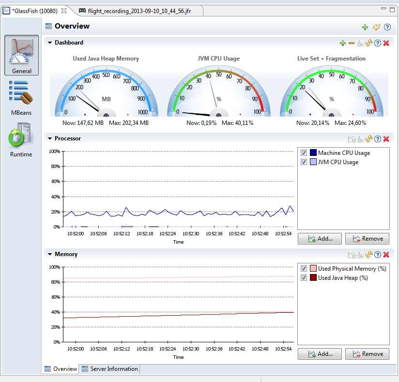
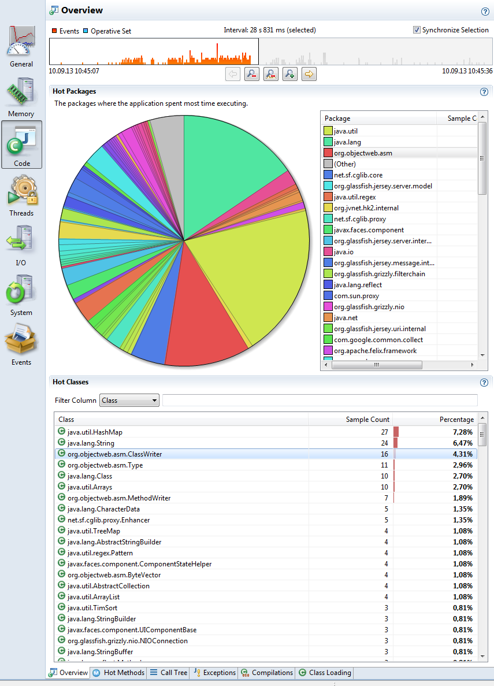

It has been a while since we last heard of this fancy little thing called Mission Control. It came all the way from JRockit and was renamed to Java Mission Control. This is one of the parts which literally survived the convergence strategy between HotSpot and JRockit. With today's Java SE 7 Update 40 you can actually use it again. 
 
 <b>Java Mission Control 5.2</b>
 
 The former JRockit Mission Control (JRMC) is now called Java Mission Control (JMC) and is a tools suite which includes tools to monitor, manage, profile, and eliminate memory leaks in your Java application without introducing the performance overhead normally associated with tools of this type. Up to today the 5.1 version was available within the Oracle HotSpot downloads which could only be received by paying customers from the Oracle Support Website. Todays release is the first release of Java Mission Control that is bundled with the Hotspot JDK! The convergence project between JRockit and Hotspot has reached critical mass. With the 7u40 release of the Hotspot JDK there is an equivalent amount of Flight Recorder information available from Hotspot. And having it finally makes sense. Beside hundreds of minor fixes and improvements the JMC Client is now build to run on Eclipse 3.8.2/4.2.2 and is also featuring a new JVM Browser with server-side subnotes. This makes tracking of running recordings and JVMs a lot easier.
 
 <b>Java Flight Recorder (JFR)</b>
 
 But the main and most important feature is the Flight Recorder. The Flight Recording feature work with events. Those events need to be produced by the underlying JVM. Hotspot has now reached event convergence with JRockit. That means that most useful information that was provided from JRockit is now also available from Hotspot. And because those are quite different JVMs; the information will in some cases be a bit different. The overall profiling overhead for your applications still stays at less than 2%. Usually much less. Which, considering the information you get, is next to nothing.
 
 <b>JFR with GlassFish 4</b>
 
 Lets get your hands dirty and try this with latest GlassFish. First change your glassfish4\glassfish\config\asenv.conf/.bat and add AS_JAVA=PATH/TO/JDK7u40 now start the domain and navigate to the JVM options. Or as an alternative open glassfish4\glassfish\domains\domain1\config\domain.xml and search for the relevant java-config tag and add the following two jvm-options:
 
 
<pre class="brush:xml">&nbsp; &nbsp; &lt;jvm-options&gt;-XX:+UnlockCommercialFeatures&lt;/jvm-options&gt; &nbsp; &lt;jvm-options&gt;-XX:+FlightRecorder&lt;/jvm-options&gt; </pre>
 
 Now restart the domain and look for the jdk1.7.0_40\bin\jmc and fire it up. If you're running on the same machine you should already see a list of available JVMs in the JVM Browser. If you expand the GlassFish node and double click the "MBean Server" node you get a nice overview over what is happening right now: 
 
 

 

 
 From there you can start a flight recording by right clicking the "Flight Recorder" node in the JVM Browser. Select the desired recording time and event settings (which now btw have a new template feature to pre select events :)) and click finish. After the desired timeframe the recording gets downloaded to JMC and you can look through the timeline and find bottlenecks. 
 <strike>A very small drawback is, that you can't run it with GlassFish 3. There is a <a href="https://java.net/jira/browse/GLASSFISH-18777" target="_blank">know bug</a> which got fixed for the 4.0 release about ordering of the jvm-options.</strike>
 
 UPDATE 12/02/13: A coworker pointed me to a nice workaround documented in the originally mentioned bug. It's possible to set the required flags using debug-options and enable debug for the domain:
 
<pre class="brush:xml">&lt;java-config ... debug-enabled="true" debug-options="... -XX:+UnlockCommercialFeatures -XX:+FlightRecorder"&gt; </pre><b>What is hot?</b>
 
 The best thing since sliced breed is, that you now have method profiling events! With the method profiling events you can find out where your application is spending the most time executing your Java code. This is, for instance, useful to optimize the application where the optimizations actually have an impact. 
 

 

  

 Further on you have an improved allocation profiling tab.You can now see per TLAB allocation with traces, and object being allocated directly in old space. That "new and improved" theme continues throughout the all tabs in the flight recorder. You get a File I/O, Socket I/O and many many more which provide plenty of insights.
 
 <b>Experimental Plugins</b>
 
 And the best part for me is that the team keep going with a bunch of experimental plugins. A new one was added called&nbsp;JOverflow - Heap dump analysis for memory waste. This plug-in allows Mission Control to do heap dump analysis, primarily to look for wasted heap space. There are several different anti-patterns JOverflow will look for, such as duplicate strings, underutilized collections etc. This plug-in also adds an action (for local connections) that will perform a heap dump and then visualize the heap dump with JOverflow. This is somehow a short term replacement for the Memleak Analyzer which you might know from JRMC. The D-Trace Plugins also got a major overhaul. You can find out more about it on <a href="http://hirt.se/blog/?p=273" target="_blank">Marcus Hirt's blog</a>.
 

  

 <b>Download and Further Reading</b>

 You can grep the latest 7u40 download from the Oracle Technology Network <a href="" target="_blank">Java SE Download Page</a>. Java Mission control is already integrated and you're ready to run it.
  
  If you need more information visit&nbsp;<a href="http://oracle.com/missioncontrol" target="_blank">oracle.com/missioncontrol</a>&nbsp;where you can find the links to the documentation and Eclipse update sites.

