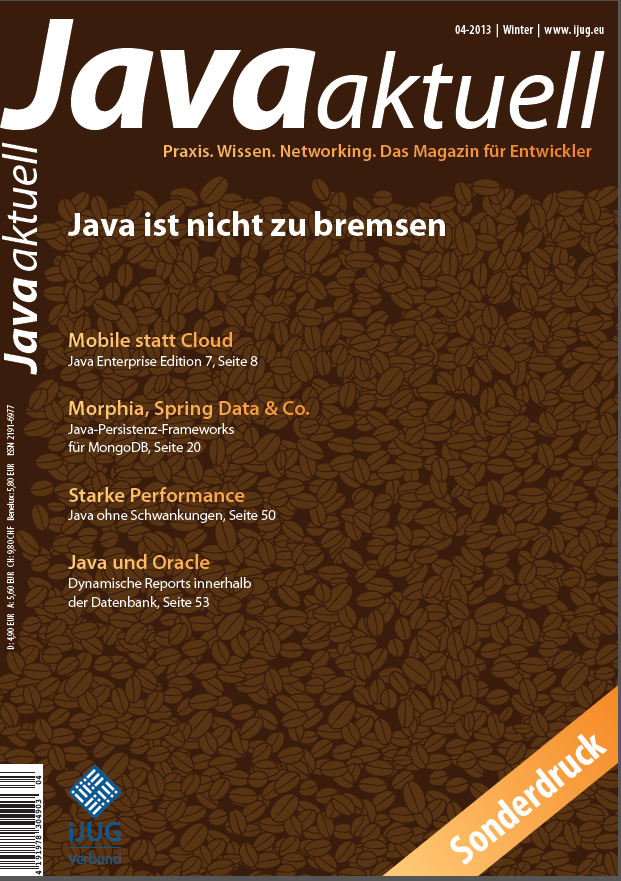

Once in a while I publish stuff. This one is for my German speaking and reading audience. Latest Java Aktuell isse, which is the mouth piece of German <a href="" target="_blank">iJUG e.V.</a> has published an article of mine about the new Java EE 7 release.
 
 <b>Mobile statt Cloud - Java EE 7</b>
 <b>Java Aktuell 04/2013</b>
 

 

 [GER] Es hat nur wenig mehr als drei Jahre gedauert, um aus der „6“ eine „7“ zu machen. Gemeint ist die Versionsnummer der Java Enterprise Edition (EE). Ursprünglich war die siebte Ausgabe stark auf das Thema „Cloud“ ausgelegt. Die Pläne stellten sich erst spät als zu ambitioniert heraus. Somit enthält die am 16. April 2013 fertiggestellte Version nur punktuell grundlegend Neues und stellt eine konsequente Abrundung der bereits vorhandenen Funktionen dar. Am 12. Juni 2013 feierte Oracle das fertige Werk mit einem internationalen Launch-Event.
 
 
 You can <a href="https://docs.google.com/file/d/0B2U4kn1681CMMGlMVjFncUFpVTA/edit?usp=sharing" target="_blank">download the article free</a>&nbsp;(PDF) of charge! Enjoy!
 
 
 If you want to know more about it have a look at the website <a href="" target="_blank">www.java-aktuell.de</a>