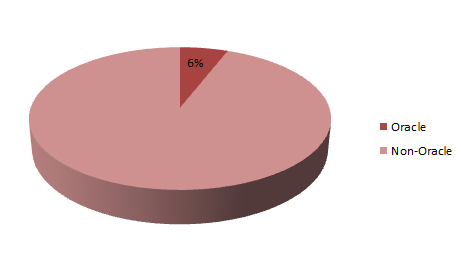

You probably have heard about the new upcoming Java centered conference in Germany next year.&nbsp;<a href="http://www.javaland.eu/en/javaland-2014.html" target="_blank">JavaLand 2014</a> will open its gates for two days. So make sure you are around when this new conference will become the hub of the German Java developer scene. I'm proudly part of the conference organizers and as a program chair I get plenty of help from the <a href="http://www.javaland.eu/en/themen/programmkomitee.html" target="_blank">awesome program committee</a> which was recruited out of the German JUG umbrella called <a href="" target="_blank">iJUG</a>.
 
 
 With every new conference or thing to happen people start asking questions. Until the final schedule isn't published and the first conference is run, most of it is unanswered. But I like to give you a solid first set of impressions about the conference. The following charts and arts are generated based on the more than 400(!) paper submissions we got during the official CfP! It is intended to give you a first impression but will probably not completely reflect the finished conference schedule which will be out shortly (expected: mid November).
 
 <b>The Topics - An Overview</b>
 

 

 First of all I tweeted a <a href="" target="_blank">Wordle</a> about the submitted topics.
 
 Basically a broad mix around Java. It is quite interesting to see, that there is quite a bit of Spring in there and JavaFX absolutely was among the big topics. It was good to see, that JVM based languages also got some love because this conference is intended to host different topics around the JVM as a runtime and as such give exposure to all the different JVM languages also. Enterprise and Mobile together with different DevOps topics are spread among the place. If you look carefully you see some German in it. As of today we don't know the ratio between German and English talks. But given the fact that we got a good number of international proposals I expect it to play a role. We basically don't focus on either one. As long as there is good content in it.
 
 <b>Proposed Talks from 18 Different Countries</b>
 
 Overall we got proposals from mostly Europe and the States. In total 18 different countries. Which is amazing! A big "Thank you!" to all the submitters!
 
 <b>What role does Oracle play?</b>
 
 Next big question is what role does Oracle play in all that. The conference is organized by German Oracle User Group (<a href="" target="_blank">DOAG</a>) and many suspect any (probably unfair) Oracle involvement. The only thing I can reply to it is: There isn't anything wrong going on here. Oracle actually IS supporting this conference along the lines they did before with the annual <a href="" target="_blank">DOAG Conference and Exhibition</a>. Given the fact, that the DOAG Conference will be hosting less and less Java over the next years Oracle was given the chance to submit talks. Like anybody else could. Additionally they host program committee meetings in their locations. Which was incredibly kind of them. That is great support for the German Java Community!
 
 The overall ratio Oracle vs. Non-Oracle talks in the CfP was 6:94 ... Yes, only 6 out of 100 talks were proposed by Oracle employees. This is not a typical Oracle conference ratio. If you compare the numbers I published from <a href="http://blog.eisele.net/2012/04/javaone-2012-analysis-submitted.html" target="_blank">last year's JavaOne</a>&nbsp;the Oracle Speakers take up to 30%.
 

 

<b> </b> <b>What will the content look like?</b>
 
 A great question. We don't know yet. The last PC meeting will happen shortly but what I can tell you is how the overall distribution looks like according to the submitted proposals:
 

 

 
 Comparable evenly distributed. Except that we got too less security submissions. But at least some good ones. I expected to see more JVM languages talks but the feedback we're taking here is that we did a bad job communicating the focus correctly. We'll try to correct this. We're beginners here. Please be patient ;)
 
 <b>What about the Rest?</b>
 
 There is plenty of stuff upcoming. We are hosting a complete scheduled conference and plan on different community centered activities around it. We also will have some other surprises in stock. Announcements are pending but will follow shortly. Best is to follow <a href="https://twitter.com/iJUGeV" target="_blank">@iJUGeV</a> or <a href="http://twitter.com/myfear" target="_blank">@myfear</a> on Twitter to stay up to date.
 
 <b>Can I book? Where? How? How much?</b>
 
 Sure you can. The <a href="http://www.javaland.eu/en/registration.html" target="_blank">registration is open</a> since a couple of days already. Going for a registration until the 01/31/2014 you get the non-iJUG member price for<b> €250/day</b>. If you're an iJUG Member you get it for €200/day! Which both is nothing! 
 
 Find all the details on the <a href="http://www.javaland.eu/en/registration/prices.html" target="_blank">registration page</a>. I'm looking forward meeting you there! If you have additional questions feel free to ask! I'll try to answer!
 
 