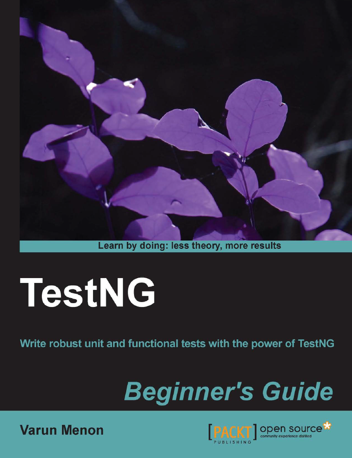

Packt was so kind to send me another book to look at. I've always been curious about testing in general and I was looking for some good stuff to hand to co-workers or otherwise interested people to get started with TestNG.
 
 <b>Abstract</b>
 

 

 Unit/Functional testing has now become part of every development life cycle. Junit was once the main framework that was used by developers for the purpose of Unit testing when it came to Java. But Junit had certain limitations in terms of execution and features. This book explains about the features and usage of TestNg, a new framework that overcomes Junit’s limitations and provides a lot of extra features.
 
 TestNg Beginner’s Guide is a practical, hands-on guide that aims to increase your knowledge of TestNg. This step-by-step guide will help you to learn and understand the different TestNg features, and you will learn about the advantages and how to use and configure each feature according to your needs.
 
 
 Book: <a href="http://goo.gl/ZZYKod" target="_blank">TestNG Beginner's Guide</a>
 
 Language: English
 
 Paperback: 276 pages [ 9.2 x 7.5 x 0.6 inches]
 
 Release Date: July 26, 2013
 
 ISBN-10: 1782166009
 
 ISBN-13: 978-1782166009
 
 <b>About the Author</b>
 <a href="" target="_blank">Varun Menon</a> is a QA consultant with several years of experience in developing automation frameworks on various technologies and languages such as Java, JavaScript, Ruby, and Groovy. He has worked on web and mobile applications for some of the leading clients in the field of supply chain management, online photo books, video analytics, and market research.
 
 <b>The Content</b>
 
 Chapter one gives a brief introduction about testing and test automation. How to get started with TestNG, where to get it from and how to integrate it into your favorite IDE. Eclipse is used throughout the book. Chapter two deals with the basic configuration and introduces test suites and the command prompt usage. It also adds a couple of tests for packages, classes and methods. Chapter three is all about annotations. Setup and destroy, disabling tests and how to use parameterization. Test groups are introduced in chapter four followed by adding dependencies in chapter five. Chapter six and seven deal with the factory annotation and parallelism in tests. Chapter eight gives an overview about build tool integration covering Ant and Maven. Logging and reporting about test runs is covered in chapter nine. Programmatic test creation is covered in chapter ten. A basic migration scenario is covered in chapter 11. The closing chapter deals with the differences between unit and functional testing and explains additional concepts like JMock, Mockito and how to use Selenium.
 
 <b>Writing and Style</b>
 
 Generally the instructions are clear and the screen-shots are helpful. The overall level of detail and mixed in complexity is appropriate. Overall an easy read and well structured. Great for beginners and even developers familiar with the topic could still use it as a reference.
 
 <b>Conclusion and recommendation</b>
 
 The book is aimed at introducing developers to TestNG. It uses numerous screenshots and code listings to introduce core features. and only requires basic Java and probably JUnit knowledge. The book is aimed at Java developers who are unfamiliar with TestNG. If you're completely new to testing and TestNG in particular it is worth a read.&nbsp;One trade off is the very basic style of the examples. Additionally it does not tell you about why to use that feature or when to use another.