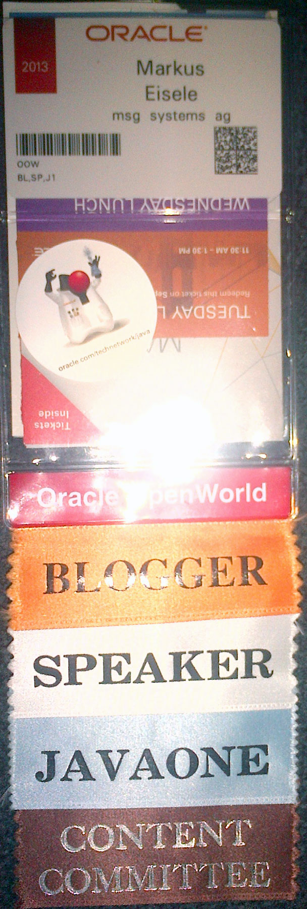
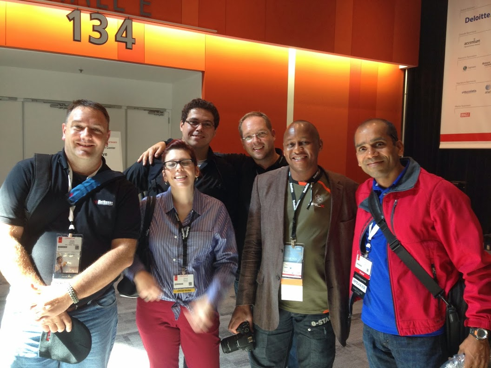
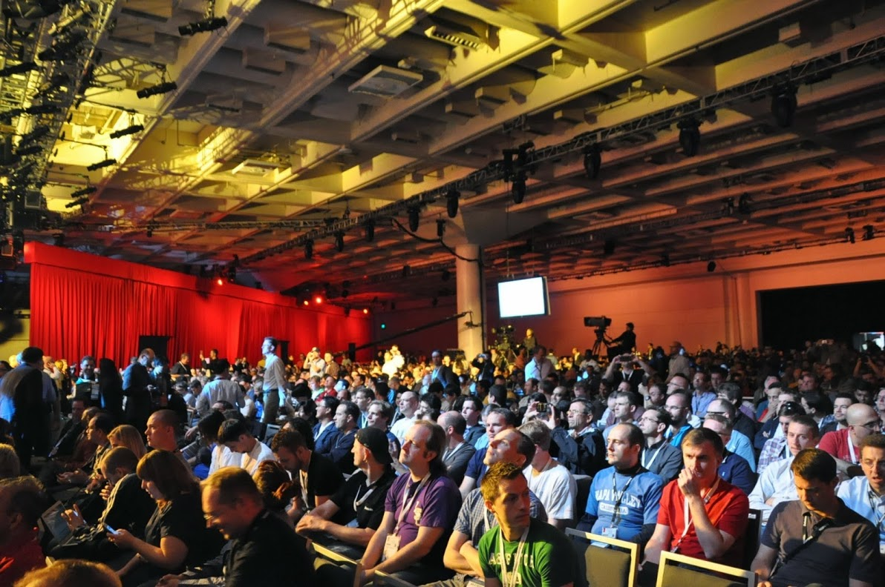

I'm back since a few days already and needed to catch up with all the things which had been on hold for the last couple of days. It was the busiest time of the year for me. A complete week of JavaOne and OpenWorld in San Francisco. A very brief travel report.
 
 <b>Annual ACED Briefing</b>
 

 

 Many of you know that I am part of Oracle's Community Recognition Program called the "<a href="http://www.oracle.com/technetwork/community/oracle-ace/index.html" target="_blank">ACE Program</a>". I get asked a lot about it. Especially because it seems as if I am working closer with Java EE and Open Source than with the Oracle Products. But this is not necessarily true. Anyway, the ACEs get a once-a-year chance of personally talking to Product Management and learn about the upcoming things early. This includes many of the upcoming announcements at OOW and J1. The ACE Briefing usually happens the last two days of the week before the conferences start in SF. Because of the many different professions among the ACEs it covers a broad mix of topics scratching nearly every bit of the Oracle product portfolio, from Engineered Systems to Linux, the DB, Middleware and Java. If you want a recap on everything you'd better <a href="http://medianetwork.oracle.com/video/player/2685494045001" target="_blank">re-watch the keynotes held at OpenWorld</a>. They are available on the media network in the meantime. For me personally the best part of the briefing is catching up with the peers from all over the world. Even if the group is growing year by year there are many familiar faces. After working with them throughout the year, a beer and a chat makes all that a bit more personal. Thank you Roland, Vikki, Lillian for making that possible. But it is not all fun and games. The Friday also held some Customer Advisory Board activities and other meetings. Reedwood is generally a perfect place to meet Oracle people in person and move stuck things around. Email isn't personal communication and this is even more true for foreigners like me. If there is one thing that makes traveling valuable it is exactly that. Gathering some intercultural knowledge and try to fix things that broke over email or other text based communications over the year. Friday evening it was time to move to the big city. San Francisco was waiting and the&nbsp;illustrious group moved into the Hilton on Union-Square. The place to be for the next few days. It also is the main hotel for JavaOne and I was surprised to not see much decoration in place already. To me it seemed as if this was different to last year. But, everything gets closer to just-in-time .. why not that part also.
 
 <b>JavaOne vs. OpenWorld - Balancing Worlds</b>
 

 

 My personal challenge is to balance activities between the two conferences happening. I want to catch up with Product Management but I'm also interested in meeting the peers in the Java space. Unlike the last years I decided to not spend to much energy on walking back and forth between the two conferences but basically stick around the JavaOne hotels. Given that my sessions and panels were more or less evenly distributed over the whole time I had preps to do every day and also wanted to see some talks. Being part of the JavaOne content committee actually helped getting in every session I liked without having to be enrolled for them. It feels good to see that the tremendous amount of work which goes into voting and commenting on proposals finally pays of and gets recognized. As <a href="http://www.adam-bien.com/roller/abien/entry/javaone_san_francisco_2013_feedback" target="_blank">Adam Bien put it</a>: "the advisory board did a great job this year". Thank you Adam. I felt the same. An insane amount of sessions I would actually have enjoyed to listen too. The most interesting ones exactly parallel to my own sessions. The good news is, that all the sessions got recorded and will be available on<a href="http://parleys.com/channel/5243df06e4b0d1fb3c78fe31/presentations?sort=date&amp;state=public" target="_blank"> Parleys in very short time</a>. Another interesting observation was, that most of the PMs I would love to talk to showed up at JavaOne. There basically was no need to run around to catch everybody. They've been all around JavaOne also. Generally the days of the conference seems to be a never ending day with a packed schedule for everybody. Saying hello mostly is ok. Sitting down for a longer chat is a rare pleasure for many.
 
 <b>Meeting Peers - Names -&nbsp;Rock-stars&nbsp;- People.</b>
 

 

 But the sheer amount of names you ran into is astonishing. Personally I don't believe in Rock-Star-Hero kind of things. What I learned about the Java community is, that there are incredible intelligent individuals out there which do amazing things with the technology they love. I've only rarely meet someone who wouldn't want to chat with me at all or makes me feel like I am not worth talking to. Thankfully this is a big exception and everybody running around at JavaOne is like you and me. I ran into Arun, Peter, John, Geertjan, Alexander, Uwe, Venkat, Lincoln, Ray, Andrew.... All have been there. And they've been like you and me. Drinking beer, preparing sessions and chatting with &nbsp;peers they've not met in a long time. That is what JavaOne actually is for.
 
 <b>Setting the Stage - The best one so far</b>
 
 The content was amazing. So many great topics presented by gifted speakers. Packed sessions and a keynote which came back to Moscone for the first time in years. No-one could any longer assume that Oracle isn't listening. It simply takes some time to turn big things around. But it is possible. And the community is driving that change by being interested, committed and providing their criticism and ideas for improvements.
 
<table align="center" cellpadding="0" cellspacing="0" class="tr-caption-container" style="margin-left: auto; margin-right: auto; text-align: center;">
 <tbody>
  <tr>
   <td style="text-align: center;"></td>
  </tr>
  <tr>
   <td class="tr-caption" style="text-align: center;">JavaOne Keynote back in Moscone (Picture: <a href="https://plus.google.com/photos/112626245189993000679/albums/5927879016800727601/5927879359801444178?pid=5927879359801444178&amp;oid=112626245189993000679" target="_blank">B.Borges</a>)</td>
  </tr>
 </tbody>
</table> I'm proudly wearing my JavaOne t-shirt today. It was a great show. And the biggest news has been, that there aren't any. The Internet-Of-Things is driving a lot of the future and the alignment of the programming models across all platforms beginning with Java 8 are both things that are the essence from the presented strategy. After this incredible week it is hard to let the work takeover again. But that is what is next. Thanks to everybody who stopped by and said hello. Thanks for being part of that incredible event. For me it has been the best one so far and I'm looking forward to the next year.