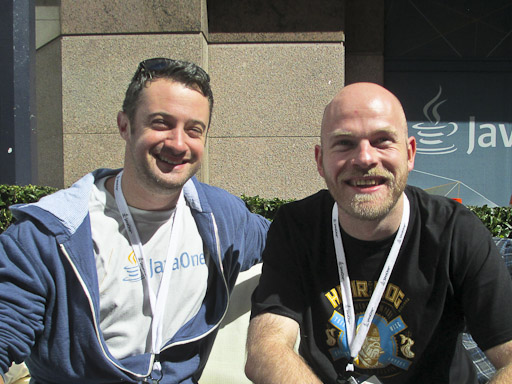

I've been doing book reviews since some time now. But this is a special one. Back at JavaOne I ran into Aslak and Andrew and we had a chance to talk about their latest book project which has been floating around the interwebs since some time now.
 
 <b>Abstract</b>
 

 

 Take a use-case approach to Enterprise Java development, and discover how to program more effectively. This practical book shows you how to perform continuous development, using a testing platform the authors built with the JBoss community. Known as Arquillian, this platform acts as the missing link between testing and development.
 
 
 Andrew Lee Rubinger and Aslak Knutsen demonstrate how testing is the very foundation of development—essential for learning and critical for ensuring that code is consumable, complete, and correct. Whether you’re learning a new technology, debugging broken behavior, or laying down new code, Arquillian helps you document your project in the form of test cases.
 
 
 Book: <a href="http://shop.oreilly.com/product/0636920025368.do" target="_blank">Continuous Enterprise Development in Java</a>
 
 Language: English
 
 Paperback: 222 pages
 
 Release Date: February 20, 2014
 
 ISBN-10:&nbsp;1-4493-2829-6
 
 ISBN-13: 978-1-4493-2829-0
 
 
 <b>My Interview</b>
 

 

 Thanks for taking the time talking to me. We know each other since a while mostly from the Arquillian Project. It was the first to have a ton of documentation beside the awesome testing features.
 
 Now you are writing a book "Continuous Enterprise Development in Java" which is about testable solutions with Arquillian. Let me ask you some questions about it.
 
 <b>What is the book all about? Putting guides together? What was your motivation?</b>
 
 
 In building out the Arquillian Test Platform, we set out to make full-scale integration testing approach the simplicity offered by unit tests. &nbsp;Historically, Enterprise Java has been cumbersome to validate in what we call a “real” runtime: one that closely mirrors how it will run in production. &nbsp;Spring and Java EE both offer POJO programming models which facilitate the re-use of our business objects outside a backing container, but we feel strongly that testing outside of the proper context can lead to misleading results. &nbsp;Only when we plug everything in together can we be assured that things are working properly, and that applies to both the code you write *and* the code you rely upon from an application server.
 
 As our community grew we continued to build out extensions and guides for Arquillian which would offer instruction not just in applying Arquillian tests to Java EE, but explaining some ways to piece together Enterprise Java applications as a whole. &nbsp;While there are plenty of books about a single technology - Andrew has written a revision of “EJB 3.1” from O’Reilly, for example - we found that our users were coming to us to learn about Java EE in general. &nbsp;This grew our mindset that “testing is development”, and the book is a natural extension of the guides we’d built off for Arquillian.
 
 In short, we felt that there wasn’t a book which broke down a complex Java application into layers and explained how they were wired together and tested, so we wrote one.
 
 <b>You're using a comprehensive example app throughout the book. What is GeekSeek all about and why did you choose it?</b>
 
 
 From the onset, we knew we wanted our examples to be more than simple toys. &nbsp;We wanted to address the concerns of a developer charged with delivering a complete application: how do you validate asynchronous components? &nbsp;What’s a good way to expose a true RESTful interface for your services? &nbsp;How may a UI call the services layer and how do we ensure the rendered response is correct? &nbsp;How do alternative domain models factor into the equation; should they be used and if so, when?
 
 
 So we needed some single application which would allow us to address the use cases we wanted to explore without feeling like we were overengineering for the sake of example. &nbsp;It turns out that the excellent Lanyrd service, one we use to track our own conference involvement, provided many of the features we needed to cover, so we created the GeekSeek example application as an homage of sorts to Lanyrd.
 
 
 It was extremely important to us to deliver a self-proving example: one that could be downloaded and built by a user, but also ran in our own continuous integration environment and lived on a production server, so GeekSeek is the manifestation of that idea. &nbsp;As developers we learn by doing, and this application is proven to work by nature of its being served up live.
 
 <b>Did the book help improve Arquillian? It is the best kind of "eat-your-own-dog-food" ... did you find stuff, that needs to be fixed while writing about best practices? Any war-stories to tell?</b>
 
 
 To be honest, we didn’t end up coming across too many issues with Arquillian by writing this book or GeekSeek; we’d waited until ARQ had reached a level of maturity before embarking on a large project to document its use in practice. &nbsp;We did, however, encounter a series of known limitations, for instance the lack of Suite support, in writing. &nbsp;Most of these issues haven’t yet been addressed because they’d require API changes in Arquillian which would break backwards-compatibility, and we have them on deck for a major version 2.0 when the time is right.
 
 
 One bit I found particularly interesting is the idea of a Modular Test Suite. E.g. Module X adds Feature A to the app. &nbsp;Now it’s possible Module Y is affected by these features on a test level. Why can’t Module X provide a Test Module to help Module Y? Security is a good example. Module Y doesn’t know about security, but if the Security Module is included, Module Y’s test suite starts to fail. Now if you want to explore the idea that a single test can run under multiple configurations (e.g. on a Module level and on an App level) like we do in the book, you would need some helpers to get around the new Security constraints. But what if the Security Module provided a Test Extension? In short, your own Modules provide Test Services / Management to the other modules.
 
 
 Right, in many cases we found the warts inherent with Java EE or using Maven to manage the builds, and we tried our best to outline those and show some possible workarounds.
 
 <b>You're using all the latest and greatest. Including a REST/HATEOS driven backend for an AngularJS frontend. Do you believe that server side UI generation is dead?</b>
 
 
 No, server-side generation of the UI certainly has a place, as does client-side. &nbsp;When you deal with dynamic elements only via JavaScript, this tends to give way to the common “loading” syndrome when the page is first rendered and then a series of async calls are made to pull in data. &nbsp;On the other end of the spectrum, server-side generation can lead to a UI-only approach where services don’t need to be exposed in a RESTful fashion, and may in some cases be more resource-intensive than is necessary. &nbsp;As with anything, we recommend that developers be aware of the strengths and limitations of each approach and choose solutions that best fit your requirements; sometimes a hybrid approach might be best.
 
 
 In our case for GeekSeek, we’d simply felt that it was worth showing how to use the services of Java EE without necessarily using JSF for the view layer. &nbsp;Having Angular tap into our RESTful interface to get at the backend data was a logical choice for us.
 
 <b>The book uses Java EE 6 as technology. And honestly I believe you did a great job. What do you think about Java EE generally and the improvements we got with EE 7 particularly. Wouldn't that have made your life easier?</b>
 
 
 It’s important that developers judge Java EE fairly; it’s aim is to standardize where appropriate and bring together a wide swath of disparate technologies. &nbsp;It intentionally leaves choice to vendors in a number of areas, and by nature of being a standard cannot necessarily evolve as quickly as some may like, as that would cause too much instability inbetween major releases. &nbsp;So it provides a very nice base upon which to build, and affords choice to the developer.
 
 
 With that choice can come confusion, which is a large motivation for our book. &nbsp;We look to illustrate a few ways of bringing the whole picture together.
 
 
 Java EE 6 did have some limiting factors which we encountered and devised custom solutions to address. &nbsp;For instance, JAX-RS 1.1 does not define interceptors, so we added a CDI-based interceptor chain to our REST layer. &nbsp;And CDI 1.0 defines beans.xml metadata per archive with no global ordering or configuration, so we again added our own chain to address this.
 
 
 WildFly was just certified as EE7-compliant during the book’s production process, and EAP will follow later, so we’ll look to provide updates to the application as time progresses; that’s why we’re releasing GeekSeek initially as an EE6 application.
 
 <b>You point your readers to JBDS and Forge for development. Honestly guys, which IDE are you using and why?</b>
 
 
 Aslak: Eclipse. For 15 years or so. I’m getting old, too many shortcuts built into my brain to change ;)
 
 
 ALR: I use both standard Eclipse and the JBDS toolset, as well as IntelliJ IDEA Community. &nbsp;It really depends upon what I’m doing; I love IDEA for most development and find it more resource-efficient, but I like m2e in Eclipse when I’m dealing with Maven dependency issues, and JBDS when doing anything with Forge or OpenShift because of the nice integration there.
 
 <b>The code runs on WildFly which isn't exactly a surprise. Do you test on other app-servers? Arquillian has a broad range of container adapters and I somehow expected to see some more here.</b>
 
 
 This again hits at the nature of Java EE; applications in compliance to the platform still need to run somewhere, and vendor differences start to show up when you put together a non-trivial application. &nbsp;While porting between WildFly and EAP is generally a relatively-simple endeavor, there are still enough differences that running the exact same codebase on both targets requires some thought and intelligent implementation. &nbsp;These gaps grow in orders of magnitude once you start to incorporate servers offered by other vendors, so for the sake of simplicity in delivering one source tree without forks to customize for individual application servers, we chose the community WildFly and free-for-development EAP (and its OpenShift cartridge) as runtimes. &nbsp;We absolutely encourage our readers to port to their application server of choice and share their patches or experiences with us!
 
 <b>The book and source are licensed under Creative Commons. So, basically free to everybody and accessible on https://github.com/arquillian/continuous-enterprise-development. Why do you still do a printed version? What is the benefit of buying one?&nbsp;</b>
 
 
 It’s really simple; we wanted the book to get into the hands of as many developers who might benefit from its lessons. &nbsp;O’Reilly has a global reach and streamlined process to deliver to large online retailers and traditional brick-and-mortar stores, and they were open to our desire to deliver the text under an open-source license. &nbsp;They additionally provide editorial and graphics work to really help deliver a more polished product than we’d have done on our own, so we decided to partner with them in the name of getting a higher-quality work out to as many people as possible.
 
 <b>I've always wondered how much work it actually is. Did you spend all your evenings on it?&nbsp;</b>
 
 
 Aslak: I would say, roughly 2 months full time. The problem is when it’s not heads down full time, you lose so much built up contextual information along the way so it gets harder and harder the longer it goes between each write session.
 
 
 ALR: Exactly; the work itself isn’t terrible in quantity, but when you couple it with a day job and have to deal with constant context-switching, it’s easy to let the book occupy more mental space than the actual time it takes to deliver would indicate. &nbsp;It’s also not the kind of thing that you can do mindlessly; like software, writing requires a decent design phase and constant iterations to align your objectives with the code, and explain in a fashion that’s hopefully concise and complete. &nbsp;It’s an exercise to our readers to judge how well we executed there. :)
 

  

