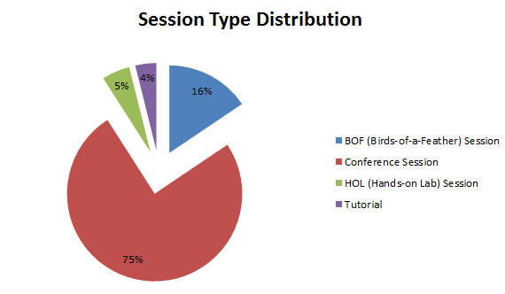

Time is running away these days. So many things happening in parallel and of course the most important Java conference is in the middle of everything. <a href="https://www.oracle.com/javaone/tracks/index.html" target="_blank">JavaOne 2014</a> closed the CfP doors already and voting is well underway. There are very few things the <a href="https://www.oracle.com/javaone/program-committee/index.html" target="_blank">Program Committee</a> is allowed to talk about but after having skipped that kind of analysis last year it was time for me to ask for permission and so I can start to spread some excitement about the content. Please keep in mind, that every number you see in here are just percentages; there is not a single hint on concrete counts or other numbers in here. It's all about proportions and overall weight. And one last remark: This is the complete overview about the submissions. The final conference program will be shaped out of it. A big "Thank you!" to the program chair <a href="https://twitter.com/steveonjava" target="_blank">Stephen Chin</a> who was kind enough to gave his permission for publication.
 
 <b>Submission Types</b>
 
 A good starting point is the overall distribution of submissions over the different session types. Speakers could select any of four different types for their submission. The classic session, a BoF (Birds of a feather) a tutorial or a HoL (Hands on Lab)
 
 Not a big surprise that most of the submissions are sessions (75%). This is slightly more than in 2012 (70,14%) Second most proposed content are BoFs. Followed by HoLs and Tutorials. Even if this sounds final for now the proportions might change because types get switched on request of the program committee.
 
 

 

 <b>Submissions per Track</b>
 
 Beside the non surprising type distribution the overall spread per track is another important figure. What is moving the community these days and which tracks got the most attention? There are <a href="https://www.oracle.com/javaone/tracks/index.html" target="_blank">nine different tracks</a> to pick from. Clients and UI, Core Java Platform, Internet of Things, JVM Languages, Java and Security, Tools and Techniques, Server-Side Java, Java in the Cloud and Agile Development.
 
 

 

 
 Very few proposals are moved around from track to track during the voting process but it happens. Spread out over the tracks is comparably equal. Slight leader is the "Tools and Techniques" Track. But the overall distribution doesn't allow to identify a clear leader.
 
 <b>Oracle vs. Non-Oracle Submissions</b>
 
 And the last two metrics I'm going to look at should answer the question about Oracle's involvement in general. Many people still believe that the JavaOne content is mostly driven by the company behind it. First of all, take the time to see and feel it for yourself. There is still <a href="https://www.oracle.com/javaone/register/index.html" target="_blank">plenty of time to register</a> and take the chance to attend this amazing conference.
 
 

 

 
 Exactly 70% of the proposals come from the broader Java community. Only 30% have been proposed by Oracle employees. Compared with the 2012 numbers this is only marginally worse by 1%. Note, that this only includes the proposals where the first speaker is an Oracle employee. I was asking myself the question if there is some track Oracle explicitly jumps in:
 
 

 

 
 Overall answer: Just a bit ;) There are only two tracks where there are significant more proposals from Oracle than from the community. Internet of Things makes the most significant different and Clients and UI marks the other spot. Given all the latest hype around both topics this is anything but surprising. I am very pleased to see, that the Tools and Techniques track is completely owned by the community. My interpretation: It's pretty clear who knows how to use Java right ;)
 
 <b>Conclusion</b>
 
 JavaOne is once again going to be a great, community driven conference with a lot of awesome content! If you haven't done so <a href="" target="_blank">take a look</a> and <a href="https://www.oracle.com/javaone/register/index.html" target="_blank">register</a>! The final program is going to be announced in a few weeks and there still is plenty of time to find a flight and a hotel near by. Save the date:&nbsp;September 28 – October 2, 2014! And don't forget to follow <a href="" target="_blank">@JavaOneConf</a>&nbsp;or <a href="https://www.facebook.com/javaone" target="_blank">Like the JavaOne FB</a> page and keep up to date by <a href="" target="_blank">reading the official blog</a>!
 
 
 
 