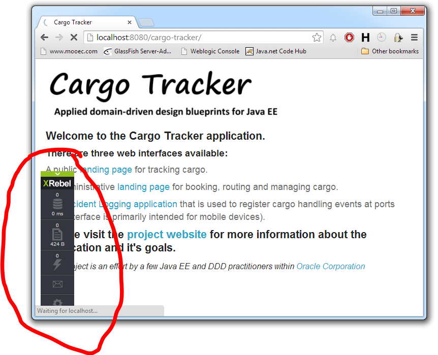
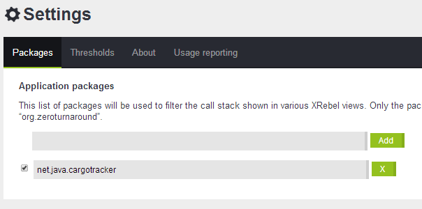
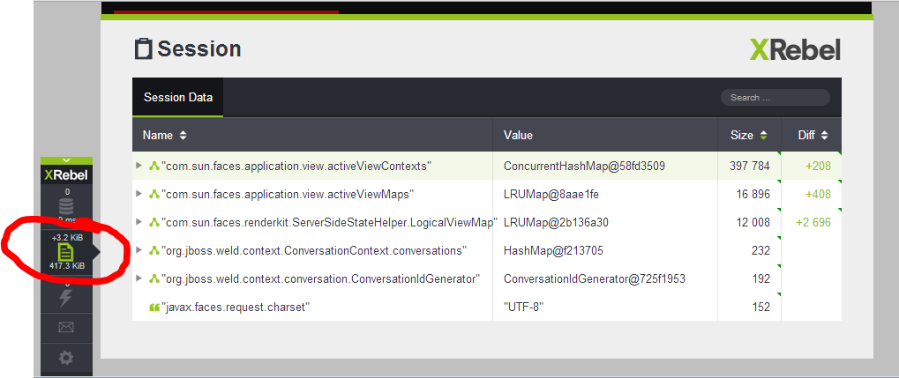
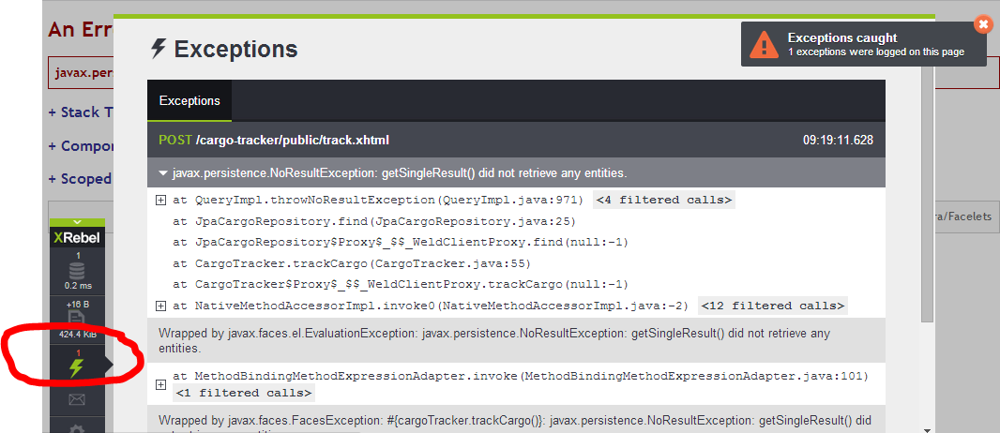

The cool <a href="" target="_blank">Zeroturnaround</a> guys recently opened the private beta for their latest product which is an interactive and live profiler for your Java EE apps. Anton showed me the M3 at DevNation and I was curious to get my hands on it. Here is the first test-drive and some screenshots.
 
 <b>Getting It And Setting It Up</b>
 
 First thing to keep in mind is, that it is a private beta. So you have to <a href="" target="_blank">apply online</a> to get access to it. After you've been approved you get an email with a password and URL to download the roughly 5MB large ZIP file which comes with a single jar and a bunch of text files. You can download the first documentation as a PDF and there is not much more than this for now. Setting it up also is very straight forward. As usual the jar has to be registered as a java-agent. In GlassFish you typically do this at the JVM settings (-javaagent:D:/path/to/xrebel.jar). For convenience reasons I decided to replace the debug feature and automatically activate XRebel while being in debug mode.
 
 

 

 
 If that is done you're ready to go. All you need to do is to install your favorite application and give it a try. I decided to use latest EE7 DDD-sample project developed by parts of the GlassFish team: <a href="" target="_blank">Cargotracker</a>. Clone the SVN from Java.net and import it into <a href="" target="_blank">NetBeans 8</a>. Build it and deploy it to GlassFish. Point your browser to http://localhost:8080/cargo-tracker/ and you can see the first XRebel magic happen.
 
 <b>First Impressions</b>
 
 Let's have a look at what XRebel can do for you.
 
 

 

 
 The tiny little control-panel is integrated in all pages you navigate through and gives you access to all kinds of runtime information. But first of all lets tweak the settings a bit and reduce the inspected number of classes a bit by configuring the package hierarchy we're interested in:
 
 

 

 
 Beside that you can also tweak thresholds and notifications on the settings page. After you've done that you can redirect your browser to the public landing page of the application (http://localhost:8080/cargo-tracker/public/track.xhtml) and watch XRebel do it's magic. A click on the session symbol brings up the HttpSession details:
 
 

 

 
 The dialog let's you inspect all the objects placed in the session and size. The little icon in the control panel keeps track of growth and alerts you if something unexpected happens. Even more impressive is the SQL inspection.
 
 

 

 
 You can drill down to individual SQL statements, see the complete statement including resolved parameters, affected rows, execution times and execution timestamp. A tiny search box let's you specifically search for expressions and if you don't want to see the complete call-stacks you can simply switch the tab and look at all the queries as a one-pager.
 
 The newest milestone M4 also has an exception tracer:
 
 

 

 
 Which gives you a better parsed result of the occurred exception and little more details about the exact path where it happened.
 
 <b>Bottom Line</b>
 
 It is an amazing little helper. Minimal intrusive. No configuration in your application and still keeps track of most of the critical things you're interested in knowing. I'm curious for the upcoming betas and of course of the final product and it's licensing. Keep up the good work guys. I love your creativity when it comes to making better tools for developers.