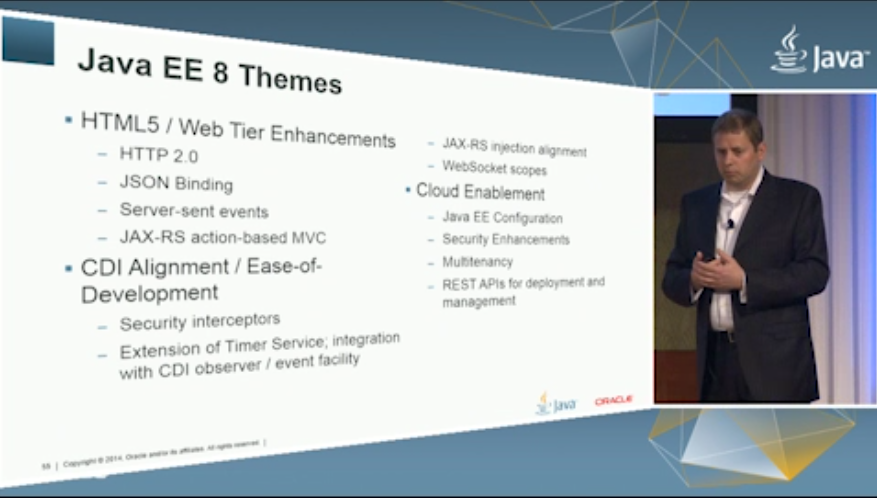

If there's one thing I dislike about summer, it is the fact that there isn't much news to share or talk about. Who ever decided to put the Java Day Tokyo into this boring time of the year did a pretty good job and gave me an opportunity to write a blog post about new and upcoming Java EE 8 specification enriched with some more thoughts and pointers.
 
 As announced on the <a href="https://java.net/projects/javaee-spec/lists/jsr342-experts/archive/2014-05/message/0" target="_blank">Java EE 7 EG Mailinglist</a> beginning of June the new EE 8 JSR is going to be filed shortly (before JavaOne).
 
 <b>Contents of EE 8</b>
 
 Unlike the first version of EE 7 which was totally dominated by the word "cloud" and later re-aligned with the hard facts, this new Java EE version will basically stick to three different areas of improvement.
 
 
<ul>
 <li>HTML 5 / Web Tier Enhancements</li>
 <li>CDI Alignment / Ease-of-Development</li>
 <li>Cloud Enablement</li>
</ul>
 
 All three can be seen as a continued evolution of what EE 7 already delivered and there is no real surprise in it at all. Head over to <a href="https://blogs.oracle.com/theaquarium/entry/java_ee_8_update" target="_blank">The Aquarium</a> to read more about the details.
 
 
<table align="center" cellpadding="0" cellspacing="0" class="tr-caption-container" style="margin-left: auto; margin-right: auto; text-align: center;">
 <tbody>
  <tr>
   <td style="text-align: center;"></td>
  </tr>
  <tr>
   <td class="tr-caption" style="text-align: center;">Cameron Purdy about EE 8 at Java Day Tokyo 2014</td>
  </tr>
 </tbody>
</table>
 

 <b>Hidden Gems - What might come up at JavaOne</b>

 The Java Day Tokyo was held recently and with Cameron Purdy as a keynote speaker about Java EE and it's general direction (<a href="http://t.co/6vpbHVm7WU" target="_blank">mp4 download</a>, 363MB) this probably was one of the first chances to see, what will be the overall story for JavaOne with regards to the platform. As Oracle should have learned the Java community isn't interested in big and unpleasant surprises. Strategic directions are communicated and prepared a bit more carefully. We all have seen and heard about the IoT hype and the efforts everybody puts in it. This obviously also seems to have some outreach into Java EE. Beside the general topics and contents of EE 8 the Purdy keynote also contained a slide titled "Powering Java Standard in the Cloud - Deliver Mode Apps to More Devices with Confidence".&nbsp;

  

 <table align="center" cellpadding="0" cellspacing="0" class="tr-caption-container" style="margin-left: auto; margin-right: auto; text-align: center;">
  <tbody>
   <tr>
    <td style="text-align: center;"></td>
   </tr>
   <tr>
    <td class="tr-caption" style="text-align: center;">Java Standards in the Cloud.</td>
   </tr>
  </tbody>
 </table>
 

  And yes, you are correct about thinking that this is EE 7 coverage. It actually is. But at least for me it is the first time, that individual features have been isolated from individual technical specifications and put into a complete, strategic picture outlining use-cases in the enterprise. It will be interesting to see, if there is something more like this to be shown at JavaOne and how much IoT we will see in EE 8 when it finally hits the road.
   
   
 

