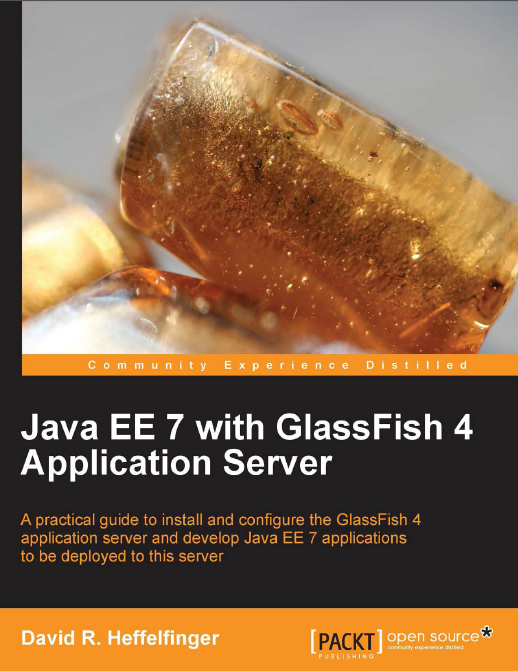

The third edition of <a href="http://www.twitter.com/ensode" target="_blank">David Heffelfinger's</a> Java EE book has been recently released. This updated edition is covering the latest Java EE 7 Platform. Thanks to Packt Publishing for giving me a review copy to look at.
 
 

 

<b>Abstract</b>
 
 This book is a practical guide and follows a very user-friendly approach. The book aims to get the reader up to speed in Java EE 7 development. All major Java EE 7 APIs and the details of the GlassFish 4 server are covered followed by examples of their use. If you are a Java developers who wants to become proficient with Java EE 7 this book is ideal for you. Readers are expected to have some experience with Java and to have developed and deployed applications in the past, but don t need any previous knowledge of Java EE or J2EE. It teaches the reader how to use GlassFish 4 to develop and deploy applications.
 
 
 Book: "<a href="http://www.packtpub.com/java-ee-7-with-glassfish-4-application-server/book" target="_blank">Java EE 7 with GlassFish 4 Application Server</a>"
 
 Language : English
 
 Paperback: 400 pages
 
 Release Date : March 26, 2014
 
 ISBN-10: 1782176888
 
 ISBN-13: 978-1782176886
 
 <b>The Author</b>
 
 David Heffelfinger (<a href="http://www.twitter.com/ensode" target="_blank">@ensode</a>) is the Chief Technology Officer of Ensode Technology, LLC, a software consulting firm based in the greater Washington DC area. He has been architecting, designing and developing software professionally since 1995 and has been using Java as his primary programming language since 1996. He has worked on many large scale projects for several clients including the US Department of Homeland Security, Freddie Mac, Fannie Mae, and the US Department of Defense. He has a Masters degree in Software Engineering from Southern Methodist University. David is editor in chief of <a href="" target="_blank">Ensode.net</a>, a website about Java, Linux, and other technology topics.
 
 <b>The Content</b>
 
 This is actually the third edition of the book. All you need to know about Java EE 7 and latest GlassFish 4 release is packed into 11 chapters. Ranging from a getting started introduction with GlassFish to developing with latest Java EE 7 core technologies, like JSF, EJB and such it is also covering how to secure your applications. The 400 pages bring a net content of 313 real content (removing preface and appendix kind of stuff).&nbsp;It is a fast paced tutorial for Java EE 7.
 
 <b>Writing and Style</b>
 
 &nbsp;If you are used to technical documentation you shouldn't struggle with this book. For a non native speaker it reads very easy and I didn't find very many complex sentences which stopped my reading. The examples always interrupt the overall reading flow but this book isn't meant to just be read. You need to get hands on the sample code and learn to use it.
 
 <b>Conclusion and recommendation</b>
 
 The book is keeping things simple enough to make it easy to start with almost the complete platform at a beginner level, summing up the concepts and without getting intimidated. The large amount of sample code, examples and pictorial representations improve the understanding of the content a lot.
 
 It is an easy read and you can quickly work your way through it. Go get it, while it is hot!