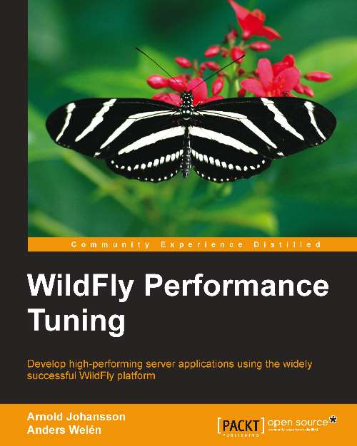

This is a seriously good start into a new area. I thought you might be interested in winning Packt's latest book about WildFly Performance Tuning. So, this is the contest to make it happen.
 
 I have 2 eBook copies of <a href="http://www.packtpub.com/wildfly-performance-tuning/book?utm_source=mention.com&amp;utm_medium=link&amp;utm_campaign=WildFly%20Performance%20Tuning" target="_blank">WildFly Performance Tuning</a> to be given away to two (2) lucky winners.
 
 

 

<b>Here are the Rules</b>
 
 - The contest is running from today (07/09/14, 5:45a UTC) to next Wednesday (07/16/14, 5:45a UTC).
 
 - Answer the three questions below correctly about WildFly and put down a comment on this blog with the answers.
 
 - If more than three correct answers are posted, I will let my daughters draw the two winners.
 
 <b>The Questions to Answer</b>
 
 1) When was WildFly 8.1.0.Final released?
 
 2) What is the name of the Red Hat project, that offers help with Java EE application migration?
 
 3) Who wrote the WildFly Plugin for NetBeans 8?
 
 <b>Content of the Book</b>
 
 Chapter 1, The Science of Performance Tuning, talks about what performance tuning is all about and how it can be applied within an organization.
 
 Chapter 2, Tools of the Tuning Trade, introduces some useful Open Source tools to use when performance tuning anything covered in this book.
 
 Chapter 3, Tuning the Java Virtual Machine, covers what the engine of Java is and how to tune it as well as all other Java-based applications.
 
 Chapter 4, Tuning WildFly, explains what can be tuned in the WildFly
 
 Application Server.
 
 Chapter 5, EJB Tuning in WildFly, talks about how Enterprise JavaBeans can be tuned.
 
 Chapter 6, Tuning the Persistence Layer, covers how to design an effective database as well as how to tune JPA and queries.
 
 Chapter 7, Tuning the Web Container in WildFly, explores Undertow—the blazingly fast, new web container in WildFly—and discusses how it can be tuned to become even better.
 
 Chapter 8, Tuning Web Applications and Services, covers numerous tuning tricks and tips surrounding the web applications and services based on Java EE.
 
 Chapter 9, JMS and HornetQ, explains how JMS works and can be tuned in HornetQ, the JMS provider of WildFly.
 
 Chapter 10, WildFly Clustering, explores tuning in a clustered WildFly, HornetQ, and Java EE components.
 
 <b>About the Author</b>
 
 Anders Welén embraced the object-oriented techniques of the Java language early in life, and later evolved to Java Enterprise specifications. As a true believer and evangelist of Open Source, he naturally discovered the JBoss Application Server,
 
 which led to years of providing expert consultation, training, and support for the JBoss and Java EE infrastructures.
 
 
 Good Luck everybody!