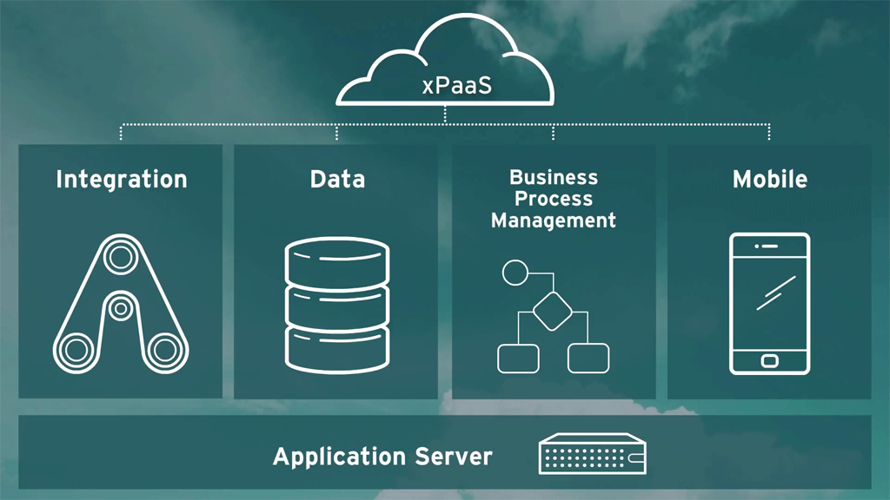

I've been reading a lot about Red Hat products lately and being interested in cloud and such since some years now, it's pretty obvious for me to look into the cloud offerings from Red Hat in more detail. Arun did a great overview about <a href="" target="_blank">JBoss xPaaS</a>&nbsp;back in April this year and I thought it might be time to not only give you an overview but also point you to all the relevant information that interested developers need to know about. If I missed something, or your stuck somewhere, don't forget to reach out to me and let me know!
 
 <b>xPaaS= aPaaS, iPaaS, bpmPaaS, dvPaaS, mPaaS + OpenShift</b>
 
 A very tiny little overview to get you up to speed. To make it simple, JBoss xPaaS services is another name for having all the powerful capabilities of JBoss Middleware available as a cloud based services, ready for use on OpenShift. A main differentiator to others is, that it is not just a bunch of services with little to know integration. It is a complete set of pre-build and ready to use integrated services.
 
 

 

 
 For those interested why it is called xPaaS: <a href="http://www.gartner.com/id=2515316" target="_blank">Gartner</a> uses the term xPaaS to describe the whole spectrum of specialized middleware services that can be offered as PaaS. Red Hat has the complete implementation.
 
 <i>More basic information:</i>
 
<ul>
 <li>JBoss xPaaS Services at OpenShift (<a href="https://www.openshift.com/xpaas" target="_blank">openshift.com/xpaas</a>)</li>
 <li>Official Landing Page (<a href="http://red.ht/xpaas" target="_blank">red.ht/xpaas</a>)</li>
 <li>Red Hat Summit JBoss Middleware Keynote (<a href="https://www.youtube.com/watch?v=mjT-pMCkkTY" target="_blank">youtube.com</a>)</li>
 <li>Mark Little about xPaaS (<a href="https://community.jboss.org/blogs/mark.little/2013/09/24/xpaas" target="_blank">community.jboss.org</a>)</li>
 <li>Gartner’s Magic Quadrant for On-Premise Application Platforms (<a href="https://www.redhat.com/about/news/press-archive/2013/8/red-hat-positioned-in-leaders-quadrant-for-on-premises-application-platforms" target="_blank">Press Release</a>, <a href="https://engage.redhat.com/forms/gartner?sc_cid=70160000000bxUrAAI&amp;offer_id=70160000000TNiyAAG" target="_blank">Gartner Report</a>)</li>
</ul>

 Time to dig deeper into the individual pieces. The idea here is to just breakup the streamlined names a bit and break them down to the individual products and upstream projects used in it.&nbsp;

  

 <b>Note:</b> Some features on OpenShift are in&nbsp;Alpha release state. Designed and provided for developers to experiment with and explore. And for the i and bpm-PaaS offerings which can be deployed in the <a href="https://www.openshift.com/products/pricing" target="_blank">free OpenShift Online</a> gears, it is recommend to use medium or large gears for optimum performance.

  

 <b>aPaaS =&nbsp;JBoss Application Hosting&nbsp;+ OpenShift</b>

 

 The app-container services of OpenShift for Java EE 6 with Red Hat JBoss EAP/JBoss AS and Java EE 7 with WildFly is there for more than 2 years already. This is the foundation of everything in the xPaaS familiy. To keep it DRY, I put everything which is OpenShift related in this section.&nbsp;

  

 <i>More basic information:</i>

 <ul>
  <li><a href="https://www.openshift.com/developers/jboss" target="_blank">JBoss Application Hosting on OpenShift</a>&nbsp;</li>
  <li>OpenShift <a href="https://www.openshift.com/get-started" target="_blank">Getting Started Guide</a>&nbsp;</li>
 </ul>
 

  <i>OpenShift Quickstarts and Cartridges:</i>
 

 <ul>
  <li>OpenShift <a href="https://www.openshift.com/quickstarts/wildfly-8" target="_blank">WildFly 8 Quickstart</a>&nbsp;</li>
  <li>OpenShift <a href="https://openshift.redhat.com/app/console/application_type/cart!jbosseap-6" target="_blank">EAP 6.1/6.2 Cartridge</a>&nbsp;</li>
 </ul>
 

  <i>Blogs to follow:</i>
 

 

  <ul>
   <li><a href="" target="_blank">Arun Gupta's Blog</a></li>
   <li><a href="" target="_blank">Thomas Qvarnström JBoss Tech Blog</a></li>
  </ul>
 

 

  <i>Various Developer Links:</i>
 

 

  <ul>
   <li><a href="" target="_blank">WildFly Website</a></li>
   <li><a href="" target="_blank">Java EE Samples on GitHub</a></li>
   <li><a href="http://origin.openshift.com/accelerators" target="_blank">OpenShift Accelerator Program</a>&nbsp;</li>
   <li><a href="https://github.com/openshift" target="_blank">OpenShift GitHub</a></li>
   <li><a href="https://github.com/openshift-cartridges" target="_blank">Community Cartridges for OpenShift</a></li>
   <li><a href="" target="_blank">EAP Product Documentation</a></li>
  </ul>
 

 

   
 

 

  <b>iPaaS = JBoss Fuse&nbsp;&amp;&amp; JBoss Data Virtualization&nbsp;+ OpenShift</b>
 

 

 The integration services consist of two separate offerings at the moment. One is&nbsp;The JBoss Fuse enterprise service bus and the other is&nbsp;JBoss Data Virtualization.&nbsp;

  

 <i>More basic information:</i>

 <ul>
  <li><a href="https://www.openshift.com/xpaas#integration" target="_blank">Integration Services on OpenShift</a>&nbsp;</li>
  <li>JBoss <a href="https://www.openshift.com/developers/jboss-fuse" target="_blank">Fuse on OpenShift</a></li>
  <li>JBoss <a href="https://www.openshift.com/developers/jboss-data-virtualization" target="_blank">Data Virtualization on OpenShift</a></li>
 </ul>
 

   
 

 <i>OpenShift Quickstarts and Cartridges:</i>

 <ul>
  <li>Fuse <a href="https://www.openshift.com/developers/jboss-fuse/getting-started" target="_blank">Getting Started Guide</a>&nbsp;</li>
  <li>Fuse&nbsp;<a href="https://openshift.redhat.com/app/console/application_type/quickstart!16634" target="_blank">Quickstart</a></li>
  <li>Data Virtualization <a href="https://www.openshift.com/developers/jboss-data-virtualization/getting-started" target="_blank">Getting Started Guide</a></li>
  <li>Data Virtualization <a href="https://openshift.redhat.com/app/console/application_type/cart!jboss-dv-6.0.0" target="_blank">Quickstart</a></li>
 </ul>
 

  <i>Blogs to follow:</i>
 

 <ul>
  <li><a href="" target="_blank">The Open Universe</a>&nbsp;</li>
  <li><a href="" target="_blank">Christina</a></li>
  <li><a href="" target="_blank">James Strachan's Blog</a></li>
 </ul>
 

  <i>Various Developer Links:</i>
 

 <ul>
  <li>Samples and Demos by <a href="https://github.com/kpeeples" target="_blank">Kenny Peeples on Github</a></li>
  <li>Demo of <a href="http://macstrac.blogspot.de/2013/12/demo-of-fuse-61-with-apache-camel-and.html" target="_blank">Fuse 6.1 with Apache Camel and hawtio</a> on OpenShift</li>
  <li><a href="https://github.com/jboss-fuse" target="_blank">JBoss Fuse on GitHub</a></li>
  <li><a href="https://github.com/jboss-datavirtualization" target="_blank">JBoss Data Virtualization on GitHub</a></li>
  <li><a href="" target="_blank">Data Virtualization Product Documentation</a></li>
  <li><a href="" target="_blank">Fuse Product Documentation</a></li>
 </ul>

  

 

 <b>bpmPaaS =&nbsp;JBoss BPM Suite&nbsp;+ OpenShift</b>

 Business Process Management (BPM) and Business Rules Management (BRM) are the most important parts of this&nbsp;

  

 <i>More basic information:</i>

 <ul>
  <li>JBoss BPM Suite Product Overview (<a href="" target="_blank">jboss.org/products/bpmsuite/overview/</a>)</li>
  <li><a href="https://www.openshift.com/developers/jboss-bpms/faq" target="_blank">Frequently Asked Questions</a></li>
 </ul>

 <i>OpenShift Quickstarts and Cartridges:</i>

 <ul>
  <li><a href="https://www.openshift.com/developers/jboss-bpms/getting-started" target="_blank">BPM Suite on OpenShift Getting Started Guide</a>&nbsp;</li>
  <li><a href="https://www.openshift.com/quickstarts/jboss-business-process-management-suite" target="_blank">BPM Suite Quickstart</a></li>
 </ul>

 Blogs to follow:

 <ul>
  <li><a href="" target="_blank">Eric D. Schabell</a></li>
 </ul>

 <i>Various Developer Links:</i>

 <ul>
  <li><a href="http://www.schabell.org/2014/08/how-to-use-rules-events-drive-jboss-brms-coolstore-xpaas.html" target="_blank">How to Use Rules and Events to Drive JBoss BRMS Cool Store for xPaaS</a>&nbsp;</li>
  <li><a href="http://www.jboss.org/products/bpmsuite/developer-materials/#!hidden_keyword=JBoss%20BPMSuite" target="_blank">Developer Materials</a> on jboss.org&nbsp;</li>
  <li><a href="https://developer.jboss.org/en/bpms" target="_blank">Feedback and Support</a>&nbsp;</li>
  <li><a href="" target="_blank">Official Product Documentation</a></li>
 </ul>
 

   
 

 

  <b>mPaaS =&nbsp;AeroGear UnifiedPush Server&nbsp;+ OpenShift</b>
 

 

 The AeroGear UnifiedPush Server allows for sending native push messages to different mobile operation systems. This initial community version of the server supports Apple’s Push Notification Service (APNs), Google Cloud Messaging (GCM) and Mozilla’s SimplePush.

  

 

  <i>More basic information:</i>
 

 

  <ul>
   <li><a href="https://www.openshift.com/quickstarts/aerogear-push-0x" target="_blank">AeroGear Push 0.X on OpenShift</a></li>
  </ul>
  

   <i>OpenShift Quickstarts and Cartridges:</i>
  

 

 <ul>
  <li>AeroGear <a href="https://openshift.redhat.com/app/console/application_type/quickstart!15549" target="_blank">Quickstart on OpenShift</a></li>
 </ul>

 

  <i>Blogs to follow:</i>
 

 <ul>
  <li><a href="http://corinnekrych.blogspot.fr/search/label/AeroGear" target="_blank">chat &amp; code by Corinne</a></li>
  <li><a href="" target="_blank">Matthias Wessendorf's Weblog</a></li>
  <li><a href="" target="_blank">Bruno Oliviera's Blog</a></li>
 </ul>

 <i>Various Developer Links:</i>

 <ul>
  <li><a href="" target="_blank">AeroGear Project Website</a></li>
  <li><a href="https://www.openshift.com/blogs/mobile-push-simplified-with-the-aerogear-push-server-on-openshift" target="_blank">Mobile Push Simplified With The AeroGear Push Server On OpenShift</a></li>
  <li><a href="" target="_blank">AeroGear Documentation</a></li>
  <li><a href="http://corinnekrych.blogspot.fr/2013/08/aerodoc-push-notification-application.html" target="_blank">AeroDoc push notification application, step by step</a></li>
  <li><a href="" target="_blank">How to use the UnifiedPush Server</a></li>
 </ul>

  

 That's it for a first overview. Let me know if you're missing something. I am committed to close the gap and make working and developing with xPaaS a fun and productive experience.

