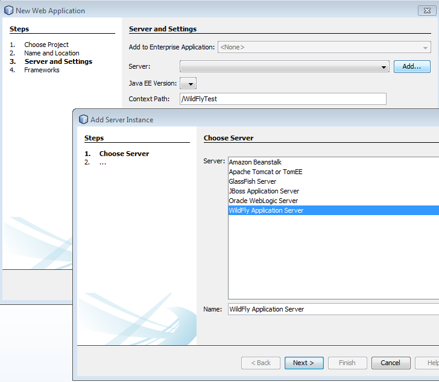

Good news out there. The recent nightly builds of NetBeans (apparently upcoming 8.0.1) already contain the latest <a href="http://plugins.netbeans.org/plugin/53333/wildfly-application-server" target="_blank">WildFly Plugin</a>. So you don't need to add it manually and can start working with your favorite application server right away.
 
 Try it out and grep the <a href="" target="_blank">latest nightly build</a>. Please keep in mind, that the nightly builds are developer builds and shouldn't be expected to be stable.
 
 <b>Some first steps to get started:</b>
 
<ul>
 <li>Download <a href="" target="_blank">WildFly&nbsp;8.1.0.Final</a></li>
 <li>Install by simply unzipping into your favorite location</li>
 <li>Download <a href="" target="_blank">NetBeans Nightly</a>&nbsp;for your platform</li>
 <li>Install into a location of your choice</li>
 <li>File &gt; New Project &gt; [Java Web | Maven] &gt; Web Application</li>
 <li>Give it a Name and Location and finally</li>
 <li>Add a Server and select "WildFly Application Server"</li>
</ul>
 
 

 

 
 If you find something make sure to <a href="https://netbeans.org/community/issues.html" target="_blank">file a bug</a>.Don't forget to follow&nbsp;Emmanuel Hugonnet (<a href="https://twitter.com/ehsavoie" target="_blank">@ehsavoie</a>, <a href="https://plus.google.com/+EmmanuelHugonnet/posts" target="_blank">G+</a>, <a href="" target="_blank">blog</a>) who is the creator of the plugin.