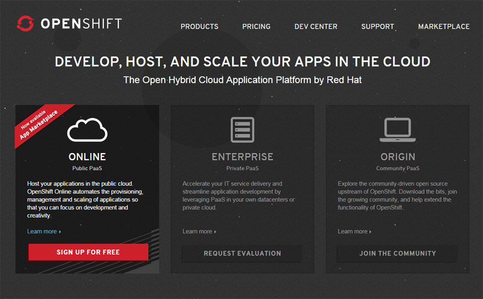

After you've hopefully read the short <a href="http://blog.eisele.net/2014/08/everything-developers-need-to-know-about-redhat-xpaas.html" target="_blank">little introduction to xPaaS</a> you're excited to try out all the new features and just want to get started without further reading? That is easy. The only true prerequisite for everything you do around xPaaS is an <a href="" target="_blank">OpenShift</a> account. And believe it or not, it is free. Like in free. If you don't believe me, follow a few simple steps to get <a href="https://www.openshift.com/app/account/new" target="_blank">yours today</a>.
 
 

 

<b> </b> <b>First and Only Step</b>
 
 is to visit http://www.openshift.com. You're presented with three choices. "Online", "Enterprise" and "Origin". Feel free to look around, what OpenShift has to offer, but what you are looking for is the "<a href="https://www.openshift.com/products/online" target="_blank">Online</a>" version,&nbsp;which is Red Hat's public cloud application development and hosting platform.
 
 
 Click the red "Signup for Free" button and simply enter your email-address, a 6 character password including the validation of it and the number/word from the captcha. When you're done, click "Signup".
 
 <b>What's next?</b>
 
 Check your inbox for an email confirming your account. You must click the link in the email to complete the registration process. If you do not receive an email within a few minutes, check your Spam folder to ensure it was not incorrectly moved. If you still run into problems you might consult the <a href="https://www.openshift.com/faq/i-just-signed-up-why-didnt-i-receive-an-email-confirmation" target="_blank">FaQ</a>, send an email to the openshift team or see them on IRC (freenode/#openshift).
 
 The link in the email sends you to a website, where you have to validate and accept the terms and conditions. Now you're all set. No credit-card, no mailing-address, no nothing. You have your own Openshift account ready.
 
 

 

 <b>Getting Started with OpenShift Online</b>
 
 You basically have three ways to continue your journey. Via the web-based console, via the command-line tools or via Eclipse/JBoss Developer Studio. Whatever way you decide to go, the <a href="https://www.openshift.com/quickstarts" target="_blank">Quickstarts</a> are a very good thing to start with. You will be overwhelmed with the polyglot nature and the variety you can find there.
 
 
 As next steps you might want to find out about:
 
<ul>
 <li><a href="https://www.openshift.com/walkthrough/developer-workflow" target="_blank">The Developer Workflow on OpenShift</a></li>
 <li><a href="https://www.openshift.com/application-gallery" target="_blank">Look Throught the Application Gallery</a></li>
 <li><a href="https://www.openshift.com/developers/documentation" target="_blank">Read through the complete Users Guide</a></li>
 <li>Find out about the <a href="https://access.redhat.com/documentation/en-US/OpenShift_Online/2.0/html/REST_API_Guide/index.html" target="_blank">APIs OpenShift offers</a></li>
 <li>Watch some <a href="https://www.openshift.com/videos" target="_blank">Videos about OpenShift</a> from Red Hat Summit</li>
</ul>