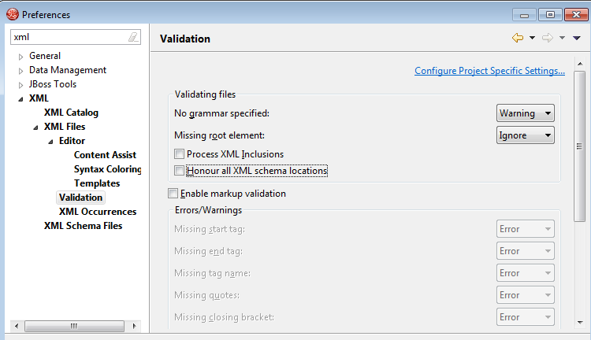

In one of my last posts I explained how you get started with SwitchYard on WildFly 8.1. In the meantime the project was busy and released another Alpha2. A very good opportunity to explore the quickstarts here and refresh your memory about it. Beside the version change, you can still use the earlier blog to setup you local&nbsp;<a href="http://blog.eisele.net/2014/07/getting-started-with-switchyard.html" target="_blank">WildFly 8 server with latest Switchyard</a>. As with all frameworks there is plenty of stuff to explore and a prerequisite for doing this is to have a working development environment to make this easier.
 
 <b>Setting up JBoss Developer Studio</b>
 

 

 First things first. Download a copy of the latest <a href="" target="_blank">JBoss Developer Studio (JBDS) 7.1.1.GA</a> for your operating system and install it. You should already have a JDK in place so a simple
 
 
<pre>java -jar&nbsp;jbdevstudio-product-eap-universal-7.1.1.GA-v20140314-2145-B688.jar</pre>
 
 will work. A simply 9 step installer will guide you through the steps necessary. Make sure to select the suitable JDK installation. JBDS works and has been tested with Java SE 6.x and 7.x. If you like to, install the complete EAP but it's not a requirement for this little how-to. A basic setup without EAP requires roughly 400 MB disc space and shouldn't take longer than a couple of minutes. If you're done with that part launch the IDE and go on and configure the tooling. We need the JBoss Tools Integration Stack (JBTIS). Configure them by visiting "Help -&gt; Install New Software" and add a new Update Site with the "Add" button. Call it SY-Development and point it to: "http://download.jboss.org/jbosstools/updates/development/kepler/integration-stack/"
 

 Wait for the list to refresh and expand the JBoss Integration and SOA Development and select all three SwitchYard entries. Click your way through the wizards and you're ready for a re-start.
 
 
<table align="center" cellpadding="0" cellspacing="0" class="tr-caption-container" style="margin-left: auto; margin-right: auto; text-align: center;">
 <tbody>
  <tr>
   <td style="text-align: center;"></td>
  </tr>
  <tr>
   <td class="tr-caption" style="text-align: center;">SY Tooling 2.0.0</td>
  </tr>
 </tbody>
</table> Please make sure to disable Honour all XML schema locations in preferences, XML→XML Files→Validation after installation. &nbsp;This will prevent erroneous XML validation errors from appearing on switchyard.xml files. 
 
 
<table align="center" cellpadding="0" cellspacing="0" class="tr-caption-container" style="margin-left: auto; margin-right: auto; text-align: center;">
 <tbody>
  <tr>
   <td style="text-align: center;"></td>
  </tr>
  <tr>
   <td class="tr-caption" style="text-align: center;">Preventing erroneous XML validation</td>
  </tr>
 </tbody>
</table> That's it for sure. Go ahead and import the bean-service example <a href="http://blog.eisele.net/2014/07/getting-started-with-switchyard.html">from the earlier blog-post</a>&nbsp;(Import -&gt; Maven -&gt; Existing Maven Projects)
 
 <b>General Information about SwitchYard Projects</b>
 
 Lets find out more about the general SwitchYard project layout before we dive into the bean-service example. &nbsp;A SwitchYard project is a Maven based project with the following characteristics:
 
<ul>
 <li>a switchyard.xml file in the project's META-INF folder</li>
 <li>one or more SwitchYard runtime dependencies declared in the pom.xml file</li>
 <li>org.switchyard:switchyard-plugin mojo configured in the pom.xml file</li>
</ul>

 Generally, a SwitchYard project may also contain a variety of other resources used to implement the application, for example: Java, BPMN2, DRL, BPEL, WSDL, XSD, and XML files. The tooling supports you with creating, changing and developing your SY projects. You can also add SY capabilities to existing Maven projects. More details can be found in the <a href="https://docs.jboss.org/author/display/SWITCHYARD/Eclipse" target="_blank">documentation for the Eclipse tooling</a>.

  

<b>Exploring the Bean-Service Example</b>
 

 The Bean-Service example is one of the more simpler ones to get a first impression about SY. All of the example applications in the Quickstarts repository are included in quickstarts/ directory of your installation and also <a href="https://github.com/jboss-switchyard/quickstarts" target="_blank">available on GitHub</a>. The bean-service quickstart demonstrates the usage of the <a href="https://docs.jboss.org/author/display/SWITCHYARD/Bean" target="_blank">bean component</a>. The scenario is easy: An OrderService, which is provided through the OrderServiceBean, and an InventoryService which is provided through the InventoryServiceBean implementation take care of orders. Orders are submitted through the OrderService.submitOrder, and the OrderService then looks up items in the InventoryService to see if they are in stock and the order can be processed. Up to here it is basically a simple CDI based Java EE application. In this application the simple process is invoked through a SOAP gateway binding (Which is indicated by the little envelope).
  
 <table align="center" cellpadding="0" cellspacing="0" class="tr-caption-container" style="margin-left: auto; margin-right: auto; text-align: center;">
  <tbody>
   <tr>
    <td style="text-align: center;"></td>
   </tr>
   <tr>
    <td class="tr-caption" style="text-align: center;">Bean Service Quickstart Overview</td>
   </tr>
  </tbody>
 </table> Let's dive into the implementation a bit. Looking at the OrderServiceBean reveals some more details. It is the implementation of the OrderService interface which defines the operations. The OrderServiceBean is just a bean class few extra CDI annotations. Most notably is the
  
 <pre style="background-color: whitesmoke; border-bottom-left-radius: 4px; border-bottom-right-radius: 4px; border-top-left-radius: 4px; border-top-right-radius: 4px; border: 1px solid rgb(204, 204, 204); box-sizing: border-box; color: #333333; font-family: Menlo, Monaco, Consolas, 'Courier New', monospace; font-size: 13px; line-height: 1.42857143; margin-bottom: 10px; overflow: auto; padding: 9.5px; word-break: break-all; word-wrap: break-word;"><code style="background-color: transparent; border-bottom-left-radius: 0px; border-bottom-right-radius: 0px; border-top-left-radius: 0px; border-top-right-radius: 0px; box-sizing: border-box; color: inherit; font-family: Menlo, Monaco, Consolas, 'Courier New', monospace; font-size: inherit; padding: 0px; white-space: pre-wrap;">@org.switchyard.component.bean.Service(OrderService.class)</code></pre> The @Service annotation allows the SwitchYard CDI Extension to discover your bean at runtime and register it as a service.&nbsp;Every bean service must have an @Service annotation with a value identifying the service interface for the service.&nbsp;In addition to providing a service in SwitchYard, beans can also consume other services. Those references need to be injected. In this example the InventoryService is injected
  
 <pre style="background-color: whitesmoke; border-bottom-left-radius: 4px; border-bottom-right-radius: 4px; border-top-left-radius: 4px; border-top-right-radius: 4px; border: 1px solid rgb(204, 204, 204); box-sizing: border-box; color: #333333; font-family: Menlo, Monaco, Consolas, 'Courier New', monospace; font-size: 13px; line-height: 1.42857143; margin-bottom: 10px; overflow: auto; padding: 9.5px; word-break: break-all; word-wrap: break-word;"><code style="background-color: transparent; border-bottom-left-radius: 0px; border-bottom-right-radius: 0px; border-top-left-radius: 0px; border-top-right-radius: 0px; box-sizing: border-box; color: inherit; font-family: Menlo, Monaco, Consolas, 'Courier New', monospace; font-size: inherit; padding: 0px; white-space: pre-wrap;"> @Inject @org.switchyard.component.bean.Reference private InventoryService _inventory;</code></pre> Finally, all you need is the switchyard.xml configuration file where your Service, Components, Types and implementations are described.
  
 <pre style="background-color: whitesmoke; border-bottom-left-radius: 4px; border-bottom-right-radius: 4px; border-top-left-radius: 4px; border-top-right-radius: 4px; border: 1px solid rgb(204, 204, 204); box-sizing: border-box; color: #333333; font-family: Menlo, Monaco, Consolas, 'Courier New', monospace; font-size: 13px; line-height: 1.42857143; margin-bottom: 10px; overflow: auto; padding: 9.5px; word-break: break-all; word-wrap: break-word;"><code style="background-color: transparent; border-bottom-left-radius: 0px; border-bottom-right-radius: 0px; border-top-left-radius: 0px; border-top-right-radius: 0px; box-sizing: border-box; color: inherit; font-family: Menlo, Monaco, Consolas, 'Courier New', monospace; font-size: inherit; padding: 0px; white-space: pre-wrap;">&lt;composite name="orders" &gt; &lt;component name="OrderService"&gt; &lt;implementation.bean class="org.switchyard.quickstarts.bean.service.OrderServiceBean"/&gt; &lt;service name="OrderService"&gt; &lt;interface.java interface="org.switchyard.quickstarts.bean.service.OrderService"/&gt; &lt;/service&gt; &lt;/component&gt; &lt;/composite&gt;</code></pre>
  
  That was a very quick rundown. We've not touched the webservice endpoints, the WSDL and the Transformer configuration and implementation. Have a look at the <a href="http://www.mastertheboss.com/soa-cloud/jboss-soa/switchyard-tutorial?showall=&amp;start=1" target="_blank">SwitchYard tutorial</a> which was published by mastertheboss and take the chance to read more about SY at the following links:
  
  
 <ul>
  <li><a href="https://docs.jboss.org/author/display/SWITCHYARD/Home" target="_blank">SwitchYard Project Documentation</a></li>
  <li><a href="" target="_blank">SwitchYard Homepage</a></li>
  <li><a href="" target="_blank">Community Pages on JBoss.org</a></li>
  <li>SwitchYard is part of <a href="" target="_blank">Fuse ServiceWorks</a>, give it a try in a full fledged SOA Suite.</li>
 </ul>
  
  

