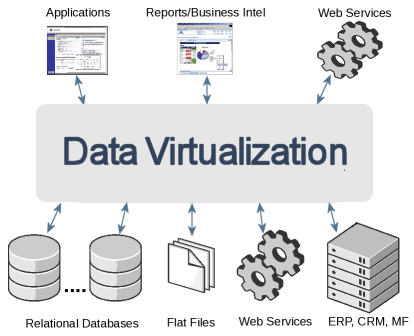

This is another blog the ongoing series about the <a href="http://red.ht/xpaas" target="_blank">Red Hat xPaaS</a> solutions, where I am trying to demystify the acronyms a bit and give you more information about the projects and products composed around it. After the <a href="http://blog.eisele.net/2014/08/everything-developers-need-to-know-about-redhat-xpaas.html" target="_blank">initial overview</a> this post focuses on the first aspect of the <a href="https://www.openshift.com/xpaas#integration" target="_blank">iPaaS solution</a>: JBoss Data Virtualization.
 
 <b>What is Data Virtualization and why should I care?</b>
 
 Think of Data Virtualization as of a distinct layer between your business applications and your data-sources. It can also be described as an integration layer for data. So, instead of pulling different datasources into your business application and following a polyglot persistence approach you take advantage of not only the data-access aspects but also get a consistent view on your distributed data-models. All perspectives are encapsulated:&nbsp;data abstraction, federation, integration, transformation, and delivery capabilities to combine data from one or multiple sources into reusable and unified logical data models.
 
 

 

 
 
 To successfully implement such an approach, you need to follow a three step approach:
 
<ul>
 <li>Connect: Access Data From Multiple Data Sources</li>
 <li>Compose: Create a Business Friendly Virtual Data Model</li>
 <li>Consume: Make the Data Model Available to Consumers</li>
</ul><b>Sounds complicated - How Do I Get Started?</b>
 
 There are a couple of different ways to get some first experiences. In no particular order:
 
<ul>
 <li><a href="https://www.openshift.com/developers/jboss-data-virtualization/getting-started" target="_blank">Data Virtualization on OpenShift</a> (Installing DV Cartridge and connecting the JBDS)</li>
 <li><a href="https://github.com/teiid/teiid-quickstarts" target="_blank">Teiid Quickstarts</a> (federation, roles, rules, webservices, hibernate, infinispan)</li>
 <li><a href="https://github.com/DataVirtualizationByExample/DVWorkshop" target="_blank">Red Hat JBoss Data Virtualization Workshop</a> (End2End Lab)</li>
 <li>JBoss.org <a href="http://www.jboss.org/products/datavirt/developer-materials/#!hidden_keyword=JBoss%20Data%20Virtualization" target="_blank">Developer Resources</a> (Videos and Screencasts)</li>
 <li><a href="" target="_blank">Official Product Documentation</a> (Developer-, Install-, Admin-, User -Guides)</li>
</ul><b>The Community Projects</b>
 
 Behind the supported Red Hat solution are:
 
<ul>
 <li><b>Teiid&nbsp;</b>(<a href="" target="_blank">http://teiid.jboss.org/</a>)
  <ul>
   <li>Documentation - <a href="http://www.jboss.org/teiid/docs" target="_blank">http://www.jboss.org/teiid/docs</a></li>
   <li>GitHub -&nbsp;<a href="https://github.com/teiid/teiid" target="_blank">https://github.com/teiid/teiid</a></li>
   <li>JIRA Issues - <a href="https://issues.jboss.org/browse/TEIID" target="_blank">https://issues.jboss.org/browse/TEIID</a></li>
   <li>User Forum - <a href="https://community.jboss.org/en/teiid?view=discussions" target="_blank">https://community.jboss.org/en/teiid?view=discussions</a></li>
   <li>Wiki - <a href="https://community.jboss.org/wiki/TheTeiidProject" target="_blank">https://community.jboss.org/wiki/TheTeiidProject</a></li>
   <li>IRC -&nbsp;irc.freenode.net#teiid</li>
  </ul></li>
 <li><b>ModeShape&nbsp;</b>(<a href="" target="_blank">http://modeshape.jboss.org/</a>)
  <ul>
   <li>Documentation - <a href="http://modeshape.jboss.org/docs" target="_blank">http://modeshape.jboss.org/docs</a></li>
   <li>GitHub -&nbsp;<a href="https://github.com/ModeShape/modeshape" target="_blank">https://github.com/ModeShape/modeshape</a></li>
   <li>JIRA Issues - <a href="https://jira.jboss.org/browse/MODE" target="_blank">https://jira.jboss.org/browse/MODE</a></li>
   <li>User Forum - <a href="http://community.jboss.org/community/modeshape" target="_blank">http://community.jboss.org/community/modeshape</a></li>
   <li>IRC -&nbsp;irc.freenode.net#modeshape</li>
  </ul></li>
</ul> A short seven minute video introduction by Blaine Mincey:
 

 <iframe allowfullscreen frameborder="0" height="263" mozallowfullscreen="" src="//player.vimeo.com/video/76457404" webkitallowfullscreen="" width="420"></iframe>

